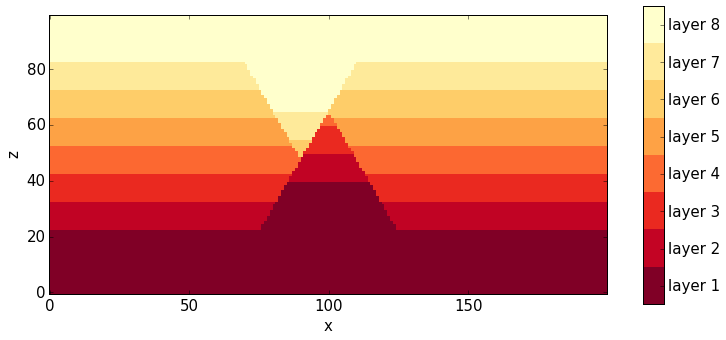
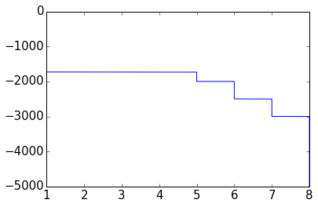
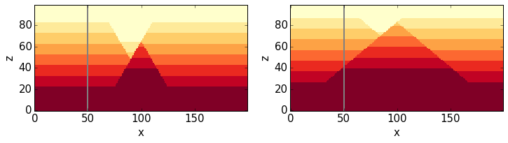
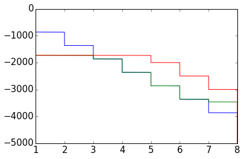
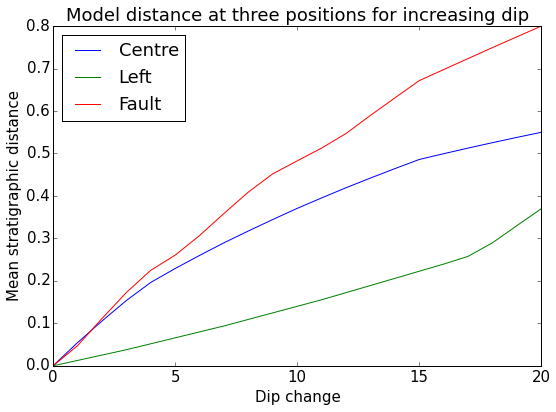

Global Sensitivity Analysis with SALib methods
==============================================

The Python library SALib provides several global sensitivity analysis
methods (including Morris and Sobol). We will test here if (and how)
these methods can be applied to sensitivity analysis of Noddy models.

We will start with the simple two-fault model and then extend the
analysis to the Gippsland basin model.

.. code:: python

    from IPython.core.display import HTML
    css_file = 'pynoddy.css'
    HTML(open(css_file, "r").read())

.. raw:: html

    <link href='http://fonts.googleapis.com/css?family=Alegreya+Sans:100,300,400,500,700,800,900,100italic,300italic,400italic,500italic,700italic,800italic,900italic' rel='stylesheet' type='text/css'>
    <link href='http://fonts.googleapis.com/css?family=Arvo:400,700,400italic' rel='stylesheet' type='text/css'>
    <link href='http://fonts.googleapis.com/css?family=PT+Mono' rel='stylesheet' type='text/css'>
    <link href='http://fonts.googleapis.com/css?family=Shadows+Into+Light' rel='stylesheet' type='text/css'>
    <link rel="stylesheet" type="text/css" href="http://fonts.googleapis.com/css?family=Tangerine">
    <link href='http://fonts.googleapis.com/css?family=Philosopher:400,700,400italic,700italic' rel='stylesheet' type='text/css'>
    <link href='http://fonts.googleapis.com/css?family=Libre+Baskerville:400,400italic' rel='stylesheet' type='text/css'>
    <link href='http://fonts.googleapis.com/css?family=Lora:400,400italic' rel='stylesheet' type='text/css'>
    <link href='http://fonts.googleapis.com/css?family=Karla:400,400italic' rel='stylesheet' type='text/css'>
    
    

Setting up the two-fault model
==============================

We set up the two fault model as in the example of the local sensitivity
analysis before:

.. code:: python

    import sys, os
    import matplotlib.pyplot as plt
    # adjust some settings for matplotlib
    from matplotlib import rcParams
    # print rcParams
    rcParams['font.size'] = 15
    # determine path of repository to set paths corretly below
    os.chdir(r'/Users/flow/git/pynoddy/docs/notebooks/')
    repo_path = os.path.realpath('../..')
    import pynoddy.history
    import pynoddy.events

Create model with 8 layers and two faults
-----------------------------------------

We will first create a simple model with one stratigraphy, defining 8
layers with a thickness of 500 m, and two faults that are completely
symmetrical in their properties:

.. code:: python

    reload(pynoddy.history)
    reload(pynoddy.events)
    nm = pynoddy.history.NoddyHistory()
    # add stratigraphy
    strati_options = {'num_layers' : 8,
                      'layer_names' : ['layer 1', 'layer 2', 'layer 3', 'layer 4', 'layer 5', 'layer 6', 'layer 7', 'layer 8'],
                      'layer_thickness' : [1500, 500, 500, 500, 500, 500, 500, 500]}
    nm.add_event('stratigraphy', strati_options )
    
    # The following options define the fault geometry:
    fault_options = {'name' : 'Fault_W',
                     'pos' : (4000, 3500, 5000),
                     'dip_dir' : 90,
                     'dip' : 60,
                     'slip' : 1000}
    
    nm.add_event('fault', fault_options)
    # The following options define the fault geometry:
    fault_options = {'name' : 'Fault_E',
                     'pos' : (6000, 3500, 5000),
                     'dip_dir' : 270,
                     'dip' : 60,
                     'slip' : 1000}
    
    nm.add_event('fault', fault_options)
    history = "two_faults_sensi.his"
    nm.write_history(history)

.. code:: python

    # compute the model:
    output_name = "two_faults_sensi_out"
    # Compute the model
    pynoddy.compute_model(history, output_name) 

.. code:: python

    # Plot output
    reload(pynoddy.output)
    nout = pynoddy.output.NoddyOutput(output_name)
    nout.plot_section('y', layer_labels = strati_options['layer_names'][::-1], 
                      colorbar = True, title="",
                      savefig = False)

Analyse series in virtual drillhole
-----------------------------------

The NoddyHistory class now has a function to evaluate geological units
in a "virtual drillhole", i.e.: a 1-D extraction at a given position
(x,y). Basically, a model is created with the same kinematic history,
but a very small range (around the position x,y), and a small cube size
(default: 1 m) for a "quasi-continuous" model export.

The idea is that the data of this "virtual drillhole" could be used for
a meaningful sensitivity analysis, as the data is almost continuous.

Here an example of a 1-D export. First, we re-open the model created
above and get some model information:

.. code:: python

    reload(pynoddy.history)
    nm_2 = pynoddy.history.NoddyHistory(history)
    nm_2.write_history("test2.his")
    nm_2.info()

.. parsed-literal::

     STRATIGRAPHY
     FAULT
     FAULT
    ************************************************************
    			Model Information
    ************************************************************
    
    
    This model consists of 3 events:
    	(1) - STRATIGRAPHY
    	(2) - FAULT
    	(3) - FAULT
    The model extent is:
    	x - 10000.0 m
    	y - 7000.0 m
    	z - 5000.0 m
    Number of cells in each direction:
    	nx = 200
    	ny = 140
    	nz = 100
    The model origin is located at: 
    	(0.0, 0.0, 5000.0)
    The cubesize for model export is: 
    	50 m
    
    
    ************************************************************
    			Meta Data
    ************************************************************
    
    
    The filename of the model is:
    	test2.his
    It was last saved (if origin was a history file!) at:
    	 3/1/2015 9:55:57
    

Let's export the geology at a 1-D profile/ virtual borehole at the
centre of the model (x = 5000, y = 3500). Note: the resolution of the
exported profile can be defined with an additional keyword (resolution
higher than 1 m are possible, as well):

.. code:: python

    # get 1-D line export at centre of model:
    drill_1 = nm_2.get_drillhole_data(5000, 3500, resolution = 1)

A plot of the data looks, so far, pretty boring:

.. code:: python

    fig = plt.figure()
    ax = fig.add_subplot(111)
    ax.plot(drill_1, np.arange(-len(drill_1),0))

.. parsed-literal::

    [<matplotlib.lines.Line2D at 0x1085a04d0>]

Evaluate effect of fault uncertainties on drillhole
---------------------------------------------------

We now assign uncertainties to the fault parameters and see how these
uncertainties affect the model - at the exported drillhole 1-D profile.

The history class contains a simple method to change event parameters:

.. code:: python

    # set parameter changes in dictionary
    
    # define the elemtents and values of the events to change:
    changes_fault_1 = {'Dip' : -20}
    changes_fault_2 = {'Dip' : -20}
    
    # Assign those changes to the events (note: event ids)
    param_changes = {2 : changes_fault_1,
                     3 : changes_fault_2}
    
    # Perform changes
    nm_2.change_event_params(param_changes)

As the ``get_drillhole_data`` method automatically performs the model
computation step, we can simply get the updated 1-D profile as:

.. code:: python

    drill_2 = nm_2.get_drillhole_data(5000, 3500, resolution = 1)

If we now compare the new profile to the previous one we can observe the
changes:

.. code:: python

    fig = plt.figure()
    ax = fig.add_subplot(111)
    ax.plot(drill_1, np.arange(-len(drill_1),0), label='original model')
    ax.plot(drill_2, np.arange(-len(drill_1),0), label='changed model')
    ax.legend(loc = 'lower left')

.. parsed-literal::

    <matplotlib.legend.Legend at 0x1084bc450>

.. image:: SALib-sensitivity-analysis_files/SALib-sensitivity-analysis_19_1.png

So, as expected, we obtain a different 1-D profile. Important to note
here is that the resolution of this 1-D export is a lot higher than the
model we would obtain with the full 3-D export so that we can use it as
a "quasi-continuous" representation at this one position (x,y). This
aspect is important for the sensitivity analysis below.

We can, however, just for the purpose of visualising the changes between
these two models, also create a quick comparison of slices through the
model:

.. code:: python

    # compute updated model
    updated_history = "changed_fault_model.his"
    updated_out = "changed_fault_model_out"
    nm_2.write_history(updated_history)
    pynoddy.compute_model(updated_history, updated_out)

.. code:: python

    nout = pynoddy.output.NoddyOutput(output_name)
    nout_2 = pynoddy.output.NoddyOutput(updated_out)
    
    fig = plt.figure(figsize=(12,12))
    ax1 = fig.add_subplot(121)
    ax2 = fig.add_subplot(122)
    
    nout.plot_section('y', layer_labels = strati_options['layer_names'][::-1], 
                      colorbar = False, title="", ax = ax1,
                      savefig = False)
    
    # plot position of drillhole
    ax1.axvline(50, c='gray', lw=2)
    
    
    nout_2.plot_section('y', layer_labels = strati_options['layer_names'][::-1], 
                      colorbar = False, title="", ax = ax2,
                      savefig = False)
    
    # plot position of drillhole
    ax2.axvline(50, c='gray', lw=2)
    
    

.. parsed-literal::

    <matplotlib.lines.Line2D at 0x109ee6c10>

The difference between the two models is also obvious in the
cross-section - but the resolution is a lot lower (as can be seen from
the stair-step faults). However, exporting the entire model in the same
resolution as the 1-D profile is prohibitive for memory and computation
time reasons - so we will use the 1-D profiles from now on for
uncertainty analysis and sensitivity testing.

Defining an objective function
------------------------------

The next step is to define an objective function based on the exported
1-D profile. This is a bit tricky to do for a general case. Note, for
example, that the profile of the "original model" only contains the
layers from 8 to 5, whereas the changed model contains layers 8 to 3!

So, we need a way to describe the "distance" between the two profiles.
As a first test, let's use a "stratigraphic distance" where we calculate
for each cell the difference between the geological layer id between the
changed model and the original model, then sum the absolute values and
scale by the number of cells.

We define a distance function:

.. code:: python

    def distance(profile_ori, profile_changed):
        """Calculate the relative stratigraphic distance along a profile"""
        return np.sum(np.abs(profile_ori - profile_changed)) / float(len(profile_ori))
        
        

.. code:: python

    distance(drill_1, drill_2)

.. parsed-literal::

    0.54979999999999996

Note: the distance can be larger than 1 (as it should be the case!).

Comparing distances for increasing model differences
----------------------------------------------------

Just to see if the distance method makes sense: let's compare distances
as a couple of locations in the model - for increasing difference in
fault dips on both sides.

We start again with the original two-fault model:

.. code:: python

    reload(pynoddy.history)
    reload(pynoddy)
    nm_ori = pynoddy.history.NoddyHistory(history)

.. parsed-literal::

     STRATIGRAPHY
     FAULT
     FAULT

And we now use a some more "drillhole" positions:

.. code:: python

    drill_ori_left = nm_ori.get_drillhole_data(2000, 3500)
    drill_ori_fault = nm_ori.get_drillhole_data(4000, 3500)
    drill_ori_centre = nm_ori.get_drillhole_data(5000, 3500)
    # drill_ori_right = nm_ori.get_drillhole_data(8000, 3500)

.. code:: python

    fig = plt.figure()
    ax = fig.add_subplot(111)
    ax.plot(drill_ori_left, np.arange(-len(drill_ori_left),0))
    ax.plot(drill_ori_fault, np.arange(-len(drill_ori_left),0))
    ax.plot(drill_ori_centre, np.arange(-len(drill_ori_left),0))

.. parsed-literal::

    [<matplotlib.lines.Line2D at 0x10b7f9b10>]

We now change the fault dips (to 20 degrees in increments of 1),
recopmute the drillhole profiles and calculate the distances:

.. code:: python

    import copy
    nm_changed = copy.deepcopy(nm_ori)
    dist_left = [0]
    dist_fault = [0]
    dist_centre = [0]
    for i in range(20):
        # define the elemtents and values of the events to change:
        changes_fault_1 = {'Dip' : -1}
        changes_fault_2 = {'Dip' : -1}
    
        # Assign those changes to the events (note: event ids)
        param_changes = {2 : changes_fault_1,
                         3 : changes_fault_2}
    
        # Perform changes
        nm_changed.change_event_params(param_changes)    
        
        # Export drillhole profiles
        drill_changed_left = nm_changed.get_drillhole_data(2000, 3500)
        drill_changed_fault = nm_changed.get_drillhole_data(4000, 3500)
        drill_changed_centre = nm_changed.get_drillhole_data(5000, 3500)
        
        # calculate distances and add to arrays
        dist_left.append(distance(drill_ori_left, drill_changed_left))
        dist_fault.append(distance(drill_ori_fault, drill_changed_fault))
        dist_centre.append(distance(drill_ori_centre, drill_changed_centre))
    
    
        
        

.. code:: python

    fig = plt.figure(figsize = (8,6))
    ax = fig.add_subplot(111)
    ax.plot(range(0,21), dist_centre, label = "Centre")
    ax.plot(range(0,21),dist_left, label = "Left")
    ax.plot(range(0,21),dist_fault, label = "Fault")
    ax.legend(loc = "upper left")
    ax.set_title("Model distance at three positions for increasing dip")
    ax.set_xlabel("Dip change")
    ax.set_ylabel("Mean stratigraphic distance")
    plt.tight_layout()

Distance is increasing for increasing dip, as expected - and
qualitatively, it looks ok, as well: the biggest model differences occur
in the range of the fault, then the central Graben, and the least
changes on the flanks.

Check distance for small dip changes
------------------------------------

We increasd above by values of 1 degree - here just a quick check if we
also get a reasonable distance for very small changes, with a model
resolution of 1 m:

.. code:: python

    nm_changed = copy.deepcopy(nm_ori)
    # define the elemtents and values of the events to change:
    changes_fault_1 = {'Dip' : -0.1}
    changes_fault_2 = {'Dip' : -0.1}
    
    # Assign those changes to the events (note: event ids)
    param_changes = {2 : changes_fault_1,
                     3 : changes_fault_2}
    
    # Perform changes
    nm_changed.change_event_params(param_changes)    
    
    # Export drillhole profiles
    drill_changed_left = nm_changed.get_drillhole_data(2000, 3500)
    drill_changed_fault = nm_changed.get_drillhole_data(4000, 3500)
    drill_changed_centre = nm_changed.get_drillhole_data(5000, 3500)
    
    # calculate distances and add to arrays
    print distance(drill_ori_left, drill_changed_left)
    print distance(drill_ori_fault, drill_changed_fault)
    print distance(drill_ori_centre, drill_changed_centre)
    

.. parsed-literal::

    0.0014
    0.0044
    0.0056

Distance convergence with incresing resolution
----------------------------------------------

A last quick check: let's see how the drillhole resolution affects the
distance calculation, i.e.: which resolution do we need to get a stable
distance estimate?

We will test three cases: a very small dip change (0.01 degree), a small
change (0.1 degree), and a larger change (10 degree). For each of these
changes, we will increase the drillhole resolution, starting from 10 m,
down to 0.1 m and calculate distances for the drillhole position at the
position of the fault:

.. code:: python

    # use logarithmic steps for resolution:
    resolution_inc = np.logspace(0,1,15)
    print "Check distance for drillhole resolutions of:"
    print resolution_inc

.. parsed-literal::

    Check distance for drillhole resolutions of:
    [  1.           1.17876863   1.38949549   1.63789371   1.93069773
       2.27584593   2.6826958    3.16227766   3.72759372   4.39397056
       5.17947468   6.1054023    7.19685673   8.48342898  10.        ]

.. code:: python

    distances = {}
    dips = [0.1, 1, 10]
    for dip in dips: # initialise dictionary to store results
        distances[dip] = []
    for res in resolution_inc:
        print res
        for dip in dips:
            # create a copy of the history object
            nm_changed = copy.deepcopy(nm_ori)
    
            # define the elemtents and values of the events to change:
            changes_fault_1 = {'Dip' : -dip}
            changes_fault_2 = {'Dip' : -dip}
    
            # Assign those changes to the events (note: event ids)
            param_changes = {2 : changes_fault_1,
                             3 : changes_fault_2}
    
            # Perform changes
            nm_changed.change_event_params(param_changes)    
    
            # Export drillhole profiles
            # drill_changed_left = nm_changed.get_drillhole_data(2000, 3500)
            drill_changed_fault = nm_changed.get_drillhole_data(4000, 3500, resolution = res)
            drill_ori_fault = nm_ori.get_drillhole_data(4000, 3500, resolution = res)
            # drill_changed_centre = nm_changed.get_drillhole_data(5000, 3500)
    
            # calculate distances and add to arrays
            # dist_left.append(distance(drill_ori_left, drill_changed_left))
            distances[dip].append(distance(drill_ori_fault, drill_changed_fault))
            # dist_centre.append(distance(drill_ori_centre, drill_changed_centre))
    
    

.. parsed-literal::

    1.0
    1.17876863479
    1.38949549437
    1.63789370695
    1.93069772888
    2.27584592607
    2.68269579528
    3.16227766017
    3.72759372031
    4.39397056076
    5.17947467923
    6.10540229659
    7.19685673001
    8.48342898244
    10.0

.. code:: python

    print distances

.. parsed-literal::

    {1: [0.047199999999999999, 0.05569978758555582, 0.06561023074784543, 0.020669291338582679, 0.02084942084942085, 0.053832116788321165, 0.063270777479892765, 0.049936788874841972, 0.058955223880597013, 0.055360281195079089, 0.048704663212435231, 0.047677261613691929, 0.047550432276657062, 0.052631578947368418, 0.051999999999999998], 10: [0.4824, 0.56927071040830779, 0.67055879899916593, 0.5508530183727034, 0.34633204633204634, 0.55018248175182483, 0.64664879356568361, 0.50821744627054366, 0.59999999999999998, 0.53075571177504388, 0.49948186528497407, 0.49144254278728605, 0.49567723342939479, 0.51273344651952457, 0.48399999999999999], 0.1: [0.0044000000000000003, 0.0051923530800094403, 0.0061162079510703364, 0.0022965879265091863, 0.0023166023166023165, 0.0041058394160583944, 0.0048257372654155499, 0.0037926675094816687, 0.0044776119402985077, 0.0070298769771528994, 0.0031088082901554403, 0.0048899755501222494, 0.0043227665706051877, 0.0050933786078098476, 0.0040000000000000001]}

.. code:: python

    fig = plt.figure()
    ax = fig.add_subplot(111)
    ax.loglog(resolution_inc, distances[10], label = "10$^o$")
    ax.loglog(resolution_inc, distances[1], label = "0.1$^o$")
    ax.loglog(resolution_inc, distances[0.1], label = "0.01$^o$")
    ax.legend()

.. parsed-literal::

    <matplotlib.legend.Legend at 0x10bcb7350>

.. image:: SALib-sensitivity-analysis_files/SALib-sensitivity-analysis_43_1.png

Results are a bit odd - to do: check implementation of resolution!

Sensitivity analysis
====================

We have got the single parts now for the sensitivity analysis. We are
now using the global sensitivity analysis methods of the Python package
SALib, available on:

https://github.com/jdherman/SALib

As a start, we will test the sensitivity of the model at each drillhole
position separately. As parameters, we will use the parameters of the
fault events: dip, dip direction, and slip.

Parameter generation with SALib
-------------------------------

The first step for a sensitivity analysis with SALib is to create a text
file with a list of parameters and defined ranges for each parameter.
Note that we define changes to the parameter (as this is the way we
implement the changes with the ``NoddyHistory.change_event_params``
method):

.. code:: python

    param_file = "params.txt"
    params = """dip_change_fault_1 -5.0 5.0
    dip_dir_change_fault_1 -5.0 5.0
    slip_change_fault_1 -100. 100.
    dip_change_fault_2 -5.0 5.0
    dip_dir_change_fault_2 -5.0 5.0
    slip_change_fault_2 -100. 100."""
    f = open(param_file, "w")
    f.write(params)
    f.close()

Now, we create samples for these parameters. The way the samples are
generated depends on the type of sensitivity analysis. We are starting
with the Sobol method and create samples:

.. code:: python

    from SALib.sample import saltelli

.. code:: python

    param_values = saltelli.sample(1, param_file, calc_second_order = True)

With this command, we create a 2-D array where each row contains a set
of parameters for our model.

The number of generated samples depends on (1) the number of input
parameters, (2) the type of sensitivity analysis, and (3) the choice of
calculating second-order sensitivities (for parameter correlation).

Running the models
------------------

We now use this array and run the parameters through our model. Results
are again stored in a text file. For simplicity, we will define a
function that takes a parameter array, creates the new model, and
calculates the distance to the original model at the position of the
drillhole:

.. code:: python

    reload(pynoddy.history)
    reload(pynoddy)
    nm_ori = pynoddy.history.NoddyHistory(history)
    
    # set resolution for analysis:
    res = 1 # m
    
    # get original model distance again:
    drill_ori_fault = nm_ori.get_drillhole_data(4000, 3500, resolution = res)
    
    def change_model_with_paramter_array(param, i=0):
        # create a copy of the history object
        nm_changed = copy.deepcopy(nm_ori)
    
        # define the elemtents and values of the events to change.
        # Note: the order of parameters is as in the text file created above!
        changes_fault_1 = {'Dip' : param[0],
                           'Dip Direction' : param[1],
                           'Slip' : param[2]}
        changes_fault_2 = {'Dip' : param[3],
                           'Dip Direction' : param[4],
                           'Slip' : param[5]}
    
        # Assign those changes to the events (note: event ids)
        param_changes = {2 : changes_fault_1,
                         3 : changes_fault_2}
    
        # Perform changes
        nm_changed.change_event_params(param_changes)    
    
        nm_changed.write_history("salib_his_%02d.his" % i)
        
        # Export drillhole profiles
        # drill_changed_left = nm_changed.get_drillhole_data(2000, 3500)
        drill_changed_fault = nm_changed.get_drillhole_data(4000, 3500, resolution = res)
        # drill_changed_centre = nm_changed.get_drillhole_data(5000, 3500)
    
        np.savetxt("salib_drill_%02d.csv" % i, drill_changed_fault)
     
        # calculate and return distance:
        return distance(drill_ori_fault, drill_changed_fault)
    
        

.. parsed-literal::

     STRATIGRAPHY
     FAULT
     FAULT

.. code:: python

    np.savetxt??

We can calculate the distance for any parameter set defined in the
model:

.. code:: python

    param_set = 0
    dist = change_model_with_paramter_array(param_values[param_set-1])
    print("Distance for parameter set %d: %.4f" % (param_set,dist))

.. parsed-literal::

    {2: {'Dip': -4.541015625, 'Dip Direction': 3.994140625, 'Slip': 0.1953125}, 3: {'Dip': -4.306640625, 'Dip Direction': -4.150390625, 'Slip': -49.0234375}}
    Distance for parameter set 0: 0.2994

Now, we run the entire parameter set through the model and store the
results in a text file:

.. code:: python

    dist_sensi = []
    i = 0
    for params in param_values:
        dist_sensi.append(change_model_with_paramter_array(params, i = i))
        i += 1

.. parsed-literal::

    {2: {'Dip': -2.802734375, 'Dip Direction': -4.033203125, 'Slip': 3.7109375}, 3: {'Dip': 1.767578125, 'Dip Direction': -2.197265625, 'Slip': 81.4453125}}
    {2: {'Dip': -4.541015625, 'Dip Direction': -4.033203125, 'Slip': 3.7109375}, 3: {'Dip': 1.767578125, 'Dip Direction': -2.197265625, 'Slip': 81.4453125}}
    {2: {'Dip': -2.802734375, 'Dip Direction': 3.994140625, 'Slip': 3.7109375}, 3: {'Dip': 1.767578125, 'Dip Direction': -2.197265625, 'Slip': 81.4453125}}
    {2: {'Dip': -2.802734375, 'Dip Direction': -4.033203125, 'Slip': 0.1953125}, 3: {'Dip': 1.767578125, 'Dip Direction': -2.197265625, 'Slip': 81.4453125}}
    {2: {'Dip': -2.802734375, 'Dip Direction': -4.033203125, 'Slip': 3.7109375}, 3: {'Dip': -4.306640625, 'Dip Direction': -2.197265625, 'Slip': 81.4453125}}
    {2: {'Dip': -2.802734375, 'Dip Direction': -4.033203125, 'Slip': 3.7109375}, 3: {'Dip': 1.767578125, 'Dip Direction': -4.150390625, 'Slip': 81.4453125}}
    {2: {'Dip': -2.802734375, 'Dip Direction': -4.033203125, 'Slip': 3.7109375}, 3: {'Dip': 1.767578125, 'Dip Direction': -2.197265625, 'Slip': -49.0234375}}
    {2: {'Dip': -2.802734375, 'Dip Direction': 3.994140625, 'Slip': 0.1953125}, 3: {'Dip': -4.306640625, 'Dip Direction': -4.150390625, 'Slip': -49.0234375}}
    {2: {'Dip': -4.541015625, 'Dip Direction': -4.033203125, 'Slip': 0.1953125}, 3: {'Dip': -4.306640625, 'Dip Direction': -4.150390625, 'Slip': -49.0234375}}
    {2: {'Dip': -4.541015625, 'Dip Direction': 3.994140625, 'Slip': 3.7109375}, 3: {'Dip': -4.306640625, 'Dip Direction': -4.150390625, 'Slip': -49.0234375}}
    {2: {'Dip': -4.541015625, 'Dip Direction': 3.994140625, 'Slip': 0.1953125}, 3: {'Dip': 1.767578125, 'Dip Direction': -4.150390625, 'Slip': -49.0234375}}
    {2: {'Dip': -4.541015625, 'Dip Direction': 3.994140625, 'Slip': 0.1953125}, 3: {'Dip': -4.306640625, 'Dip Direction': -2.197265625, 'Slip': -49.0234375}}
    {2: {'Dip': -4.541015625, 'Dip Direction': 3.994140625, 'Slip': 0.1953125}, 3: {'Dip': -4.306640625, 'Dip Direction': -4.150390625, 'Slip': 81.4453125}}
    {2: {'Dip': -4.541015625, 'Dip Direction': 3.994140625, 'Slip': 0.1953125}, 3: {'Dip': -4.306640625, 'Dip Direction': -4.150390625, 'Slip': -49.0234375}}

.. code:: python

    plot(drill_changed_fault)

.. parsed-literal::

    [<matplotlib.lines.Line2D at 0x10dfd42d0>]

.. image:: SALib-sensitivity-analysis_files/SALib-sensitivity-analysis_59_1.png

Look at sensitivities to check if we actually changed different
"quasi-continuous" values:

.. code:: python

    plot(dist_sensi, 'o-')

.. parsed-literal::

    [<matplotlib.lines.Line2D at 0x10e296190>]

.. image:: SALib-sensitivity-analysis_files/SALib-sensitivity-analysis_61_1.png

We now save the sensitivities to a file and then perform the sobol
sensitivity analysis:

.. code:: python

    # save results
    results_file = 'dist_sensi_graben.txt'
    np.savetxt(results_file, dist_sensi, delimiter=' ')

.. code:: python

    from SALib.analyze import sobol

.. code:: python

    Si = sobol.analyze(param_file, results_file, 
                       column = 0, 
                       conf_level = 0.95,
                       calc_second_order = True, 
                       print_to_console=False)

.. code:: python

    # create composite matrix for sensitivities
    n_params = 6
    comp_matrix = np.ndarray(shape = (n_params,n_params))
    for j in range(n_params):
        for i in range(n_params):
            if i == j:
                comp_matrix[i,j] = Si['S1'][i]
            else:
                comp_matrix[i,j] = Si['S2'][i,j]
                comp_matrix[j,i] = Si['S2'][i,j]
                
    # print comp_matrix
    
    # define labels for figure: phi = dip, d = dip direction, s = slip, subscript = fault event
    label_names = ["","$\phi_1$", "$d_1$", "$s_1$", "$\phi_2$", "$d_2$", "$s_2$"]
    
    # Create figure
    fig = plt.figure()
    ax = fig.add_subplot(111)
    im = ax.imshow(comp_matrix, interpolation='nearest', cmap='RdBu_r', 
                   vmax = np.max(np.abs(comp_matrix)),
                    vmin = -np.max(np.abs(comp_matrix)),
    
    )
    
    ax.yaxis.set_ticks_position("both")
    ax.xaxis.set_ticks_position("top")
    
    ax.set_xticklabels(label_names)
    ax.set_yticklabels(label_names)
    
    # ax.set_title("Sensitivities")
    
    ax.set_xlabel("Parameter Sensitivities")
    
    fig.colorbar(im)
    
    plt.tight_layout()

.. image:: SALib-sensitivity-analysis_files/SALib-sensitivity-analysis_66_0.png

Discussion: interpretation of sensitivities
-------------------------------------------

Let's first have a look at the actual position of the "drillhole" that
we analyse with this sensitivity analysis:

.. code:: python

    # re-compute original model, just in case:
    ori_history = "fault_ori.his"
    ori_out = "fault_ori_out"
    nm_ori.write_history(ori_history)
    pynoddy.compute_model(ori_history, ori_out)
    
    no_ori = pynoddy.output.NoddyOutput(ori_out)

.. code:: python

    fig = plt.figure(figsize=(8,6))
    ax1 = fig.add_subplot(111)
    
    no_ori.plot_section('y', layer_labels = strati_options['layer_names'][::-1], 
                      colorbar = False, title="", ax = ax1,
                      savefig = False)
    
    # plot position of drillhole
    ax1.axvline(40, c='gray', lw=2);

.. image:: SALib-sensitivity-analysis_files/SALib-sensitivity-analysis_69_0.png

The position of the "drillhole" is actually at 4000 m (cell 40),
coinciding with the position of the first fault:

.. code:: python

    print("Position of first fault:\t%.2f" % nm_ori.events[2].properties['X'])
    print("Position of second fault:\t%.2f" % nm_ori.events[3].properties['X'])

.. parsed-literal::

    Position of first fault:	4000.00
    Position of second fault:	6000.00

So we could expect that the drillhole geology is sensitive to changes in
the parameters of this fault.

Still, the simulated model at this position is more sensitive to the
properties of the second fault, at position 6000 (see sensitivity
matrix)! This is a bit counter-intuitive, let's see what actually
happens: we generate a couple of the realisations for the drawn
parameter sets and visualise the cross-sections:

.. code:: python

    # create base figure:
    fig = plt.figure(figsize = (12,16))
    
    for i in range(10):
        # create axis for figure
        ax = fig.add_subplot(5,2,i+1)
        param = param_values[i]
        nm_changed = copy.deepcopy(nm_ori)
        # read and assign parameter changes:
        changes_fault_1 = {'Dip' : param[0],
                           'Dip Direction' : param[1],
                           'Slip' : param[2]}
        changes_fault_2 = {'Dip' : param[3],
                           'Dip Direction' : param[4],
                           'Slip' : param[5]}
    
        # Assign those changes to the events (note: event ids)
        param_changes = {2 : changes_fault_1,
                         3 : changes_fault_2}
    
        # Perform changes
        nm_changed.change_event_params(param_changes)  
        
        # compute model and create section:
        tmp_his = "fault_tmp.his"
        tmp_out = "fault_tmp_out"
        nm_changed.write_history(tmp_his)
        pynoddy.compute_model(tmp_his, tmp_out)
        no_changed = pynoddy.output.NoddyOutput(tmp_out)
        
        no_changed.plot_section('y', layer_labels = strati_options['layer_names'][::-1], 
                          colorbar = False, title="", ax = ax,
                          savefig = False)
    
        # plot position of drillhole
        ax.axvline(40, c='gray', lw=2);    
    
    
        

.. image:: SALib-sensitivity-analysis_files/SALib-sensitivity-analysis_73_0.png

If we look at these results, it is quite good to see that the influence
of the right (second) fault is more important as it affects the entire
lower part of the "drillhole". It is also obvious that the fault dip and
the fault slip play a major role (dip direction is actually quite
insiginficant as the profile is taken at the center of the model where
the fault position is defined).

Results of the analysis
-----------------------

With these considerations, here the interpretation for the results of
the sensitivity analysis:

We analysed the sensitivity of the modelled geology along a 1-D profile
(a virtual "drillhole") with respect to fault parameters at two defined
fault events. A global sobol sensitivity analysis revealed that:

1. The profile data is most sensitive to the dip and slip of the late
   (right) fault - which is initially a bit counter-intuitive as the
   profile is at the position of the early (left) fault.
2. The profile is almost insensitive to the dip value of the early
   fault, and literally insensitive to values of dip direction and slip
   of the early fault.
3. Parameter correlations (second-order effects, off-diagonal in matrix)
   show that the highest parameter correlation (with respect to the
   profile) exist between dip and slip of the late fault. Furthermore,
   the correlation is negative, indicating that an increase in dip can
   be compensated with a decrease in fault slip. Given the position of
   the fault and the profile, this results sense, as well.

The result of the sensitivity analysis provides a good insight into the
sensitivities of modelled geology along a 1-D profile with respect to
event parameters. Results are initially a bit counter-intuitive, but
make perfect sense (and so, are actually quite interesting!).

The next step would now be to:

1. Extend the analysis to more than one position (not really sure if
   this is possible with SALib), and
2. Apply the analysis to the Gippsland Basin model.

I am actually quite happy with the first test and think that we could
get a nice analysis out for the Gippsland Basin - maybe also some
interesting counter-intuitive results!

