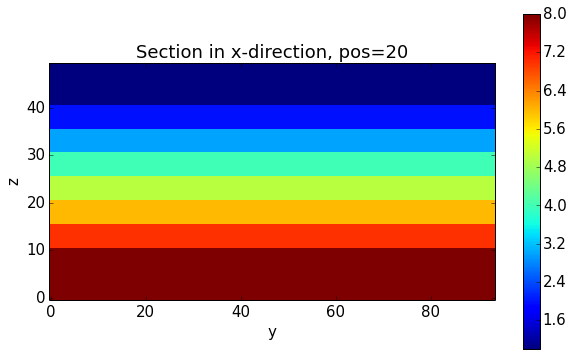

Test slice models
=================

There was a problem with exporting "2D-like" slice models. Check what's
going on:

.. code:: python

    import sys, os
    import matplotlib.pyplot as plt
    # adjust some settings for matplotlib
    from matplotlib import rcParams
    # print rcParams
    rcParams['font.size'] = 15
    # determine path of repository to set paths corretly below
    os.chdir(r'/Users/flow/git/pynoddy/docs/notebooks/')# some basic module imports
    repo_path = os.path.realpath('../..')
    
    import pynoddy

.. code:: python

    reload(pynoddy.history)
    reload(pynoddy.events)
    reload(pynoddy.output)
    
    # Change to sandbox directory to store results
    os.chdir(os.path.join(repo_path, 'sandbox'))
    
    # Path to exmaple directory in this repository
    example_directory = os.path.join(repo_path,'examples')
    # Compute noddy model for history file
    history = 'simple_two_faults.his'
    history_ori = os.path.join(example_directory, history)
    output_name = 'noddy_out'
    
    H1 = pynoddy.history.NoddyHistory(history_ori)
    # Before we do anything else, let's actually define the cube size here to
    # adjust the resolution for all subsequent examples
    H1.change_cube_size(100)
    # compute model - note: not strictly required, here just to ensure changed cube size
    H1.write_history(history)
    pynoddy.compute_model(history, output_name)
    
    his_full_3d = pynoddy.history.NoddyHistory(history)
    block_full_3d = pynoddy.output.NoddyOutput(output_name)
    
    # now create the slice history with the same cube size
    H1 = pynoddy.history.NoddyHistory(os.path.join(example_directory, 
                                                             "simple_two_faults_slice.his"))
    H1.change_cube_size(100)
    # compute model - note: not strictly required, here just to ensure changed cube size
    H1.write_history(history)
    pynoddy.compute_model(history, output_name)
    his_2d_slice = pynoddy.history.NoddyHistory(history)
    block_2d_slice = pynoddy.output.NoddyOutput(output_name)
    

.. parsed-literal::

     STRATIGRAPHY
     FAULT
     FAULT
     STRATIGRAPHY
     FAULT
     FAULT
     STRATIGRAPHY
     FAULT
     FAULT
     STRATIGRAPHY
     FAULT
     FAULT

.. code:: python

    block_full_3d.nx, block_full_3d.ny, block_full_3d.nz

.. parsed-literal::

    (124, 94, 50)

.. code:: python

    block_2d_slice.nx, block_2d_slice.ny, block_2d_slice.nz

.. parsed-literal::

    (100, 2, 50)

.. code:: python

    block_full_3d.plot_section('x', position=20)

.. code:: python

    block_2d_slice.plot_section('y', position=0)

.. image:: Sundry_files/Sundry_6_0.png

.. code:: python

    block_2d_slice.block = np.array(block_2d_slice.block)

.. code:: python

    block_2d_slice.export_to_vtk(vtk_filename = "slice_model")

.. code:: python

    block_full_3d.export_to_vtk()

Test problem with axes orientation
----------------------------------

There seems to be a problem with the axis orientation, probably also
related to the problem of the slice plots above. Check what's going on
with a couple of simple models:

.. code:: python

    reload(pynoddy.history)
    
    # Change to sandbox directory to store results
    os.chdir(os.path.join(repo_path, 'sandbox'))
    
    # Path to exmaple directory in this repository
    example_directory = os.path.join(repo_path,'examples')

.. code:: python

    noddy_his = os.path.join(example_directory, "slightly_complicated.his")
    noddy_out = 'slightly_complicated_out'
    # recompute model
    pynoddy.compute_model(noddy_his, noddy_out)

.. code:: python

    f = open(noddy_out + ".g12").readlines()

.. code:: python

    len(f[0].strip().split("\t"))

.. parsed-literal::

    47

.. code:: python

    # Now open output file
    reload(pynoddy.output)
    no = pynoddy.output.NoddyOutput(noddy_out)
    print no.block.shape
    imshow(no.block[10,:,:], interpolation = 'nearest')
    no.export_to_vtk(vtk_filename = noddy_out)

.. parsed-literal::

    (62, 47, 25)

.. image:: Sundry_files/Sundry_15_1.png

.. code:: python

    no.plot_section('x')
    no.plot_section('y')
    no.plot_section('z')

.. image:: Sundry_files/Sundry_16_0.png

.. image:: Sundry_files/Sundry_16_1.png

.. image:: Sundry_files/Sundry_16_2.png

.. code:: python

    im = imshow(no.block[40,:,:], interpolation='nearest')

.. image:: Sundry_files/Sundry_17_0.png

.. code:: python

    nh = pynoddy.history.NoddyHistory(noddy_his)

.. parsed-literal::

     STRATIGRAPHY
     FAULT

.. code:: python

    nh.events[1].__dict__

.. parsed-literal::

    {'event_lines': ['Event #1\t= STRATIGRAPHY\r\n',
      '\tNum Layers\t= 7\r\n',
      '\tUnit Name\t= Base\r\n',
      '\tHeight\t= -31000\r\n',
      '\tApply Alterations\t= ON\r\n',
      '\tDensity\t= 4.00e+000\r\n',
      '\tAnisotropic Field\t= 0\r\n',
      '\tMagSusX\t= 1.60e-003\r\n',
      '\tMagSusY\t= 1.60e-003\r\n',
      '\tMagSusZ\t= 1.60e-003\r\n',
      '\tMagSus Dip\t= 9.00e+001\r\n',
      '\tMagSus DipDir\t= 9.00e+001\r\n',
      '\tMagSus Pitch\t= 0.00e+000\r\n',
      '\tRemanent Magnetization\t= 0\r\n',
      '\tInclination\t=  30.00\r\n',
      '\tAngle with the Magn. North\t=  30.00\r\n',
      '\tStrength\t= 1.60e-003\r\n',
      '\tColor Name\t= Color 92\r\n',
      '\tRed\t= 0\r\n',
      '\tGreen\t= 153\r\n',
      '\tBlue\t= 48\r\n',
      '\tUnit Name\t= Lower\r\n',
      '\tHeight\t= 1000\r\n',
      '\tApply Alterations\t= ON\r\n',
      '\tDensity\t= 3.00e+000\r\n',
      '\tAnisotropic Field\t= 0\r\n',
      '\tMagSusX\t= 1.50e-003\r\n',
      '\tMagSusY\t= 1.50e-003\r\n',
      '\tMagSusZ\t= 1.50e-003\r\n',
      '\tMagSus Dip\t= 9.00e+001\r\n',
      '\tMagSus DipDir\t= 9.00e+001\r\n',
      '\tMagSus Pitch\t= 0.00e+000\r\n',
      '\tRemanent Magnetization\t= 0\r\n',
      '\tInclination\t=  30.00\r\n',
      '\tAngle with the Magn. North\t=  30.00\r\n',
      '\tStrength\t= 1.50e-003\r\n',
      '\tColor Name\t= Color 141\r\n',
      '\tRed\t= 102\r\n',
      '\tGreen\t= 46\r\n',
      '\tBlue\t= 0\r\n',
      '\tUnit Name\t= L Middle\r\n',
      '\tHeight\t= 2000\r\n',
      '\tApply Alterations\t= ON\r\n',
      '\tDensity\t= 2.80e+000\r\n',
      '\tAnisotropic Field\t= 0\r\n',
      '\tMagSusX\t= 1.40e-003\r\n',
      '\tMagSusY\t= 1.40e-003\r\n',
      '\tMagSusZ\t= 1.40e-003\r\n',
      '\tMagSus Dip\t= 9.00e+001\r\n',
      '\tMagSus DipDir\t= 9.00e+001\r\n',
      '\tMagSus Pitch\t= 0.00e+000\r\n',
      '\tRemanent Magnetization\t= 0\r\n',
      '\tInclination\t=  30.00\r\n',
      '\tAngle with the Magn. North\t=  30.00\r\n',
      '\tStrength\t= 1.40e-003\r\n',
      '\tColor Name\t= Color 130\r\n',
      '\tRed\t= 0\r\n',
      '\tGreen\t= 102\r\n',
      '\tBlue\t= 4\r\n',
      '\tUnit Name\t= Middle\r\n',
      '\tHeight\t= 3000\r\n',
      '\tApply Alterations\t= ON\r\n',
      '\tDensity\t= 2.60e+000\r\n',
      '\tAnisotropic Field\t= 0\r\n',
      '\tMagSusX\t= 1.30e-003\r\n',
      '\tMagSusY\t= 1.30e-003\r\n',
      '\tMagSusZ\t= 1.30e-003\r\n',
      '\tMagSus Dip\t= 9.00e+001\r\n',
      '\tMagSus DipDir\t= 9.00e+001\r\n',
      '\tMagSus Pitch\t= 0.00e+000\r\n',
      '\tRemanent Magnetization\t= 0\r\n',
      '\tInclination\t=  30.00\r\n',
      '\tAngle with the Magn. North\t=  30.00\r\n',
      '\tStrength\t= 1.30e-003\r\n',
      '\tColor Name\t= Color 42\r\n',
      '\tRed\t= 59\r\n',
      '\tGreen\t= 0\r\n',
      '\tBlue\t= 204\r\n',
      '\tUnit Name\t= U Middle\r\n',
      '\tHeight\t= 3500\r\n',
      '\tApply Alterations\t= ON\r\n',
      '\tDensity\t= 2.40e+000\r\n',
      '\tAnisotropic Field\t= 0\r\n',
      '\tMagSusX\t= 1.20e-003\r\n',
      '\tMagSusY\t= 1.20e-003\r\n',
      '\tMagSusZ\t= 1.20e-003\r\n',
      '\tMagSus Dip\t= 9.00e+001\r\n',
      '\tMagSus DipDir\t= 9.00e+001\r\n',
      '\tMagSus Pitch\t= 0.00e+000\r\n',
      '\tRemanent Magnetization\t= 0\r\n',
      '\tInclination\t=  30.00\r\n',
      '\tAngle with the Magn. North\t=  30.00\r\n',
      '\tStrength\t= 1.20e-003\r\n',
      '\tColor Name\t= Color 70\r\n',
      '\tRed\t= 204\r\n',
      '\tGreen\t= 59\r\n',
      '\tBlue\t= 0\r\n',
      '\tUnit Name\t= Upper\r\n',
      '\tHeight\t= 4500\r\n',
      '\tApply Alterations\t= ON\r\n',
      '\tDensity\t= 2.20e+000\r\n',
      '\tAnisotropic Field\t= 0\r\n',
      '\tMagSusX\t= 1.10e-003\r\n',
      '\tMagSusY\t= 1.10e-003\r\n',
      '\tMagSusZ\t= 1.10e-003\r\n',
      '\tMagSus Dip\t= 9.00e+001\r\n',
      '\tMagSus DipDir\t= 9.00e+001\r\n',
      '\tMagSus Pitch\t= 0.00e+000\r\n',
      '\tRemanent Magnetization\t= 0\r\n',
      '\tInclination\t=  30.00\r\n',
      '\tAngle with the Magn. North\t=  30.00\r\n',
      '\tStrength\t= 1.10e-003\r\n',
      '\tColor Name\t= Color 75\r\n',
      '\tRed\t= 111\r\n',
      '\tGreen\t= 0\r\n',
      '\tBlue\t= 153\r\n',
      '\tUnit Name\t= Top\r\n',
      '\tHeight\t= 5500\r\n',
      '\tApply Alterations\t= ON\r\n',
      '\tDensity\t= 2.00e+000\r\n',
      '\tAnisotropic Field\t= 0\r\n',
      '\tMagSusX\t= 1.00e-003\r\n',
      '\tMagSusY\t= 1.00e-003\r\n',
      '\tMagSusZ\t= 1.00e-003\r\n',
      '\tMagSus Dip\t= 9.00e+001\r\n',
      '\tMagSus DipDir\t= 9.00e+001\r\n',
      '\tMagSus Pitch\t= 0.00e+000\r\n',
      '\tRemanent Magnetization\t= 0\r\n',
      '\tInclination\t=  30.00\r\n',
      '\tAngle with the Magn. North\t=  30.00\r\n',
      '\tStrength\t= 1.00e-003\r\n',
      '\tColor Name\t= Color 66\r\n',
      '\tRed\t= 204\r\n',
      '\tGreen\t= 175\r\n',
      '\tBlue\t= 0\r\n',
      '\tName\t= Strat\r\n'],
     'event_type': 'STRATIGRAPHY',
     'num_layers': 7}

.. code:: python

    ?? np.loadtxt

Void ratio as degree of compactness

.. code:: python

    def e(n): return n/(1-n)

.. code:: python

    e(0.5)

.. parsed-literal::

    1.0

.. code:: python

    ns = np.linspace(0.01,0.8)

.. code:: python

    plt.plot(ns, e(ns))
    plt.title('Void ratio as degree of compactness')
    plt.xlabel('Eulerian porosity')
    plt.ylabel('Void ratio')
    plt.axvline(0.5, color = 'k', linestyle = ':')
    plt.axhline(1.0, color = 'k', linestyle = ':')

.. parsed-literal::

    <matplotlib.lines.Line2D at 0x104e47750>

.. image:: Sundry_files/Sundry_25_1.png

Combine "write history" for new and existing models
---------------------------------------------------

.. code:: python

    import sys, os
    import matplotlib.pyplot as plt
    # adjust some settings for matplotlib
    from matplotlib import rcParams
    # print rcParams
    rcParams['font.size'] = 15
    # determine path of repository to set paths corretly below
    os.chdir(r'/Users/flow/git/pynoddy/docs/notebooks/')# some basic module imports
    repo_path = os.path.realpath('../..')
    
    import pynoddy

.. code:: python

    reload(pynoddy.history)
    reload(pynoddy.events)
    reload(pynoddy.output)
    
    # Change to sandbox directory to store results
    os.chdir(os.path.join(repo_path, 'sandbox'))
    
    # Path to exmaple directory in this repository
    example_directory = os.path.join(repo_path,'examples')
    # Compute noddy model for history file
    history = 'simple_two_faults.his'
    history_ori = os.path.join(example_directory, history)
    output_name = 'noddy_out'
    
    H1 = pynoddy.history.NoddyHistory(history_ori)
    # Before we do anything else, let's actually define the cube size here to
    # adjust the resolution for all subsequent examples
    H1.change_cube_size(100)
    # compute model - note: not strictly required, here just to ensure changed cube size
    H1.write_history(history)
    pynoddy.compute_model(history, output_name)

.. parsed-literal::

     STRATIGRAPHY
     FAULT
     FAULT

.. code:: python

    no = pynoddy.output.NoddyOutput(output_name)

.. code:: python

    import pynoddy.experiment

.. code:: python

    ne = pynoddy.experiment.Experiment(1)

.. code:: python

    ne.load_history(history)

.. code:: python

    ne.determine_events()

.. parsed-literal::

     STRATIGRAPHY
     FAULT
     FAULT

.. code:: python

    ne.info()

.. parsed-literal::

    ************************************************************
    			Model Information
    ************************************************************
    
    
    This model consists of 3 events:
    	(1) - STRATIGRAPHY
    	(2) - FAULT
    	(3) - FAULT
    The model extent is:
    	x - 10000.0 m
    	y - 7000.0 m
    	z - 5000.0 m
    Number of cells in each direction:
    	nx = 100
    	ny = 70
    	nz = 50
    The model origin is located at: 
    	(0.0, 0.0, 5000.0)
    The cubesize for model export is: 
    	100 m
    
    
    ************************************************************
    			Meta Data
    ************************************************************
    
    
    The filename of the model is:
    	 simple_two_faults.his
    It was last saved (if origin was a history file!) at:
    	 29/11/2014 19:43:35
    

Check weighting terms:

.. math:: \frac{a - b}{a + b}

.. code:: python

    a = 2
    xs = np.arange(0,-2,-0.1)
    
    def func(a,b):
        return (a-b) / (a+b)
    
    plot(xs, func(a, a + xs))

.. parsed-literal::

    [<matplotlib.lines.Line2D at 0x105119f10>]

.. image:: Sundry_files/Sundry_36_1.png

.. code:: python

    func(1,2.)

.. parsed-literal::

    -0.3333333333333333

.. code:: python

    np.linalg.inv(np.array([[-2,1],[1,-2]]))

.. parsed-literal::

    array([[-0.66666667, -0.33333333],
           [-0.33333333, -0.66666667]])

.. code:: python

    A = np.array([[-2,1],[1,-2]])

.. code:: python

    np.linalg.det(A)

.. parsed-literal::

    2.9999999999999996

.. code:: python

    b = [-1, -4]

.. code:: python

    np.linalg.solve(A,b)

.. parsed-literal::

    array([ 2.,  3.])

.. code:: python

    A = np.array([[1,0],[0,1]])

.. code:: python

    np.linalg.eig(A)

.. parsed-literal::

    (array([ 1.,  1.]), array([[ 1.,  0.],
            [ 0.,  1.]]))

.. code:: python

    np.linalg.eigvals(A)

.. parsed-literal::

    array([ 1.,  1.,  0.])

.. code:: python

    A = np.array([[1,0,0],[0,1,0],[0,0,0]])
    np.linalg.eigvals(A)

.. parsed-literal::

    array([ 1.,  1.,  0.])

.. code:: python

    det(A)

.. parsed-literal::

    0.0

.. code:: python

    def dt(kappa, dx):
        return (0.5 * dx**2 / kappa)

.. code:: python

    kappa = 10**(-3)
    dx = 1
    day = 3600. * 24.
    dt(kappa, dx)

.. parsed-literal::

    8.333333333333334

