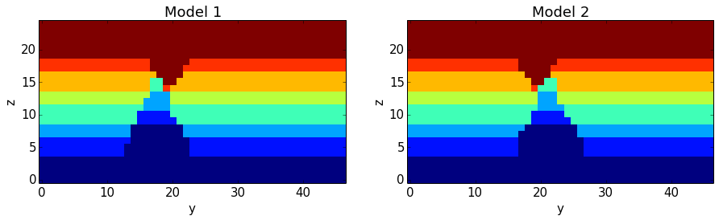

Geological events in pynoddy: organisation and adpatiation
==========================================================

We will here describe how the single geological events of a Noddy
history are organised within pynoddy. We will then evaluate in some more
detail how aspects of events can be adapted and their effect evaluated.

Loading events from a Noddy history
-----------------------------------

In the current set-up of pynoddy, we always start with a pre-defined
Noddy history loaded from a file, and then change aspects of the history
and the single events. The first step is therefore to load the history
file and to extract the single geological events. This is done
automatically as default when loading the history file into the History
object:

.. code:: python

    import sys, os
    import matplotlib.pyplot as plt
    # adjust some settings for matplotlib
    from matplotlib import rcParams
    # print rcParams
    rcParams['font.size'] = 15
    # determine path of repository to set paths corretly below
    # os.chdir(r'/Users/flow/git/pynoddy/docs/notebooks/')# some basic module imports
    repo_path = os.path.realpath('../..')
    
    import pynoddy
.. code:: python

    # Change to sandbox directory to store results
    os.chdir(os.path.join(repo_path, 'sandbox'))
    
    # Path to exmaple directory in this repository
    example_directory = os.path.join(repo_path,'examples')
    # Compute noddy model for history file
    history_file = 'simple_two_faults.his'
    history = os.path.join(example_directory, history_file)
    output_name = 'noddy_out'
    reload(pynoddy.history)
    H1 = pynoddy.history.NoddyHistory(history)

.. parsed-literal::

    8

Events are stored in the object dictionary "events" (who would have
thought), where the key corresponds to the position in the timeline:

.. code:: python

    H1.events

.. parsed-literal::

    {1: <pynoddy.events.Stratigraphy instance at 0x10fc90680>,
     2: <pynoddy.events.Fault instance at 0x10fc90098>,
     3: <pynoddy.events.Fault instance at 0x10fc906c8>}

We can see here that three events are defined in the history. Events are
organised as objects themselves, containing all the relevant properties
and information about the events. For example, the second fault event is
defined as:

.. code:: python

    H1.events[3].properties

.. parsed-literal::

    {'Amplitude': 2000.0,
     'Blue': 0.0,
     'Color Name': 'Custom Colour 5',
     'Cyl Index': 0.0,
     'Dip': 60.0,
     'Dip Direction': 270.0,
     'Event #3': 'FAULT',
     'Geometry': 'Translation',
     'Green': 0.0,
     'Movement': 'Hanging Wall',
     'Pitch': 90.0,
     'Profile Pitch': 90.0,
     'Radius': 1000.0,
     'Red': 254.0,
     'Rotation': 30.0,
     'Slip': 1000.0,
     'X': 5500.0,
     'XAxis': 2000.0,
     'Y': 7000.0,
     'YAxis': 2000.0,
     'Z': 5000.0,
     'ZAxis': 2000.0}

Changing aspects of geological events
-------------------------------------

So what we now want to do, of course, is to change aspects of these
events and to evaluate the effect on the resulting geological model.

Changes can be performed directly on the level of the Fault.properties
dictionary:

.. code:: python

    # get the original dip of the fault
    dip_ori = H1.events[3].properties['Dip']
    # add 10 degrees to dip
    dip_new = dip_ori + 10
    # and assign back to properties dictionary:
    H1.events[3].properties['Dip'] = dip_new
What is left now is to write the model back to a new history file, to
recompute the model, and then visualise the output, as before, to
compare the results:

.. code:: python

    H1.write_history(new_history)
    pynoddy.compute_model(new_history, new_output)
.. code:: python

    H1.all_events_end

.. parsed-literal::

    761

.. code:: python

    n_lines = 0
    for ev in H1.events.values:
        ev.

::

      File "<ipython-input-96-da469714939a>", line 3
        ev.
           ^
    SyntaxError: invalid syntax

.. code:: python

    print H1.history_lines[H1.all_events_begin]
    print H1.history_lines[H1.all_events_end]

.. parsed-literal::

    Event #1	= STRATIGRAPHY
    
    	Name	= Fault1
    

.. code:: python

    a = [2,3]
    b = [4,5]
    c = []
    c.append([a1 for a1 in a])
    c.append(b[:])
    c

.. parsed-literal::

    [[2, 3], [4, 5]]

.. code:: python

    a.pop()

.. parsed-literal::

    3

Changing the order of geological events
---------------------------------------

The geological history is parameterised as single events in a timeline.
Changing the order of events can be performed with two basic methods:

1. Swapping two events with a simple command
2. Adjusting the entire timeline with a complete remapping of events

The first method is probably the most useful to test how a simple change
in the order of events will effect the final geological model. We will
use it here with our example to test how the model would change if the
timing of the faults is swapped.

The method to swap two geological events is defined on the level of the
history object:

.. code:: python

    reload(pynoddy.history)
    reload(pynoddy.events)
    H1 = pynoddy.history.NoddyHistory(history)

.. parsed-literal::

    8

.. code:: python

    # The names of the two fault events defined in the history file are:
    print H1.events[2].name
    print H1.events[3].name
    print H1.events[2].event_lines[-4:]
    print H1.events[3].event_lines[-4:]

.. parsed-literal::

    Fault1
    Fault2
    ['\tSurface XDim\t= 0.000000\r\n', '\tSurface YDim\t= 0.000000\r\n', '\tSurface ZDim\t= 0.000000\r\n', '\tName\t= Fault1\r\n']
    ['\tSurface XDim\t= 0.000000\r\n', '\tSurface YDim\t= 0.000000\r\n', '\tSurface ZDim\t= 0.000000\r\n', '\tName\t= Fault2\r\n']

.. code:: python

    # Now: swap the events:
    H1.swap_events(2,3)
.. code:: python

    # And let's check if this is correctly relfected in the events order now:
    print H1.events[2].name
    print H1.events[3].name
    print H1.events[2].event_lines[-4:]
    print H1.events[3].event_lines[-4:]

.. parsed-literal::

    Fault1
    Fault2
    ['\tSurface XDim\t= 0.000000\r\n', '\tSurface YDim\t= 0.000000\r\n', '\tSurface ZDim\t= 0.000000\r\n', '\tName\t= Fault1\r\n']
    ['\tSurface XDim\t= 0.000000\r\n', '\tSurface YDim\t= 0.000000\r\n', '\tSurface ZDim\t= 0.000000\r\n', '\tName\t= Fault2\r\n']

Now let's create a new history file and evaluate the effect of the
changed order in a cross section view:

.. code:: python

    new_history = "faults_changed_order.his"
    new_output = "faults_out"
    H1.write_history(new_history)
    pynoddy.compute_model(new_history, new_output)
.. code:: python

    # Load and compare both models
    NO2 = pynoddy.NoddyOutput(output_name)
    NO2 = pynoddy.NoddyOutput(new_output)
    # create basic figure layout
    fig = plt.figure(figsize = (15,5))
    ax1 = fig.add_subplot(121)
    ax2 = fig.add_subplot(122)
    NO1.plot_section('x', ax = ax1, colorbar=False, title="Model 1")
    NO2.plot_section('x', ax = ax2, colorbar=False, title="Model 2")
    
    plt.show()

.. code:: python

    
.. code:: python

    
.. code:: python

    
.. code:: python

    
.. code:: python

    