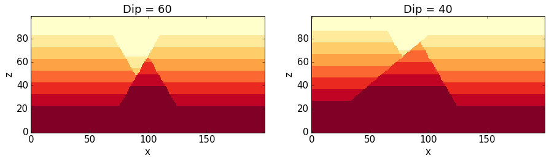

Sensitivity Analysis
====================

Test here: (local) sensitivity analysis of kinematic parameters with
respect to a defined objective function. Aim: test how sensitivity the
resulting model is to uncertainties in kinematic parameters to:

1. Evaluate which the most important parameters are, and to
2. Determine which parameters could, in principle, be inverted with
   suitable information.

Theory: local sensitivity analysis
----------------------------------

Basic considerations:

-  parameter vector :math:`\vec{p}`
-  residual vector :math:`\vec{r}`
-  calculated values at observation points :math:`\vec{z}`
-  Jacobian matrix
   :math:`J_{ij} = \frac{\partial \vec{z}}{\partial \vec{p}}`

Numerical estimation of Jacobian matrix with central difference scheme
(see Finsterle):

.. math:: J_{ij} = \frac{\partial z_i}{\partial p_j} \approx \frac{z_i(\vec{p}; p_j + \delta p_j) - z_i(\vec{p};p_j - \delta p_j)}{2 \delta p_j}

where :math:`\delta p_j` is a small perturbation of parameter :math:`j`,
often as a fraction of the value.

Defining the responses
----------------------

A meaningful sensitivity analysis obviously depends on the definition of
a suitable response vector :math:`\vec{z}`. Ideally, these responses are
related to actual observations. In our case, we first want to determine
how sensitive a kinematic structural geological model is with respect to
uncertainties in the kinematic parameters. We therefore need
calculatable measures that describe variations of the model.

As a first-order assumption, we will use a notation of a stratigraphic
distance for discrete subsections of the model, for example in single
voxets for the calculated model. We define distance :math:`d` of a
subset :math:`\omega` as the (discrete) difference between the
(discrete) stratigraphic value of an ideal model, :math:`\hat{s}`, to
the value of a model realisation :math:`s_i`:

.. math:: d(\omega) = \hat{s} - s_i

In the first example, we will consider only one response: the overall
sum of stratigraphic distances for a model realisation :math:`r` of all
subsets (= voxets, in the practical sense), scaled by the number of
subsets (for a subsequent comparison of model discretisations):

.. math:: D_r = \frac{1}{n} \sum_{i=1}^n d(\omega_i)

Note: mistake before: not considering distances at single nodes but only
the sum - this lead to "zero-difference" for simple translation! Now:
consider more realistic objective function, squared distance:

.. math:: r = \sqrt{\sum_i (z_{i calc} - z_{i ref})^2}

.. code:: python

    from IPython.core.display import HTML
    css_file = 'pynoddy.css'
    HTML(open(css_file, "r").read())

.. raw:: html

   

.. code:: python

    %matplotlib inline

Setting up the base model
-------------------------

For a first test: use simple two-fault model from paper

.. code:: python

    import sys, os
    import matplotlib.pyplot as plt
    import numpy as np
    # adjust some settings for matplotlib
    from matplotlib import rcParams
    # print rcParams
    rcParams['font.size'] = 15
    # determine path of repository to set paths corretly below
    repo_path = os.path.realpath('../..')
    import pynoddy.history
    import pynoddy.events
    import pynoddy.output

.. code:: python

    reload(pynoddy.history)
    reload(pynoddy.events)
    nm = pynoddy.history.NoddyHistory()
    # add stratigraphy
    strati_options = {'num_layers' : 8,
                      'layer_names' : ['layer 1', 'layer 2', 'layer 3', 'layer 4', 'layer 5', 'layer 6', 'layer 7', 'layer 8'],
                      'layer_thickness' : [1500, 500, 500, 500, 500, 500, 500, 500]}
    nm.add_event('stratigraphy', strati_options )

    # The following options define the fault geometry:
    fault_options = {'name' : 'Fault_W',
                     'pos' : (4000, 3500, 5000),
                     'dip_dir' : 90,
                     'dip' : 60,
                     'slip' : 1000}

    nm.add_event('fault', fault_options)
    # The following options define the fault geometry:
    fault_options = {'name' : 'Fault_E',
                     'pos' : (6000, 3500, 5000),
                     'dip_dir' : 270,
                     'dip' : 60,
                     'slip' : 1000}

    nm.add_event('fault', fault_options)
    history = "two_faults_sensi.his"
    nm.write_history(history)

.. code:: python

    output_name = "two_faults_sensi_out"
    # Compute the model
    pynoddy.compute_model(history, output_name) 

::

    ''

.. code:: python

    # Plot output
    nout = pynoddy.output.NoddyOutput(output_name)
    nout.plot_section('y', layer_labels = strati_options['layer_names'][::-1], 
                      colorbar = True, title="",
                      savefig = False)

.. figure:: 8-Sensitivity-Analysis_files/8-Sensitivity-Analysis_7_0.png
   :alt: png

   png

Define parameter uncertainties
------------------------------

We will start with a sensitivity analysis for the parameters of the
fault events.

.. code:: python

    H1 = pynoddy.history.NoddyHistory(history)
    # get the original dip of the fault
    dip_ori = H1.events[3].properties['Dip']
    # dip_ori1 = H1.events[2].properties['Dip']
    # add 10 degrees to dip
    add_dip = -20
    dip_new = dip_ori + add_dip
    # dip_new1 = dip_ori1 + add_dip

    # and assign back to properties dictionary:
    H1.events[3].properties['Dip'] = dip_new

.. code:: python

    reload(pynoddy.output)
    new_history = "sensi_test_dip_changed.his"
    new_output = "sensi_test_dip_changed_out"
    H1.write_history(new_history)
    pynoddy.compute_model(new_history, new_output)
    # load output from both models
    NO1 = pynoddy.output.NoddyOutput(output_name)
    NO2 = pynoddy.output.NoddyOutput(new_output)

    # create basic figure layout
    fig = plt.figure(figsize = (15,5))
    ax1 = fig.add_subplot(121)
    ax2 = fig.add_subplot(122)
    NO1.plot_section('y', position=0, ax = ax1, colorbar=False, title="Dip = %.0f" % dip_ori)
    NO2.plot_section('y', position=0, ax = ax2, colorbar=False, title="Dip = %.0f" % dip_new)

    plt.show()

   png

Calculate total stratigraphic distance
--------------------------------------

.. code:: python

    # def determine_strati_diff(NO1, NO2):
    #     """calculate total stratigraphic distance between two models"""
    #     return np.sum(NO1.block - NO2.block) / float(len(NO1.block))

    def determine_strati_diff(NO1, NO2):
        """calculate total stratigraphic distance between two models"""
        return np.sqrt(np.sum((NO1.block - NO2.block)**2)) / float(len(NO1.block))

    diff = determine_strati_diff(NO1, NO2)
    print(diff)

::

    5.56205897128

Function to modify parameters
-----------------------------

Multiple event parameters can be changed directly with the function
``change_event_params``, which takes a dictionarly of events and
parameters with according changes relative to the defined parameters.
Here a brief example:

.. code:: python

    # set parameter changes in dictionary

    changes_fault_1 = {'Dip' : -20}
    changes_fault_2 = {'Dip' : -20}
    param_changes = {2 : changes_fault_1,
                     3 : changes_fault_2}

.. code:: python

    reload(pynoddy.history)
    H2 = pynoddy.history.NoddyHistory(history)
    H2.change_event_params(param_changes)

.. code:: python

    new_history = "param_dict_changes.his"
    new_output = "param_dict_changes_out"
    H2.write_history(new_history)
    pynoddy.compute_model(new_history, new_output)
    # load output from both models
    NO1 = pynoddy.output.NoddyOutput(output_name)
    NO2 = pynoddy.output.NoddyOutput(new_output)

    # create basic figure layout
    fig = plt.figure(figsize = (15,5))
    ax1 = fig.add_subplot(121)
    ax2 = fig.add_subplot(122)
    NO1.plot_section('y', position=0, ax = ax1, colorbar=False, title="Original Model")
    NO2.plot_section('y', position=0, ax = ax2, colorbar=False, title="Changed Model")

    plt.show()

.. figure:: 8-Sensitivity-Analysis_files/8-Sensitivity-Analysis_16_0.png
   :alt: png

   png

Full sensitivity analysis
-------------------------

Perform now a full sensitivity analysis for all defined parameters and
analyse the output matrix. For a better overview, we first create a
function to perform the sensitivity analysis:

.. code:: python

    import copy
    new_history = "sensi_tmp.his"
    new_output = "sensi_out"
    def noddy_sensitivity(history_filename, param_change_vals):
        """Perform noddy sensitivity analysis for a model"""
        param_list = [] # list to store parameters for later analysis
        distances = [] # list to store calcualted distances
        # Step 1:
        # create new parameter list to change model
        for event_id, event_dict in param_change_vals.items(): # iterate over events
            for key, val in event_dict.items(): # iterate over all properties separately
                changes_list = dict()
                changes_list[event_id] = dict()
                param_list.append("event_%d_property_%s" % (event_id, key))
                for i in range(2):
                    # calculate positive and negative values
                    his = pynoddy.history.NoddyHistory(history_filename)
                    if i == 0:
                        changes_list[event_id][key] = val
                        # set changes
                        his.change_event_params(changes_list)
                        # save and calculate model
                        his.write_history(new_history)
                        pynoddy.compute_model(new_history, new_output)
                        # open output and calculate distance
                        NO_tmp = pynoddy.output.NoddyOutput(new_output)
                        dist_pos = determine_strati_diff(NO1, NO_tmp)
                        NO_tmp.plot_section('y', position = 0, colorbar = False, 
                                            title = "Dist: %.2f" % dist_pos,
                                            savefig = True, 
                                            fig_filename = "event_%d_property_%s_val_%d.png" \
                                            % (event_id, key,val))
                    if i == 1:
                        changes_list[event_id][key] = -val
                        his.change_event_params(changes_list)
                        # save and calculate model
                        his.write_history(new_history)
                        pynoddy.compute_model(new_history, new_output)
                        # open output and calculate distance
                        NO_tmp = pynoddy.output.NoddyOutput(new_output)
                        dist_neg = determine_strati_diff(NO1, NO_tmp)
                        NO_tmp.plot_section('y', position=0, colorbar=False, 
                                            title="Dist: %.2f" % dist_neg,
                                            savefig=True, 
                                            fig_filename="event_%d_property_%s_val_%d.png" \
                                            % (event_id, key,val))
                # calculate central difference
                central_diff = (dist_pos + dist_neg) / (2.)
                distances.append(central_diff)
        return param_list, distances

                

As a next step, we define the parameter ranges for the local sensitivity
analysis (i.e. the :math:`\delta p_j` from the theoretical description
above):

.. code:: python

    changes_fault_1 = {'Dip' : 1.5,
                       'Dip Direction' : 10,
                       'Slip': 100.0,
                       'X': 500.0}
    changes_fault_2 = {'Dip' : 1.5,
                       'Dip Direction' : 10,
                       'Slip': 100.0,
                       'X': 500.0}
    param_changes = {2 : changes_fault_1,
                     3 : changes_fault_2}

And now, we perform the local sensitivity analysis:

.. code:: python

    param_list_1, distances = noddy_sensitivity(history, param_changes)

The function passes back a list of the changed parameters and the
calculated distances according to this change. Let's have a look at the
results:

.. code:: python

    for p,d in zip(param_list_1, distances):
        print "%s \t\t %f" % (p, d)

::

    event_2_property_X       2.716228
    event_2_property_Dip         1.410039
    event_2_property_Dip Direction       2.133553
    event_2_property_Slip        1.824993
    event_3_property_X       3.323528
    event_3_property_Dip         1.644589
    event_3_property_Dip Direction       2.606573
    event_3_property_Slip        1.930455

Results of this local sensitivity analysis suggest that the model is
most sensitive to the X-position of the fault, when we evaluate
distances as simple stratigraphic id differences. Here just a bar plot
for better visualisation (feel free to add proper labels):

.. code:: python

    d = np.array([distances])
    fig = plt.figure(figsize=(5,3))
    ax = fig.add_subplot(111)
    ax.bar(np.arange(0.6,len(distances),1.), np.array(distances[:]))

::

    <Container object of 8 artists>

.. figure:: 8-Sensitivity-Analysis_files/8-Sensitivity-Analysis_26_1.png
   :alt: png

   png

The previous experiment showed how ``pynoddy`` can be used for simple
scientific experiments. The sensitivity analysis itself is purely local.
A better way would be to use (more) global sensitivity analysis, for
example using the Morris or Sobol methods. These methods are implemented
in the Python package ``SALib``, and an experimental implementation of
this method into ``pynoddy`` exists, as well (see further notebooks on
repository, note: no guaranteed working, so far!).
