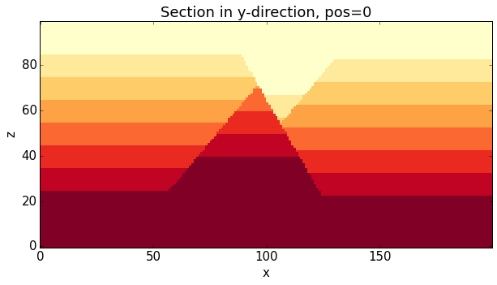

Combined experiments with Noddy experiment class
================================================

.. code:: python

    from IPython.core.display import HTML
    css_file = 'pynoddy.css'
    HTML(open(css_file, "r").read())

.. raw:: html

    <link href='http://fonts.googleapis.com/css?family=Alegreya+Sans:100,300,400,500,700,800,900,100italic,300italic,400italic,500italic,700italic,800italic,900italic' rel='stylesheet' type='text/css'>
    <link href='http://fonts.googleapis.com/css?family=Arvo:400,700,400italic' rel='stylesheet' type='text/css'>
    <link href='http://fonts.googleapis.com/css?family=PT+Mono' rel='stylesheet' type='text/css'>
    <link href='http://fonts.googleapis.com/css?family=Shadows+Into+Light' rel='stylesheet' type='text/css'>
    <link rel="stylesheet" type="text/css" href="http://fonts.googleapis.com/css?family=Tangerine">
    <link href='http://fonts.googleapis.com/css?family=Philosopher:400,700,400italic,700italic' rel='stylesheet' type='text/css'>
    <link href='http://fonts.googleapis.com/css?family=Libre+Baskerville:400,400italic' rel='stylesheet' type='text/css'>
    <link href='http://fonts.googleapis.com/css?family=Lora:400,400italic' rel='stylesheet' type='text/css'>
    <link href='http://fonts.googleapis.com/css?family=Karla:400,400italic' rel='stylesheet' type='text/css'>
    
    

.. code:: python

    %matplotlib inline

.. code:: python

    # settings for figures
    from matplotlib import rc_params, rcParams
    rcParams.update({'font.size': 20})

.. code:: python

    import sys, os
    import matplotlib.pyplot as plt
    # adjust some settings for matplotlib
    from matplotlib import rcParams
    # print rcParams
    rcParams['font.size'] = 15
    # determine path of repository to set paths corretly below
    os.chdir(r'/Users/flow/git/pynoddy/docs/notebooks/')
    repo_path = os.path.realpath('../..')
    import pynoddy.experiment

.. parsed-literal::

    /usr/local/Cellar/python/2.7.9/Frameworks/Python.framework/Versions/2.7/lib/python2.7/site-packages/scipy-0.15.1-py2.7-macosx-10.9-x86_64.egg/scipy/stats/_continuous_distns.py:3959: RuntimeWarning: overflow encountered in exp
      return vonmises_cython.von_mises_cdf(kappa, x)
    /usr/local/Cellar/python/2.7.9/Frameworks/Python.framework/Versions/2.7/lib/python2.7/site-packages/scipy-0.15.1-py2.7-macosx-10.9-x86_64.egg/scipy/stats/_continuous_distns.py:3959: RuntimeWarning: invalid value encountered in divide
      return vonmises_cython.von_mises_cdf(kappa, x)

Experiments combine input and output
------------------------------------

The simplest set-up for an experiment is based on a pre-existing Noddy
history file. The history file can directly be loaded into the
experiment object with the filename passed as keyword argument:

.. code:: python

    reload(pynoddy.experiment)
    
    
    
    his_filename = "../../sandbox/Noddy_Models/Synthetic_Model_1/histories/Synthetic_Model_1.his"
    ex1 = pynoddy.experiment.Experiment(history = his_filename)
    
    

The first notable difference to the standard Noddy way of using history
and output files is that, within the experiment, model computation is
performed "on the fly", whenever required. We can, for example, obtain a
direct visualisation of the model in a cross-section (default is: slice
through centre of model in y-direction, resolution as defined in the
history file cube size):

.. code:: python

    
    ex1.plot_section('y', position = 'center', 
                     resolution = 20, savefig = True, fig_filename = "test.pdf")

.. image:: Examples_Philipp_files/Examples_Philipp_8_0.png

.. code:: python

    ex1.events[2].properties['Wavelength'] = 5000.
    ex1.plot_section('y', position = 'center', 
                     resolution = 20, savefig = True, fig_filename = "test.pdf")
    #ex1.plot_section('y', position = 'center', 
    #                 resolution = 50, savefig = True, fig_filename = "test.pdf", cmap='gray')
    

.. image:: Examples_Philipp_files/Examples_Philipp_9_0.png

.. code:: python

    ex1.export_to_vtk()

.. parsed-literal::

    

The important difference to the previous approach is that the output is
now only generated at the position of the section. Therefore, creating a
section with higher resolution is possible without blowing up computing
time.

As the section is re-computed automatically, we can easily obtain a
section with a higher resolution, passing "resolution" as a keyword:

.. code:: python

    ex1.plot_section(resolution = 200)

.. image:: Examples_Philipp_files/Examples_Philipp_12_0.png

Also, all the required settings and default values are combined from
both input (history) and output files, so the combined approach offers
directly more flexibility and ease of use. One example is that the layer
names for the plot are directly determined from the history file.

Changing properties and directly obtain update of section
---------------------------------------------------------

We can now combine options from input and output more easily, for
example: change properties of an event (e.g. fault dip) and directly
observe the effect in an update section. Let's actually create two plots
side-by-side:

.. code:: python

    reload(pynoddy.experiment)
    
    # Start again with the original model
    his_filename = "two_faults_sensi.his"
    ex1 = pynoddy.experiment.Experiment(history = his_filename)
    
    fig = plt.figure(figsize = (12,6))
    # first, create a figure of the original model section:
    ax1 = fig.add_subplot(121)
    ex1.plot_section(ax = ax1, colorbar = False)
    
    # now, let's change the fault dip of event 2:
    ex1.events[3].properties['Dip'] = 50
    
    # Then, update the plot:
    ax2 = fig.add_subplot(122)
    ex1.plot_section(ax = ax2, colorbar = False)

.. image:: Examples_Philipp_files/Examples_Philipp_15_0.png

**That's it!** A lot easier than using noddy history and output files
separately! Plus: faster computation and less memory requirements as the
model "views" are only created when - and where - they are required!

The functionality to automatically update the model now brings pynoddy a
bit more towards the functionality of the GUI as it is easier to
actually quickly test and update models. However, the main reason for
writing pynoddy was not initially to replace the GUI - but to enable
more flexible (and automatted) experiments!

In the following, we will have a look at some of the new types of
experiments that we can now perform.

The real value of experiment objects: uncertainty simulation and sensitivity studies
------------------------------------------------------------------------------------

The real reason for combining both history and output into one class is
actually to enable a new set of experiments that are not possible with
the GUI itself.

.. code:: python

    reload(pynoddy.experiment)
    
    # Start again with the original model
    his_filename = "two_faults_sensi.his"
    ex1 = pynoddy.experiment.Experiment(history = his_filename)

Random replacement of event order
~~~~~~~~~~~~~~~~~~~~~~~~~~~~~~~~~

One possibility is now to randomly re-shuffle the order of events,
directly with a class method:

.. code:: python

    ex1.shuffle_event_order([2,3])
    ex1.plot_section(colorbar = False)

Define statistics for event parameters
~~~~~~~~~~~~~~~~~~~~~~~~~~~~~~~~~~~~~~

It is now possible to assign parameter statistics to the standard Noddy
event properties (Dip of faults, wavelength of folds, etc.). These
statistics are internally assigned to a parameter statistics dictionary.
One possibility is to define the dictionary explicitly:

.. code:: python

    reload(pynoddy.experiment)
    # Start again with the original model
    his_filename = "two_faults_sensi.his"
    ex1 = pynoddy.experiment.Experiment(history = his_filename)

.. code:: python

    # Initialise dictionary
    param_stats = {}
    
    # Definition of stats dictionary is:
    # param_stats[event_id][parameter_name][stats_type] = value
    
    
    # Define statistics for event 2 (first fault):
    param_stats[2] = {'Dip' : {'min' : 50., 'max' : 70.},
                      'Slip' : {'min' : 500., 'max' : 1500.}}
    
    # and for event 3 (second fault):
    param_stats[3] = {'Dip' : {'min' : 50., 'max' : 70.},
                      'Slip' : {'min' : 500., 'max' : 1500.}}
    
    # Assign to experiment object:
    ex1.set_parameter_statistics(param_stats)

Random model perturbation
~~~~~~~~~~~~~~~~~~~~~~~~~

We can now directly generate a random realisation of the model, in the
range of the assigned model parameters (note: if no distribution is
assigned, then simply a value within the range is chosen, assuming a
uniform distribution):

.. code:: python

    reload(pynoddy.experiment)
    # Start again with the original model
    his_filename = "two_faults_sensi.his"
    ex1 = pynoddy.experiment.Experiment(history = his_filename)
    
    # freeze base model
    ex1.freeze()
    
    # Initialise list
    param_stats = []
    
    # Add one entry as dictionary with relevant properties:
    
    # for event 2:
    param_stats.append({'event' : 2, 'parameter' : 'Dip', 'min' : 50., 'max' : 70., 
                        'type' : 'normal', 'stdev' : 10., 'mean' : 60.})
    param_stats.append({'event' : 2, 'parameter' : 'Slip', 'min' : 500., 'max' : 1500., 
                        'type' : 'normal', 'stdev' : 500, 'mean' : 1000.})
    # for event 3:
    param_stats.append({'event' : 3, 'parameter' : 'Dip', 'min' : 50., 'max' : 70., 
                        'type' : 'normal', 'stdev' : 10., 'mean' : 60.})
    param_stats.append({'event' : 3, 'parameter' : 'Slip', 'min' : 500., 'max' : 1500., 
                        'type' : 'normal', 'stdev' : 500, 'mean' : 1000.})
    
    ex1.set_parameter_statistics(param_stats)

.. code:: python

    ex1.reset_base()
    ex1.random_perturbation()
    ex1.plot_section()

.. image:: Examples_Philipp_files/Examples_Philipp_26_0.png

And here another model perturbation:

.. code:: python

    ex1.random_perturbation()
    ex1.plot_section()

The sampled parameter changes (note: *not* the values, but the relative
changes!) are stored for later analysis:

.. code:: python

    print ex1.random_parameter_changes

Derived experiment classes
--------------------------

The "Experiment" class can be used as a base class to define more
refined and specialised experiments with kinematic models. We will show
here the extension to sensitivity analysis and stochastic uncertainty
simulations.

Stochastic model generation
~~~~~~~~~~~~~~~~~~~~~~~~~~~

Information entropy analysis
~~~~~~~~~~~~~~~~~~~~~~~~~~~~

Sensitivity analysis
~~~~~~~~~~~~~~~~~~~~

.. code:: python

    reload(pynoddy.history)
    reload(pynoddy.experiment)
    # Start again with the original model
    his_filename = "two_faults_sensi.his"
    sa = pynoddy.experiment.SensitivityAnalysis(history = his_filename)

First, we define the parameter statistics in a list for a clear order
(required, for example, for the following sensitivity analysis):

.. code:: python

    # Initialise list
    param_stats = []
    
    # Add one entry as dictionary with relevant properties:
    
    # for event 2:
    param_stats.append({'event' : 2, 'parameter' : 'Dip', 'min' : 50., 'max' : 70., 
                        'type' : 'normal', 'stdev' : 10., 'mean' : 60.})
    param_stats.append({'event' : 2, 'parameter' : 'Slip', 'min' : 500., 'max' : 1500., 
                        'type' : 'normal', 'stdev' : 500, 'mean' : 1000.})
    # for event 3:
    param_stats.append({'event' : 3, 'parameter' : 'Dip', 'min' : 50., 'max' : 70., 
                        'type' : 'normal', 'stdev' : 10., 'mean' : 60.})
    param_stats.append({'event' : 3, 'parameter' : 'Slip', 'min' : 500., 'max' : 1500., 
                        'type' : 'normal', 'stdev' : 500, 'mean' : 1000.})
    
    sa.set_parameter_statistics(param_stats)

For the distance calculate, we first define sampling lines along which
the distance to the original model is then calculated.

.. code:: python

    sa.add_sampling_line(5000, 3500, label = 'centre')
    sa.add_sampling_line(2500, 3500, label = 'left')
    sa.add_sampling_line(7500, 3500, label = 'right')

.. code:: python

    sa.sampling_lines.values()

We now "freeze" the current state of the model as the base state to
which compare the following realisations to (i.e. to calculate the
distances). We basically create a copy of the events and store it in a
class variable (self.base\_events):

.. code:: python

    sa.freeze()

As a next step, we export the model realisation for the base model along
the sampling lines (it is here possible to define a sampling
resolution):

.. code:: python

    resolution = 10
    sa.random_perturbation()
    current_model = sa.get_model_lines(resolution = resolution, model_type = 'current')

.. code:: python

    plt.plot(current_model, '-')
    sa.get_model_lines(resolution = resolution, model_type = 'base')
    plt.plot(sa.base_model_lines, 'k--', lw=2)

We can now define a penalty/ objective/ distance function for the model
values along those lines. Several reasonable choices are possible and,
as always, the choice depends on the experimental question.

The standard distance (L1 of stratigraphic difference) is obtained with
the "distance()" method:

.. code:: python

    sa.random_draw()
    sa.distance()

.. code:: python

    sa.plot_section()

Let's have a look at a couple of realisations to see if the distance
makes sense. Recall that the distance is only calculated along three
vertical line in the model (i.e. our virtual "drillholes") - and does
not represent an actual distance for the entire section! We plot the
position of the "drillholes" for comparison:

.. code:: python

    fig = plt.figure(figsize = (10,16))
    ax = fig.add_subplot(5,2,1)
    
    sa.reset_base()
    
    # plot base model
    sa.plot_section(ax = ax, model_type = 'base', title = 'Base model', colorbar = False)
    
    ax.plot([25,25], [0,50], 'k--')
    ax.plot([50,50], [0,50], 'k--')
    ax.plot([75,75], [0,50], 'k--')
    
    ax.set_xlim([0,100])
    ax.set_ylim([0,50])
    
    # set random seed for comparison
    # np.random.seed(12345)
    
    for i in range(9):
        ax = fig.add_subplot(5,2,i+2)
        sa.random_draw()
        distance = sa.distance()
        sa.plot_section(ax = ax, title = 'Distance = %.2f' % distance, colorbar = False)
        ax.plot([25,25], [0,50], 'k--')
        ax.plot([50,50], [0,50], 'k--')
        ax.plot([75,75], [0,50], 'k--')
    
        ax.set_xlim([0,100])
        ax.set_ylim([0,50])    

