Uncertainty analysis of a 2-D slice model
=========================================

Possible paper titles:

Posterior analysis of geological models/ geophysical inversions? with
information theory

...with measures from information theory

...with information theoretic measures

...with information measures

...with information

Ensemble analysis...

Posterior and ensemble analysis...

(Note: reference to posterior analysis, e.g. in Tarantola paper!)

Include:

-  Analysis of pynoddy models:

   -  simple example of graben (because the uncertainty reduction is so
      counter-intuitive),
   -  and maybe more complex example of folding structure?

-  Analysis of object modelling results? (i.e. the typical "Stanford
   channels"? but: only two outcomes, so not so meaningful... better
   example?)
-  Analysis of posterior ensemble from geophysical inversion (Greenstone
   model? Other examples from Mark & Mark?)

Journal? Math. Geo? Tectonophysics (note: relevance to strucural
geological models!)

Include theory: error bounds on information measures!

.. code:: python

    from IPython.core.display import HTML
    css_file = 'pynoddy.css'
    HTML(open(css_file, "r").read())

.. raw:: html

    <link href='http://fonts.googleapis.com/css?family=Alegreya+Sans:100,300,400,500,700,800,900,100italic,300italic,400italic,500italic,700italic,800italic,900italic' rel='stylesheet' type='text/css'>
    <link href='http://fonts.googleapis.com/css?family=Arvo:400,700,400italic' rel='stylesheet' type='text/css'>
    <link href='http://fonts.googleapis.com/css?family=PT+Mono' rel='stylesheet' type='text/css'>
    <link href='http://fonts.googleapis.com/css?family=Shadows+Into+Light' rel='stylesheet' type='text/css'>
    <link rel="stylesheet" type="text/css" href="http://fonts.googleapis.com/css?family=Tangerine">
    <link href='http://fonts.googleapis.com/css?family=Philosopher:400,700,400italic,700italic' rel='stylesheet' type='text/css'>
    <link href='http://fonts.googleapis.com/css?family=Libre+Baskerville:400,400italic' rel='stylesheet' type='text/css'>
    <link href='http://fonts.googleapis.com/css?family=Lora:400,400italic' rel='stylesheet' type='text/css'>
    <link href='http://fonts.googleapis.com/css?family=Karla:400,400italic' rel='stylesheet' type='text/css'>
    
    

.. code:: python

    %matplotlib inline

.. code:: python

    # here the usual imports. If any of the imports fails, 
    # make sure that pynoddy is installed
    # properly, ideally with 'python setup.py develop' 
    # or 'python setup.py install'
    import sys, os
    import matplotlib.pyplot as plt
    import numpy as np
    # adjust some settings for matplotlib
    from matplotlib import rcParams
    # print rcParams
    rcParams['font.size'] = 15
    # determine path of repository to set paths corretly below
    repo_path = os.path.realpath('../..')
    import pynoddy
    reload(pynoddy)
    import pynoddy.history
    import pynoddy.experiment
    reload(pynoddy.experiment)
    rcParams.update({'font.size': 15})

Model set-up
------------

Subsequently, we will use a model from the "Atlas of Structural
Geophysics" as an example model.

.. code:: python

    from pynoddy.experiment import monte_carlo
    model_url = 'http://tectonique.net/asg/ch3/ch3_7/his/typeb.his'
    ue = pynoddy.experiment.Experiment(url = model_url)

.. code:: python

    ue.change_cube_size(100)
    sec = ue.get_section('y')

BUG!!!!
-------

Note: there is either a bug in pynoddy or in Noddy itself: but the slice
plotting method fails: actually, not a slice is computed but the entire
model (and the extent is also not correct!). Check with Mark in course
of paper prep!

.. code:: python

    sec.block.shape

.. parsed-literal::

    (100, 100, 40)

.. code:: python

    ue.plot_section('y')

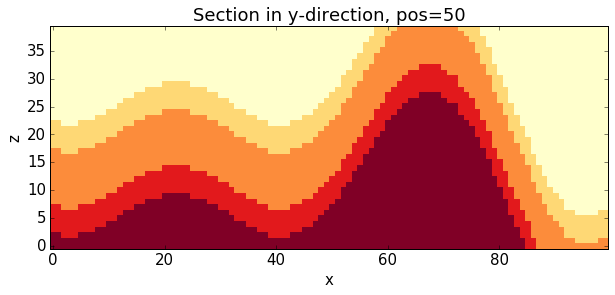

.. code:: python

    plt.imshow(sec.block[:,50,:].transpose(), origin = 'lower left', interpolation = 'none')

.. parsed-literal::

    <matplotlib.image.AxesImage at 0x10def2c50>

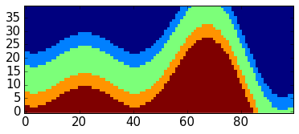

.. code:: python

    tmp = sec.block[:,50,:]
    tmp.shape

.. parsed-literal::

    (100, 40)

.. code:: python

    ue.set_random_seed(12345)

.. code:: python

    ue.info(events_only = True)

.. parsed-literal::

    This model consists of 3 events:
    	(1) - STRATIGRAPHY
    	(2) - FOLD
    	(3) - FOLD
    

We now define the parameter uncertainties:

.. code:: python

    param_stats = [{'event' : 2, 
                  'parameter': 'Amplitude',
                  'stdev': 100.0,
                  'type': 'normal'},
                  {'event' : 2, 
                  'parameter': 'Wavelength',
                  'stdev': 500.0,
                  'type': 'normal'},
                  {'event' : 2, 
                  'parameter': 'X',
                  'stdev': 500.0,
                  'type': 'normal'}]
    
    ue.set_parameter_statistics(param_stats)

And, in a next step, perform the model sampling:

.. code:: python

    ue.set_random_seed(112358)
    # perfrom random sampling
    resolution = 100
    sec = ue.get_section('y')
    
    tmp = sec.block[:,50,:]
    n_draws = 5000
    model_sections = np.empty((n_draws, tmp.shape[0], tmp.shape[1]))
    
    for i in range(n_draws):
        ue.random_draw()
        tmp_sec = ue.get_section('y', resolution = resolution, 
                                 remove_tmp_files = True)
        model_sections[i,:,:] = tmp_sec.block[:,50,:]

Save the model data for later re-use (e.g. to extend the data set):

.. code:: python

    import pickle

.. code:: python

    f_out = open("model_sections_5k.pkl", 'w')

.. code:: python

    pickle.dump(model_sections, f_out)

Calculation of cell information entropy
---------------------------------------

(Include note on: theory of entropy calculation)

(Include in this paper: estimates on error bounds?)

Here now the function to calculate entropy from a data array in general.
What we will need to do later is to pass all results at a single
position as a "data array" and we can then estimate the information
entropy at this position.

This function already expects a sorted array as an input and then uses
the (ultra-fast) switchpoint method to calculate entropy:

.. code:: python

    def entropy(diff_array, n_samples):
        """Determine entropy from diffarray using switchpoints"""
        switchpts = np.where(diff_array > 0 )[0] + 1
        switchpts = np.append(0, switchpts)
        switchpts = np.append(switchpts, n_samples)
        pdiff = np.diff(switchpts)
        j_prob = pdiff / float(n_samples)
        # calculate entropy
        h = 0.
        for jp in j_prob:
            h -= jp * np.log2(jp)
        return h

The algorithm works on the simple idea that we do not explicitly require
the single outputs at each location, but only the relative probability
values. This may not matter too much for single entropy estimates
(uni-variate), but it will matter a lot for multivariate cases, because
we do not need to check all possible outcomes! Note that all outcomes
with zero probability are simply not considered in the sorting algorithm
(and they do not play any role in the calculation of the entropy,
anyway), and that's exactly what we want to have!

.. code:: python

    # sort data (axis = 0: sort along model results!)
    mssort = np.sort(model_sections, axis = 0)
    # create difference matrix
    mssort_diff = mssort[1:,:,:] - mssort[:-1,:,:]
    
    n_samples = model_sections.shape[0]
    # and now: for all!
    h = np.empty_like(mssub[0,:,:])
    for i in range(100):
        for j in range(40):
            h[i,j] = entropy(mssort_diff[:,i,j], n_samples)
    h[50,30]

.. parsed-literal::

    1.5373957598393617

We now visualise the cell information entropy, shown in Fig. (). We can
here clearly identify uncertain regions within this model section. It is
interesting to note that we can mostly still identify the distinct layer
boundaries in the fuzzy areas of uncertainty around their borders (note:
highlight in Figure!). However, additional aspects of uncertainty are
now introduced: (a) the uncertainty about the x-position of the folds
(see parameters: event 2, parameter x) is now clearly visible, and (b)
uncertianties now seem to concentrate on the fold hinges. However, this
is not so clear in the left part of the model, where the fold hing seems
to be the least uncertain part. (check why: is this where the fold is
actually fixed (even though still uncertain). My current interpretation:
the fold location is fixed somewhere near this point, and so the
wavelength uncertainty does not play a significant role. Furthermore,
the fold is quite "open" at this position (i.e.: low angle between
hinges) and therefore lateral shifts do not play a significant role.

.. code:: python

    plt.imshow(h.transpose(), origin = 'lower left',
              cmap = 'gray', interpolation = 'none')
    plt.colorbar(orientation = 'horizontal')

.. parsed-literal::

    <matplotlib.colorbar.Colorbar at 0x113628090>

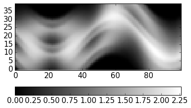

Here again an example of single models (adjust to visualise and probably
include something like a "table plot" of multiple images for a paper!):

.. code:: python

    plt.imshow(mssub[70,:,:].transpose(), origin = 'lower left', interpolation = 'none')

.. parsed-literal::

    <matplotlib.image.AxesImage at 0x10e9edcd0>

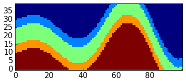

And here the "mean" lithologies (note: not really a distinct meaning,
simply showing the average litho ids - could be somehow interpreted as
characteristic functions, though...).

.. code:: python

    plt.imshow(np.mean(mssub, axis = 0).transpose(), origin = 'lower left', interpolation = 'none')

.. parsed-literal::

    <matplotlib.image.AxesImage at 0x10f127990>

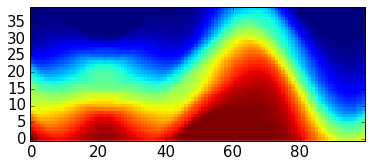

And here a bit more meaningful: the analysis of single layer
probabilities:

.. code:: python

    # step 1: estimate probabilities (note: unfortunate workaround with ones multiplication,
    # there may be a better way, but this is somehow a recurring problem of implicit
    # array flattening in numpy)
    litho_id = 4
    prob = np.sum(np.ones_like(mssub) * (mssub == litho_id), axis = 0) / float(n_samples)

.. code:: python

    plt.imshow(prob.transpose(), 
               origin = 'lower left', 
               interpolation = 'none', 
               cmap = 'gray_r')
    plt.colorbar(orientation = 'horizontal')

.. parsed-literal::

    <matplotlib.colorbar.Colorbar at 0x1127bad10>

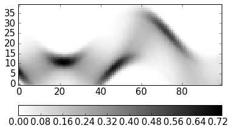

Idea: also include a "new" consideration: where to collect information
to reduce uncertainty of a single layer? Could be identified by reducing
layer fuzziness, for example!

Or: what are most likely positions/ locations of a specific unit, given
collected information?

Analysis of multivariate condtional entropy
-------------------------------------------

Later also:

-  "opposite" question, i.e.: if we would like to resolve uncertainty in
   a specific region: where to look best?
-  "complete" uncertainty (i.e.: joint entropy!)
-  greedy search for best spots for uncertainty reduction, simple
   (cell-wise), complex (related to potential drilling positions)
-  further ideas for "greedy search" to reduce uncertainties in a
   specific "search region" (i.e.: expected location of a deposit,
   etc.):

   -  start with cell with highest (multivariate) mutual information
   -  rank cells with highest I due to their own mutual information with
      other cells, which are not part of a defined "search region"

-  for simple, cell-wise: describe similarity to mapping! Maybe even a
   field example with data from Belgium? But this is still one or two
   MSc theses away...)

For the joint entropy analysis, we now use the new lexicographic
(correct term?) sorting algorithm, implemented in the module hspace:

.. code:: python

    sys.path.append("/Users/flow/git/mutual_information/")

.. code:: python

    import hspace
    reload(hspace)

.. parsed-literal::

    <module 'hspace' from '/Users/flow/git/mutual_information/hspace.py'>

Problem now: in hspace module, a single location information is
required. Try to adapt?

.. code:: python

    locs = np.array([1,2,3])
    locs.shape

.. parsed-literal::

    (3,)

.. code:: python

    locs = np.array([[1,1],[1,2],[1,3]])
    locs.shape

.. parsed-literal::

    (3, 2)

.. code:: python

    models_sub = model_sections[:10,:,:]

.. code:: python

    joint_units = []
    for entry in models_sub:
        joint_val = ""
        for i, loc in enumerate(locs):
            joint_val += "%d" % entry[loc[0], loc[1]]
        joint_units.append(joint_val)
    print joint_units

.. parsed-literal::

    ['555', '555', '544', '554', '444', '444', '555', '544', '555', '555']

.. code:: python

    hspace.joint_entropy(model_sections, locs, n_samples)

.. parsed-literal::

    1.7990750648942482

.. code:: python

    # now: define position of "drill":
    n = 10
    drill_i = [60] * n
    drill_j = range(39,39-n,-1)
    drill_locs = zip(drill_i, drill_j)

.. code:: python

    # determine joint entropy of drill_locs:
    h_joint_drill = hspace.joint_entropy(model_sections, drill_locs, n_samples)

.. code:: python

    # check with arbitrary additional position:
    locs = drill_locs + [[50, 20]]
    print locs
    h_joint_loc = hspace.joint_entropy(model_sections, locs, n_samples)
    print h_joint_drill
    print h_joint_loc
    print h_joint_loc - h_joint_drill
    print h[50,30]

.. parsed-literal::

    [(60, 39), (60, 38), (60, 37), (60, 36), (60, 35), (60, 34), (60, 33), (60, 32), (60, 31), (60, 30), [50, 20]]
    4.70788509644
    5.20006290337
    0.492177806936
    1.53739575984

.. code:: python

    # Determine max value of initital entropies for colorbar scaling
    h_max = np.max(h)
    print h_max
    n_max = int(np.ceil(2 ** h_max))
    print n_max
    print np.log2(n_max)

.. parsed-literal::

    2.26920150856
    5
    2.32192809489

.. code:: python

    pwd

.. parsed-literal::

    u'/Users/flow/git/pynoddy/docs/notebooks'

.. code:: python

    # Import Viridis colorscale
    import colormaps as cmaps
    plt.register_cmap(name='viridis', cmap=cmaps.viridis)
    plt.register_cmap(name='magma', cmap=cmaps.magma)
    plt.set_cmap(cmaps.viridis)

.. parsed-literal::

    <matplotlib.figure.Figure at 0x112cc5d90>

Try own "entropy colormap":

.. code:: python

    # generate conditional entropies for entire section:
    h_cond_drill = np.zeros_like(h)
    for i in range(100):
        for j in range(40):
            # add position to locations
            locs = drill_locs + [[i,j]]
            # determine joint entropy
            h_joint_loc = hspace.joint_entropy(model_sections, locs, n_samples)
            # subtract joint entropy of drill locs to obtain conditional entropy
            h_cond_drill[i,j] = h_joint_loc - h_joint_drill

.. code:: python

    import simple_2D_example
    from simple_2D_example import entropy_colormap
    reload(simple_2D_example)

.. parsed-literal::

    <module 'simple_2D_example' from '/Users/flow/git/mutual_information/simple_2D_example.py'>

.. code:: python

    ecmap = simple_2D_example.entropy_colormap(h_max);

.. parsed-literal::

    1.0 5 0.0
    2.0 5 0.430676558073
    3.0 5 0.682606194486
    4.0 5 0.861353116147
    5.0 5 1.0

.. code:: python

    plt.imshow(h_cond_drill.transpose(), origin = 'lower left',
              cmap = 'viridis', interpolation = 'none', vmax=np.log2(n_max+0.02))
    plt.colorbar(orientation = 'horizontal')
    # half-step contour lines
    contour_levels = np.log2(np.arange(1., n_max + 0.001, .5))
    plt.contour(h_cond_drill.transpose(), contour_levels, colors = 'gray')
    # superpose 1-step contour lines
    contour_levels = np.log2(np.arange(1., n_max + 0.001, 1.))
    plt.contour(h_cond_drill.transpose(), contour_levels, colors = 'white')
    
    plt.plot(dp[0], dp[1], 'ws')
    plt.xlim([0,99])
    plt.ylim([0,39])

.. parsed-literal::

    (0, 39)

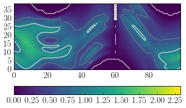

For comparison again: the entropy of the initial model:

.. code:: python

    plt.imshow(h.transpose(), origin = 'lower left',
              cmap = 'viridis', interpolation = 'none', vmax=np.log2(n_max+0.02))
    plt.colorbar(orientation = 'horizontal')
    # half-step contour lines
    contour_levels = np.log2(np.arange(1., n_max + 0.001, .5))
    plt.contour(h.transpose(), contour_levels, colors = 'gray')
    # superpose 1-step contour lines
    contour_levels = np.log2(np.arange(1., n_max + 0.001, 1.))
    plt.contour(h.transpose(), contour_levels, colors = 'white')
    

.. parsed-literal::

    <matplotlib.contour.QuadContourSet at 0x129a44810>

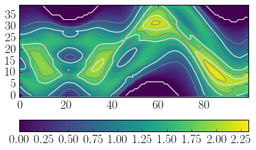

And the difference, for clarity:

.. code:: python

    plt.imshow((h - h_cond_drill).transpose(), origin = 'lower left',
              cmap = 'viridis', interpolation = 'none')
    plt.colorbar(orientation = 'horizontal')
    # plot drilling positions above it:
    dp = np.array(drill_locs).transpose()
    plt.plot(dp[0], dp[1], 'ws')
    plt.xlim([0,99])
    plt.ylim([0,39])

.. parsed-literal::

    (0, 39)

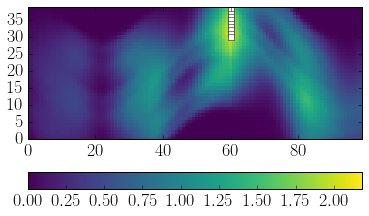

Clearly, the highset reduction is in the area around the borehole, but
interestingly, the uncertianty in other areas is also reduced! Note
specifically the reduction of uncertainties in the two neighbouring fold
hinges.

Let's check some other positions (and drilling "depths"):

.. code:: python

    # define position of "drill":
    n = 10
    drill_i = [20] * n
    drill_j = range(39,39-n,-1)
    drill_locs = zip(drill_i, drill_j)
    # determine joint entropy of drill_locs:
    h_joint_drill = hspace.joint_entropy(model_sections, drill_locs, n_samples)

We also just include one timing step to estimate the approximate
simualtion time:

.. code:: python

    %%timeit
    locs = drill_locs + [[50,20]]
    h_joint_loc = hspace.joint_entropy(model_sections, locs, n_samples)

.. parsed-literal::

    10 loops, best of 3: 47.6 ms per loop

.. code:: python

    # esimated total time:
    ttime = 100 * 40 * 0.0476
    print("Estimated total time: %.3f seconds or %.3f minutes" % (ttime, ttime/60.))

.. parsed-literal::

    Estimated total time: 190.400 seconds or 3.173 minutes

.. code:: python

    # generate conditional entropies for entire section:
    h_cond_drill = np.zeros_like(h)
    for i in range(100):
        for j in range(40):
            # add position to locations
            locs = drill_locs + [[i,j]]
            # determine joint entropy
            h_joint_loc = hspace.joint_entropy(model_sections, locs, n_samples)
            # subtract joint entropy of drill locs to obtain conditional entropy
            h_cond_drill[i,j] = h_joint_loc - h_joint_drill

.. code:: python

    # store results
    f_out = open("h_cond_drill_i20_10.pkl", 'w')
    pickle.dump(h_cond_drill, f_out)
    f_out.close()

.. code:: python

    plt.imshow(h_cond_drill.transpose(), origin = 'lower left',
              cmap = 'gray', interpolation = 'none')
    plt.colorbar(orientation = 'horizontal')
    # plot drilling positions above it:
    dp = np.array(drill_locs).transpose()
    plt.plot(dp[0], dp[1], 'ws')
    plt.xlim([0,100])
    plt.ylim([0,40])

.. parsed-literal::

    (0, 40)

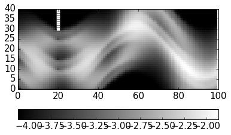

.. code:: python

    plt.imshow((h - h_cond_drill).transpose(), origin = 'lower left',
              cmap = 'RdBu', interpolation = 'none')
    plt.colorbar(orientation = 'horizontal')
    # plot drilling positions above it:
    dp = np.array(drill_locs).transpose()
    plt.plot(dp[0], dp[1], 'ws')
    plt.xlim([0,100])
    plt.ylim([0,40])

.. parsed-literal::

    [<matplotlib.lines.Line2D at 0x12abe2090>]

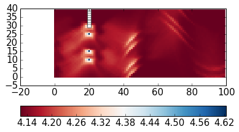

Intersting! Only a local reduction around the drilling position,
however: extending to the deeper layers, as well! Why?

Drill deeper:

.. code:: python

    # define position of "drill":
    n = 30
    drill_i = [20] * n
    drill_j = range(39,39-n,-1)
    drill_locs = zip(drill_i, drill_j)
    # determine joint entropy of drill_locs:
    h_joint_drill = hspace.joint_entropy(model_sections, drill_locs, n_samples)

.. code:: python

    %%timeit
    locs = drill_locs + [[50,20]]
    h_joint_loc = hspace.joint_entropy(model_sections, locs, n_samples)

.. parsed-literal::

    10 loops, best of 3: 130 ms per loop

.. code:: python

    # esimated total time:
    ttime = 100 * 40 * 0.130
    print("Estimated total time: %.3f seconds or %.3f minutes" % (ttime, ttime/60.))

.. parsed-literal::

    Estimated total time: 520.000 seconds or 8.667 minutes

.. code:: python

    # generate conditional entropies for entire section:
    h_cond_drill = np.zeros_like(h)
    for i in range(100):
        for j in range(40):
            # add position to locations
            locs = drill_locs + [[i,j]]
            # determine joint entropy
            h_joint_loc = hspace.joint_entropy(model_sections, locs, n_samples)
            # subtract joint entropy of drill locs to obtain conditional entropy
            h_cond_drill[i,j] = h_joint_loc - h_joint_drill

.. code:: python

    plt.imshow(h_cond_drill.transpose(), origin = 'lower left',
              cmap = 'gray', interpolation = 'none')
    plt.colorbar(orientation = 'horizontal')
    # plot drilling positions above it:
    dp = np.array(drill_locs).transpose()
    plt.plot(dp[0], dp[1], 'ws')
    plt.xlim([0,100])
    plt.ylim([0,40])

.. parsed-literal::

    (0, 40)

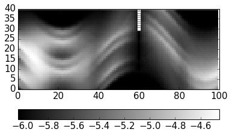

.. code:: python

    plt.imshow(h.transpose(), origin = 'lower left',
              cmap = 'gray', interpolation = 'none')
    plt.colorbar(orientation = 'horizontal')

.. parsed-literal::

    <matplotlib.colorbar.Colorbar at 0x12b2d0fd0>

.. image:: Experiment_entropy_analysis_2D_files/Experiment_entropy_analysis_2D_75_1.png

.. code:: python

    plt.imshow((h - h_cond_drill).transpose(), origin = 'lower left',
              cmap = 'RdBu', interpolation = 'none')
    plt.colorbar(orientation = 'horizontal')
    # plot drilling positions above it:
    dp = np.array(drill_locs).transpose()
    plt.plot(dp[0], dp[1], 'ws')
    plt.xlim([0,100])
    plt.ylim([0,40])

.. parsed-literal::

    (0, 40)

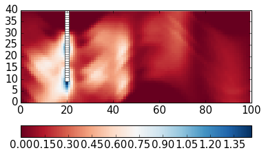

.. code:: python

    # define position of "drill":
    n = 30
    drill_i = [60] * n
    drill_j = range(39,39-n,-1)
    drill_locs = zip(drill_i, drill_j)
    # determine joint entropy of drill_locs:
    h_joint_drill = hspace.joint_entropy(model_sections, drill_locs, n_samples)

.. code:: python

    %%timeit
    locs = drill_locs + [[50,20]]
    h_joint_loc = hspace.joint_entropy(model_sections, locs, n_samples)

.. parsed-literal::

    10 loops, best of 3: 129 ms per loop

.. code:: python

    # generate conditional entropies for entire section:
    h_cond_drill = np.zeros_like(h)
    for i in range(100):
        for j in range(40):
            # add position to locations
            locs = drill_locs + [[i,j]]
            # determine joint entropy
            h_joint_loc = hspace.joint_entropy(model_sections, locs, n_samples)
            # subtract joint entropy of drill locs to obtain conditional entropy
            h_cond_drill[i,j] = h_joint_loc - h_joint_drill

.. code:: python

    plt.imshow(h_cond_drill.transpose(), origin = 'lower left',
              cmap = 'gray', interpolation = 'none')
    plt.colorbar(orientation = 'horizontal')
    # plot drilling positions above it:
    dp = np.array(drill_locs).transpose()
    plt.plot(dp[0], dp[1], 'ws')
    plt.xlim([0,100])
    plt.ylim([0,40])

.. parsed-literal::

    (0, 40)

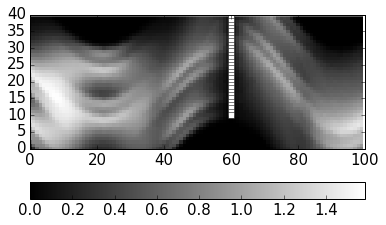

.. code:: python

    plt.imshow((h - h_cond_drill).transpose(), origin = 'lower left',
              cmap = 'RdBu', interpolation = 'none')
    plt.colorbar(orientation = 'horizontal')
    # plot drilling positions above it:
    dp = np.array(drill_locs).transpose()
    plt.plot(dp[0], dp[1], 'ws')
    plt.xlim([0,100])
    plt.ylim([0,40])

.. parsed-literal::

    (0, 40)

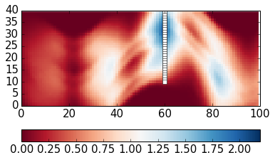

Interesting! And now both combined:

.. code:: python

    # define position of "drill":
    n = 30
    drill_i = [60] * n + [20] * n
    drill_j = range(39,39-n,-1) + range(39,39-n,-1)
    drill_locs = zip(drill_i, drill_j)
    # determine joint entropy of drill_locs:
    h_joint_drill = hspace.joint_entropy(model_sections, drill_locs, n_samples)

.. code:: python

    %%timeit
    locs = drill_locs + [[50,20]]
    h_joint_loc = hspace.joint_entropy(model_sections, locs, n_samples)

.. parsed-literal::

    1 loops, best of 3: 249 ms per loop

.. code:: python

    # generate conditional entropies for entire section:
    h_cond_drill = np.zeros_like(h)
    for i in range(100):
        for j in range(40):
            # add position to locations
            locs = drill_locs + [[i,j]]
            # determine joint entropy
            h_joint_loc = hspace.joint_entropy(model_sections, locs, n_samples)
            # subtract joint entropy of drill locs to obtain conditional entropy
            h_cond_drill[i,j] = h_joint_loc - h_joint_drill

.. code:: python

    plt.imshow(h_cond_drill.transpose(), origin = 'lower left',
              cmap = 'gray', interpolation = 'none')
    plt.colorbar(orientation = 'horizontal')
    # plot drilling positions above it:
    dp = np.array(drill_locs).transpose()
    plt.plot(dp[0], dp[1], 'ws')
    plt.xlim([0,100])
    plt.ylim([0,40])

.. parsed-literal::

    (0, 40)

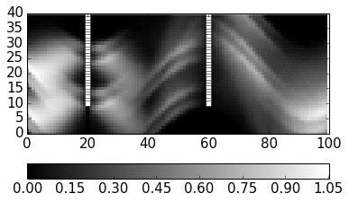

.. code:: python

    plt.imshow((h - h_cond_drill).transpose(), origin = 'lower left',
              cmap = 'RdBu', interpolation = 'none')
    plt.colorbar(orientation = 'horizontal')
    # plot drilling positions above it:
    dp = np.array(drill_locs).transpose()
    plt.plot(dp[0], dp[1], 'ws')
    plt.xlim([0,100])
    plt.ylim([0,40])

.. parsed-literal::

    (0, 40)

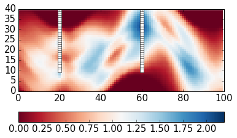

We can see that now only a part on the left remains with significant
uncertainties. So, let's "drill" into this, as well:

.. code:: python

    # define position of "drill":
    n = 30
    drill_i = [60] * n + [20] * n + [5] * n
    drill_j = range(39,39-n,-1) + range(39,39-n,-1) + range(39,39-n,-1)
    drill_locs = zip(drill_i, drill_j)
    # determine joint entropy of drill_locs:
    h_joint_drill = hspace.joint_entropy(model_sections, drill_locs, n_samples)

.. code:: python

    %%timeit
    locs = drill_locs + [[50,20]]
    h_joint_loc = hspace.joint_entropy(model_sections, locs, n_samples)

.. parsed-literal::

    1 loops, best of 3: 375 ms per loop

.. code:: python

    # generate conditional entropies for entire section:
    h_cond_drill = np.zeros_like(h)
    for i in range(100):
        for j in range(40):
            # add position to locations
            locs = drill_locs + [[i,j]]
            # determine joint entropy
            h_joint_loc = hspace.joint_entropy(model_sections, locs, n_samples)
            # subtract joint entropy of drill locs to obtain conditional entropy
            h_cond_drill[i,j] = h_joint_loc - h_joint_drill

.. code:: python

    # store results
    f_out = open("h_cond_drill_i62_20_5_30.pkl", 'w')
    pickle.dump(h_cond_drill, f_out)
    f_out.close()

Additional idea to speed up computation (especially for higher
multivariate examples): do not estimate value at locations where
conditional entropy of subset (i.e.: often previously calculated)!
(Check: theoretical reason/ justification!)

.. code:: python

    plt.imshow(h_cond_drill.transpose(), origin = 'lower left',
              cmap = 'gray', interpolation = 'none')
    plt.colorbar(orientation = 'horizontal')
    # plot drilling positions above it:
    dp = np.array(drill_locs).transpose()
    plt.plot(dp[0], dp[1], 'ws')
    plt.xlim([0,100])
    plt.ylim([0,40])

.. parsed-literal::

    (0, 40)

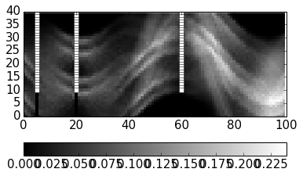

.. code:: python

    plt.imshow((h - h_cond_drill).transpose(), origin = 'lower left',
              cmap = 'RdBu', interpolation = 'none')
    plt.colorbar(orientation = 'horizontal')
    # plot drilling positions above it:
    dp = np.array(drill_locs).transpose()
    plt.plot(dp[0], dp[1], 'ws')
    plt.xlim([0,100])
    plt.ylim([0,40])

.. parsed-literal::

    (0, 40)

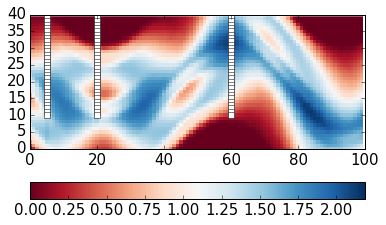

