Analysis of classification results
==================================

Objective: read back in the classification results and compare to
original model

.. code:: python

    from IPython.core.display import HTML
    css_file = 'pynoddy.css'
    HTML(open(css_file, "r").read())

.. raw:: html

    <link href='http://fonts.googleapis.com/css?family=Alegreya+Sans:100,300,400,500,700,800,900,100italic,300italic,400italic,500italic,700italic,800italic,900italic' rel='stylesheet' type='text/css'>
    <link href='http://fonts.googleapis.com/css?family=Arvo:400,700,400italic' rel='stylesheet' type='text/css'>
    <link href='http://fonts.googleapis.com/css?family=PT+Mono' rel='stylesheet' type='text/css'>
    <link href='http://fonts.googleapis.com/css?family=Shadows+Into+Light' rel='stylesheet' type='text/css'>
    <link rel="stylesheet" type="text/css" href="http://fonts.googleapis.com/css?family=Tangerine">
    <link href='http://fonts.googleapis.com/css?family=Philosopher:400,700,400italic,700italic' rel='stylesheet' type='text/css'>
    <link href='http://fonts.googleapis.com/css?family=Libre+Baskerville:400,400italic' rel='stylesheet' type='text/css'>
    <link href='http://fonts.googleapis.com/css?family=Lora:400,400italic' rel='stylesheet' type='text/css'>
    <link href='http://fonts.googleapis.com/css?family=Karla:400,400italic' rel='stylesheet' type='text/css'>
    
    

.. code:: python

    import sys, os
    import matplotlib.pyplot as plt
    # adjust some settings for matplotlib
    from matplotlib import rcParams
    # print rcParams
    rcParams['font.size'] = 15
    # determine path of repository to set paths corretly below
    repo_path = os.path.realpath('../..')
    import pynoddy.history
    import numpy as np

.. code:: python

    %matplotlib inline

Load original model:

.. code:: python

    import pynoddy.output
    reload(pynoddy.output)
    output_name = "feature_out"
    nout = pynoddy.output.NoddyOutput(output_name)

.. code:: python

    nout.plot_section('x', 
                      colorbar = True, title="",
                      savefig = False, fig_filename = "ex01_faults_combined.eps",
                      cmap = 'YlOrRd') # note: YlOrRd colourmap should be suitable for colorblindness!

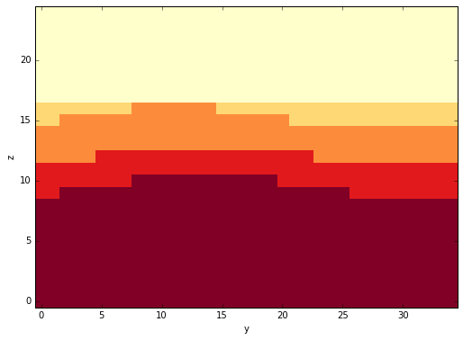

Load sample classification results
----------------------------------

The implemented classification method does not return a single best-fit
model, but an ensemble of probable model (as it is an MCMC sampling from
the posterior). As a first test, we will therefore import single models
first and check the misclassification rate defined as:

.. math:: \mbox{MCR} = \frac{\mbox{Number of misclassified voxels}}{\mbox{Total number of voxels}}

.. code:: python

    f_set1 = open("../../sandbox/jack/features_lowres-5 with class ID.csv").readlines()

.. code:: python

    f_set1[0]

.. parsed-literal::

    'x, y, z, f1, f2, f3,ID\n'

.. code:: python

    # initialise classification results array
    cf1 = np.empty_like(nout.block)

.. code:: python

    # iterate through results and append
    for f in f_set1[1:]:
        fl = f.rstrip().split(",")
        cf1[int(fl[0]),int(fl[1]),int(fl[2])] = int(fl[6])

.. code:: python

    f_set1[2:6]

.. parsed-literal::

    ['1,0,0,1.99307,5.07239,0.93235,2\n',
     '2,0,0,1.80728,5.09784,1.1543,2\n',
     '3,0,0,1.64958,5.04218,1.30599,2\n',
     '4,0,0,1.53292,5.13074,0.91244,2\n']

.. code:: python

    nout.plot_section('x', data = cf1,
                      colorbar = True, title="", layer_labels = range(5),
                      savefig = False, fig_filename = "ex01_faults_combined.eps",
                      cmap = 'YlOrRd') 

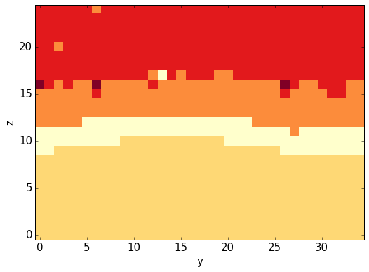

.. code:: python

    # compare to original model:
    fig = plt.figure(figsize = (12,6))
    ax1 = fig.add_subplot(121)
    ax2 = fig.add_subplot(122)
    nout.plot_section('x', ax = ax1, 
                      colorbar = False, title="",
                      savefig = False, fig_filename = "ex01_faults_combined.eps",
                      cmap = 'YlOrRd') # note: YlOrRd colourmap should be suitable for colorblindness!
    nout.plot_section('x', data = cf1,ax = ax2,
                      colorbar = False, title="",
                      savefig = False, fig_filename = "ex01_faults_combined.eps",
                      cmap = 'YlOrRd') 

.. parsed-literal::

    <matplotlib.axes._subplots.AxesSubplot at 0x110f7c550>

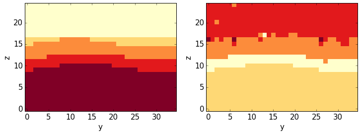

Results of the classification do not necessarily contain the same ids as
the units in the initial model. This seems to be the case here, as well.
Re-sort:

.. code:: python

    fig = plt.figure(figsize = (12,6))
    ax1 = fig.add_subplot(121)
    ax2 = fig.add_subplot(122)
    im1 = ax1.imshow(nout.block[15,:,:].transpose(), 
               interpolation = 'none', cmap = 'YlOrRd', origin = 'lower left')
    plt.colorbar(im1)
    im2 = ax2.imshow(cf1[15,:,:].transpose(), 
               interpolation = 'none', 
               cmap = 'YlOrRd', origin = 'lower left')

.. image:: Feature-Analysis_files/Feature-Analysis_17_0.png

.. code:: python

    print np.unique(nout.block)
    print np.unique(cf1)
    # define id mapping from cluster results to original:
    # id_mapping = {2:1, 3:2, 4:5, 5:3, 1:4}
    # remapping for result 4:
    # id_mapping = {4:5, 3:4, 1:3, 5:2, 2:1}
    # remapping for result 5:
    id_mapping = {2:5, 1:4, 3:3, 5:2, 4:1}

.. parsed-literal::

    [ 1.  2.  3.  4.  5.]
    [ 1.  2.  3.  4.  5.]

Now remap results and compare again:

**Note**: create a vectorised function to enable a direct re-mapping of
the entire array while keeping the structure!

.. code:: python

    def re_map(id_val):
        return id_mapping[id_val]

.. code:: python

    re_map_vect = np.vectorize(re_map)

.. code:: python

    cf1_remap = re_map_vect(cf1)

.. code:: python

    # compare to original model:
    fig = plt.figure(figsize = (12,6))
    ax1 = fig.add_subplot(121)
    ax2 = fig.add_subplot(122)
    nout.plot_section('x', ax = ax1, 
                      colorbar = False, title="",
                      savefig = False, fig_filename = "ex01_faults_combined.eps",
                      cmap = 'YlOrRd') # note: YlOrRd colourmap should be suitable for colorblindness!
    nout.plot_section('x', data = cf1_remap, ax = ax2,
                      colorbar = False, title="",
                      savefig = False, fig_filename = "ex01_faults_combined.eps",
                      cmap = 'YlOrRd') 

.. parsed-literal::

    <matplotlib.axes._subplots.AxesSubplot at 0x1132643d0>

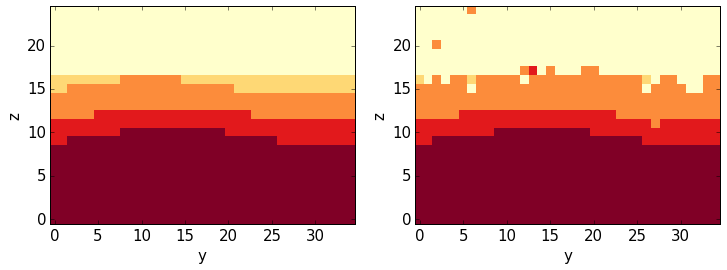

.. code:: python

    feature_diff = (nout.block != cf1_remap)

.. code:: python

    nout.plot_section('x', data = feature_diff,
                      colorbar = False, title="Difference between real and matched model",
                      cmap = 'YlOrRd') 

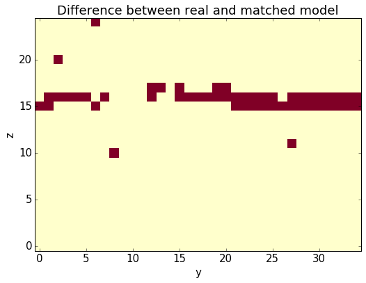

.. code:: python

    # Calculate the misclassification:
    np.sum(feature_diff) / float(nout.n_total)

.. parsed-literal::

    0.059177142857142859

.. code:: python

    # Export misclassification to VTK:
    misclass = feature_diff.astype('int')

.. code:: python

    nout.export_to_vtk(vtk_filename = "misclass", data=misclass)

Combined analysis in a single function
--------------------------------------

*Note*: function assumes correct EOL character in data file (check/
adjust with vi: %s/:raw-latex:`\r`/:raw-latex:`\r`/g)

**Problem**: remapping is unfortunatley not identical!

.. code:: python

    def calc_misclassification(nout, filename):
        """Calculate misclassification for classification results data stored in file
        
        **Arguments**:
            - *nout* = NoddyOutput: original model (Noddy object)
            - *filename* = filename (with path): file with classification results
        """
        f_set1 = open(filename).readlines()
        # initialise classification results array
        cf1 = np.empty_like(nout.block)
        # iterate through results and append
        for f in f_set1[1:]:
            fl = f.rstrip().split(",")
            cf1[int(fl[0]),int(fl[1]),int(fl[2])] = int(fl[6])
        # remap ids
        cf1_remap = re_map_vect(cf1)
        # determine differences in class ids:
        feature_diff = (nout.block != cf1_remap)
        # Calculate the misclassification:
        misclass = np.sum(feature_diff) / float(nout.n_total)
        return misclass

.. code:: python

    filename = r"../../sandbox/jack/features_lowres-4 with class ID.csv"
    calc_misclassification(nout, filename)

.. parsed-literal::

    0.09332571428571429

Determine validity of uncertainty estimate
------------------------------------------

In addition to single model realisations, an esitmate of model
uncertainty is calculated (this is, actually, also one of the main
"selling points" of the paper). So, we will now check if the correct
model is actually in the range of the estimated model uncertainty bounds
(i.e.: if all voxets values from the original model actually have a
non-zero probability in the estimated model)!

First step: load estimated class probabilities:

.. code:: python

    # f_set1 = open("../../sandbox/jack/features_lowres-6 with class ID and Prob.csv").readlines()
    f_set1 = open("../../sandbox/jack/features_lowres-8 with Prob (weak Beta).csv").readlines()

.. code:: python

    f_set1[0]

.. parsed-literal::

    'x, y, z, f1, f2, f3,P1,P2,P3,P4,P5\n'

.. code:: python

    # initialise classification results array
    cf1 = np.empty_like(nout.block)

.. code:: python

    # Initialise probability array
    probs = np.empty((5, cf1.shape[0], cf1.shape[1], cf1.shape[2]))

.. code:: python

    # iterate through results and append
    for f in f_set1[1:]:
        fl = f.rstrip().split(",")
        i,j,k = int(fl[0]),int(fl[1]),int(fl[2])
        # cf1[i,j,k] = int(fl[6])
        for i2 in range(5):
            probs[i2,i,j,k] = float(fl[i2+6])

We now need to perform the remapping similar to before, but now for the
probability fields:

.. code:: python

    fig = plt.figure(figsize = (12,6))
    ax1 = fig.add_subplot(121)
    ax2 = fig.add_subplot(122)
    im1 = ax1.imshow(nout.block[15,:,:].transpose(), 
               interpolation = 'none', cmap = 'YlOrRd', origin = 'lower left')
    plt.colorbar(im2)
    im2 = ax2.imshow(probs[4,15,:,:].transpose(), 
               interpolation = 'none', 
               cmap = 'YlOrRd', origin = 'lower left')

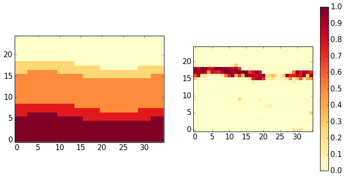

.. code:: python

    # Note: map now ids from original model to probability fields in results:
    prob_mapping = {4:0, 5:1, 3:2, 1:3, 2:4}

.. code:: python

    # Check membership for each class in original model
    for i in range(1,6):
        tmp = np.ones_like(nout.block) * (nout.block==i)
        # test if voxels have non-zero probability by checking conjunction with zero-prob voxels
        prob_zero = probs[prob_mapping[i],:,:,:] == 0
        misidentified = np.sum(tmp * prob_zero)
        print i, misidentified
        

.. parsed-literal::

    1 0.0
    2 32.0
    3 0.0
    4 1.0
    5 3.0

.. code:: python

    prob_zero = probs[prob_mapping[1],:,:,:] == 0

Determination of misclassification statistics
---------------------------------------------

Next step: use multiple results from one chain to determine
misclassification statistics.

.. code:: python

    f_set1 = open("../../sandbox/jack/features_lowres-7 with 151 realizations.csv").readlines()

.. code:: python

    # Initialise results array
    all_results = np.empty((152, cf1.shape[0], cf1.shape[1], cf1.shape[2]))

.. code:: python

    # iterate through results and append
    for f in f_set1[1:]:
        fl = f.rstrip().split(",")
        i,j,k = int(fl[0]),int(fl[1]),int(fl[2])
        # cf1[i,j,k] = int(fl[6])
        for i2 in range(152):
            try:
                all_results[i2,i,j,k] = float(fl[i2+5])
            except IndexError:
                print i2, i, j, k

First, we again need to check the assignment of the units/ class ids:

.. code:: python

    fig = plt.figure(figsize = (12,6))
    ax1 = fig.add_subplot(121)
    ax2 = fig.add_subplot(122)
    im1 = ax1.imshow(nout.block[15,:,:].transpose(), 
               interpolation = 'none', cmap = 'YlOrRd', origin = 'lower left')
    plt.colorbar(im1)
    im2 = ax2.imshow(all_results[5,15,:,:].transpose(), 
               interpolation = 'none', 
               cmap = 'YlOrRd', origin = 'lower left')

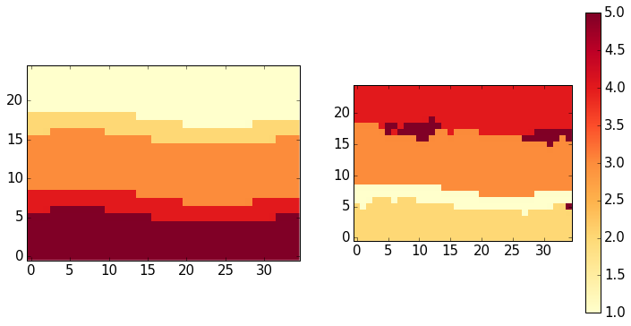

.. code:: python

    # mapping from results to original:
    id_mapping = {2:5, 1:4, 3:3, 5:2, 4:1}

.. code:: python

    def re_map(id_val):
        return id_mapping[id_val]
    re_map_vect = np.vectorize(re_map)

.. code:: python

    # Apply remapping to all but first result (seems to be original feature)
    all_results_remap = re_map_vect(all_results[1:,:,:,:])

.. code:: python

    fig = plt.figure(figsize = (12,6))
    ax1 = fig.add_subplot(121)
    ax2 = fig.add_subplot(122)
    im1 = ax1.imshow(nout.block[30,:,:].transpose(), 
               interpolation = 'none', cmap = 'YlOrRd', origin = 'lower left')
    # plt.colorbar(im1)
    im2 = ax2.imshow(all_results_remap[85,30,:,:].transpose(), 
               interpolation = 'none', 
               cmap = 'YlOrRd', origin = 'lower left')

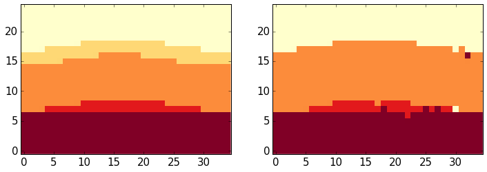

We can now determine the misclassification for all results:

.. code:: python

    all_misclass = np.empty(151)
    for i in range(151):
        # determine differences in class ids:
        feature_diff = (nout.block != all_results_remap[i,:,:,:])
        # Calculate the misclassification:
        all_misclass[i] = np.sum(feature_diff) / float(nout.n_total)

.. code:: python

    plt.plot(all_misclass)
    plt.title("Misclassification of suite lowres-7")
    plt.xlabel("Model id")
    plt.ylabel("MCR")

.. parsed-literal::

    <matplotlib.text.Text at 0x116b50b10>

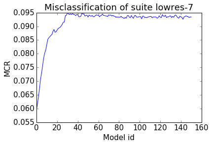

It seems to be the case that the upper thin layer vanishes after
approimately 30-40 iterations. From then on, the misclassification rate
is approximately constant at around 9.5 percent (which is still quite
acceptable!).

Let's compare this now to classifications with another (lower) beta
value (which should put more weight to the data?):

.. code:: python

    f_set1 = open("../../sandbox/jack/features_lowres-9 with 151 realizations.csv").readlines()

.. code:: python

    # Initialise results array
    all_results = np.empty((151, cf1.shape[0], cf1.shape[1], cf1.shape[2]))

.. code:: python

    # iterate through results and append
    for f in f_set1[1:]:
        fl = f.rstrip().split(",")
        i,j,k = int(fl[0]),int(fl[1]),int(fl[2])
        # cf1[i,j,k] = int(fl[6])
        for i2 in range(151):
            try:
                all_results[i2,i,j,k] = float(fl[i2+6])
            except IndexError:
                print i2, i, j, k

.. code:: python

    fig = plt.figure(figsize = (12,6))
    ax1 = fig.add_subplot(121)
    ax2 = fig.add_subplot(122)
    im1 = ax1.imshow(nout.block[15,:,:].transpose(), 
               interpolation = 'none', cmap = 'YlOrRd', origin = 'lower left')
    plt.colorbar(im1)
    im2 = ax2.imshow(all_results[20,15,:,:].transpose(), 
               interpolation = 'none', 
               cmap = 'YlOrRd', origin = 'lower left')

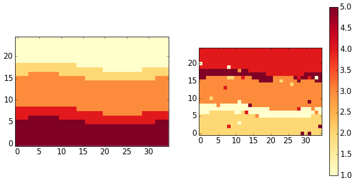

.. code:: python

    # define re-mapping
    id_mapping = {2:5, 1:4, 3:3, 5:2, 4:1}

.. code:: python

    # Apply remapping to all but first result (seems to be original feature)
    all_results_remap = re_map_vect(all_results[1:,:,:,:])

.. code:: python

    fig = plt.figure(figsize = (12,6))
    ax1 = fig.add_subplot(121)
    ax2 = fig.add_subplot(122)
    im1 = ax1.imshow(nout.block[30,:,:].transpose(), 
               interpolation = 'none', cmap = 'YlOrRd', origin = 'lower left')
    # plt.colorbar(im1)
    im2 = ax2.imshow(all_results_remap[115,30,:,:].transpose(), 
               interpolation = 'none', 
               cmap = 'YlOrRd', origin = 'lower left')

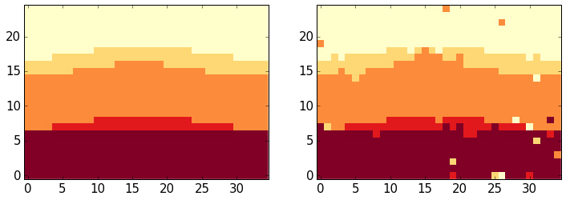

.. code:: python

    all_misclass = np.empty(150)
    for i in range(150):
        # determine differences in class ids:
        feature_diff = (nout.block != all_results_remap[i,:,:,:])
        # Calculate the misclassification:
        all_misclass[i] = np.sum(feature_diff) / float(nout.n_total)

.. code:: python

    plt.plot(all_misclass)
    plt.title("Misclassification of suite lowres-9")
    plt.xlabel("Model id")
    plt.ylabel("MCR")

.. parsed-literal::

    <matplotlib.text.Text at 0x1186ce610>

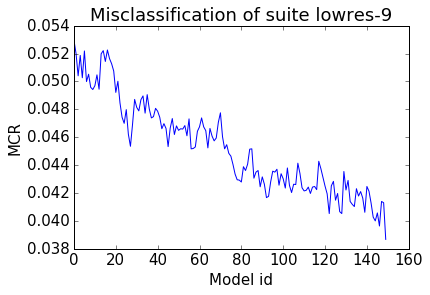

.. code:: python

    f_set1 = open("../../sandbox/jack/features_lowres-10 with 2000 realizations.csv").readlines()

.. code:: python

    # Initialise results array
    all_results = np.empty((2000, cf1.shape[0], cf1.shape[1], cf1.shape[2]))

.. code:: python

    # iterate through results and append
    for f in f_set1[1:]:
        fl = f.rstrip().split(",")
        i,j,k = int(fl[0]),int(fl[1]),int(fl[2])
        # cf1[i,j,k] = int(fl[6])
        for i2 in range(2000):
            try:
                all_results[i2,i,j,k] = float(fl[i2+6])
            except IndexError:
                print i2, i, j, k

.. code:: python

    fig = plt.figure(figsize = (12,6))
    ax1 = fig.add_subplot(121)
    ax2 = fig.add_subplot(122)
    im1 = ax1.imshow(nout.block[15,:,:].transpose(), 
               interpolation = 'none', cmap = 'YlOrRd', origin = 'lower left')
    plt.colorbar(im1)
    im2 = ax2.imshow(all_results[20,15,:,:].transpose(), 
               interpolation = 'none', 
               cmap = 'YlOrRd', origin = 'lower left')

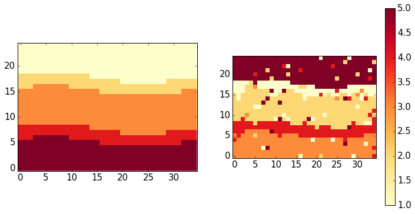

.. code:: python

    # define re-mapping
    id_mapping = {3:5, 4:4, 2:3, 1:2, 5:1, 0:0}

.. code:: python

    # Apply remapping to all but first result (seems to be original feature)
    all_results_remap = re_map_vect(all_results[2:,:,:,:])

.. code:: python

    np.unique(all_results[1999,:,:,:])

.. parsed-literal::

    array([ 0.,  1.,  2.,  3.,  4.,  5.])

.. code:: python

    fig = plt.figure(figsize = (12,6))
    ax1 = fig.add_subplot(121)
    ax2 = fig.add_subplot(122)
    im1 = ax1.imshow(nout.block[30,:,:].transpose(), 
               interpolation = 'none', cmap = 'YlOrRd', origin = 'lower left')
    # plt.colorbar(im1)
    im2 = ax2.imshow(all_results_remap[115,30,:,:].transpose(), 
               interpolation = 'none', 
               cmap = 'YlOrRd', origin = 'lower left')

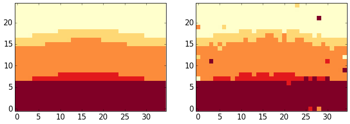

.. code:: python

    all_misclass = np.empty(1998)
    for i in range(1998):
        # determine differences in class ids:
        feature_diff = (nout.block != all_results_remap[i,:,:,:])
        # Calculate the misclassification:
        all_misclass[i] = np.sum(feature_diff) / float(nout.n_total)
    

.. code:: python

    plt.plot(all_misclass[100:])
    plt.title("Misclassification of suite lowres-10")
    plt.xlabel("Model id")
    plt.ylabel("MCR")

.. parsed-literal::

    <matplotlib.text.Text at 0x1186c2a90>

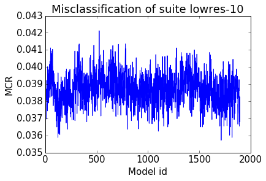

.. code:: python

    plt.hist(all_misclass[100:])

.. parsed-literal::

    (array([   8.,   42.,  177.,  432.,  494.,  418.,  230.,   75.,   21.,    1.]),
     array([ 0.03572571,  0.03636571,  0.03700571,  0.03764571,  0.03828571,
             0.03892571,  0.03956571,  0.04020571,  0.04084571,  0.04148571,
             0.04212571]),
     <a list of 10 Patch objects>)

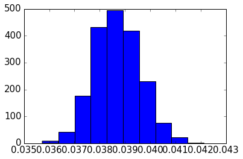

Determine validity of estimated probability
-------------------------------------------

.. code:: python

    # f_set1 = open("../../sandbox/jack/features_lowres-6 with class ID and Prob.csv").readlines()
    f_set1 = open("../../sandbox/jack/features_lowres-10 with Prob (weak Beta).csv").readlines()

.. code:: python

    # initialise classification results array
    cf1 = np.empty_like(nout.block)

.. code:: python

    f_set1[0]

.. parsed-literal::

    'x, y, z, f1, f2, f3,P1,P2,P3,P4,P5\n'

.. code:: python

    # Initialise probability array
    probs = np.empty((5, cf1.shape[0], cf1.shape[1], cf1.shape[2]))

.. code:: python

    # iterate through results and append
    for f in f_set1[1:]:
        fl = f.rstrip().split(",")
        i,j,k = int(fl[0]),int(fl[1]),int(fl[2])
        # cf1[i,j,k] = int(fl[6])
        for i2 in range(5):
            probs[i2,i,j,k] = float(fl[i2+6])

.. code:: python

    fig = plt.figure(figsize = (12,6))
    ax1 = fig.add_subplot(121)
    ax2 = fig.add_subplot(122)
    im1 = ax1.imshow(nout.block[15,:,:].transpose(), 
               interpolation = 'none', cmap = 'YlOrRd', origin = 'lower left')
    plt.colorbar(im2)
    im2 = ax2.imshow(probs[0,15,:,:].transpose(), 
               interpolation = 'none', 
               cmap = 'YlOrRd', origin = 'lower left')

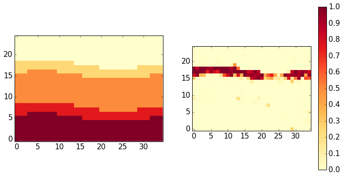

.. code:: python

    # Note: map now ids from original model to probability fields in results:
    prob_mapping = {2:0, 3:1, 5:2, 4:3, 1:4}

.. code:: python

    # Check membership for each class in original model
    for i in range(1,6):
        tmp = np.ones_like(nout.block) * (nout.block==i)
        # test if voxels have non-zero probability by checking conjunction with zero-prob voxels
        prob_zero = probs[prob_mapping[i],:,:,:] == 0
        misidentified = np.sum(tmp * prob_zero)
        print i, misidentified
        

.. parsed-literal::

    1 0.0
    2 0.0
    3 0.0
    4 0.0
    5 0.0

.. code:: python

    info_entropy = np.zeros_like(nout.block)

.. code:: python

    for prob in probs:
        info_entropy[prob > 0] -= prob[prob > 0] * np.log2(prob[prob > 0])

.. code:: python

    fig = plt.figure(figsize = (12,6))
    ax1 = fig.add_subplot(121)
    ax2 = fig.add_subplot(122)
    im1 = ax1.imshow(nout.block[15,:,:].transpose(), 
               interpolation = 'none', cmap = 'YlOrRd', origin = 'lower left')
    plt.colorbar(im2)
    im2 = ax2.imshow(info_entropy[1,:,:].transpose(), 
               interpolation = 'none', 
               cmap = 'YlOrRd', origin = 'lower left')

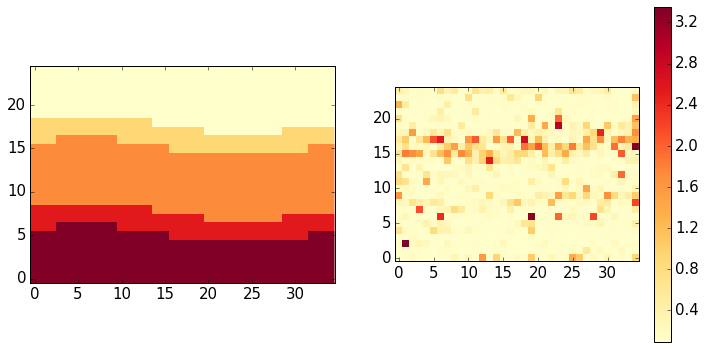

.. code:: python

    nout.export_to_vtk(vtk_filename = "../../sandbox/jack/info_entropy", data = info_entropy)

.. code:: python

    np.max(probs)

.. parsed-literal::

    1.0

.. code:: python

    np.max(info_entropy)

.. parsed-literal::

    nan

