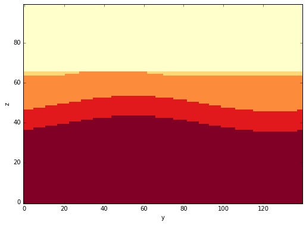
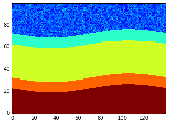

Using pynoddy to generate features in geological model space
============================================================

.. code:: python

    from IPython.core.display import HTML
    css_file = 'pynoddy.css'
    HTML(open(css_file, "r").read())

.. raw:: html

    <link href='http://fonts.googleapis.com/css?family=Alegreya+Sans:100,300,400,500,700,800,900,100italic,300italic,400italic,500italic,700italic,800italic,900italic' rel='stylesheet' type='text/css'>
    <link href='http://fonts.googleapis.com/css?family=Arvo:400,700,400italic' rel='stylesheet' type='text/css'>
    <link href='http://fonts.googleapis.com/css?family=PT+Mono' rel='stylesheet' type='text/css'>
    <link href='http://fonts.googleapis.com/css?family=Shadows+Into+Light' rel='stylesheet' type='text/css'>
    <link rel="stylesheet" type="text/css" href="http://fonts.googleapis.com/css?family=Tangerine">
    <link href='http://fonts.googleapis.com/css?family=Philosopher:400,700,400italic,700italic' rel='stylesheet' type='text/css'>
    <link href='http://fonts.googleapis.com/css?family=Libre+Baskerville:400,400italic' rel='stylesheet' type='text/css'>
    <link href='http://fonts.googleapis.com/css?family=Lora:400,400italic' rel='stylesheet' type='text/css'>
    <link href='http://fonts.googleapis.com/css?family=Karla:400,400italic' rel='stylesheet' type='text/css'>
    
    

.. code:: python

    import sys, os
    import matplotlib.pyplot as plt
    # adjust some settings for matplotlib
    from matplotlib import rcParams
    # print rcParams
    rcParams['font.size'] = 15
    # determine path of repository to set paths corretly below
    repo_path = os.path.realpath('../..')
    import pynoddy.history

.. code:: python

    %matplotlib inline

.. code:: python

    reload(pynoddy.history)
    reload(pynoddy.events)
    reload(pynoddy)
    history = "feature_model.his"
    output_name = "feature_out"
    nm = pynoddy.history.NoddyHistory()
    # add stratigraphy
    strati_options = {'num_layers' : 5,
                      'layer_names' : ['layer 1', 'layer 2', 'layer 3',
                                       'layer 4', 'layer 5'],
                      'layer_thickness' : [1500, 500, 500, 1500, 500]}
    nm.add_event('stratigraphy', strati_options )
    
    fold_options = {'name' : 'Fold',
                     'pos' : (4000, 3500, 5000),
                     'amplitude' : 200,
                    'dip_dir' : 135.0,
                     'wavelength' : 5000}
    
    nm.add_event('fold', fold_options)
    
    # The following options define the fault geometry:
    fault_options = {'name' : 'Fault_W',
                     'pos' : (4000, 3500, 5000),
                     'dip_dir' : 90,
                     'dip' : 60,
                     'slip' : 1000}
    
    nm.add_event('fault', fault_options)
    # The following options define the fault geometry:
    fault_options = {'name' : 'Fault_E',
                     'pos' : (6000, 3500, 5000),
                     'dip_dir' : 270,
                     'dip' : 60,
                     'slip' : 1000}
    
    nm.add_event('fault', fault_options)
    nm.write_history(history)

.. code:: python

    # Change cube size
    nm1 = pynoddy.history.NoddyHistory(history)
    nm1.change_cube_size(50)
    nm1.write_history(history)

.. code:: python

    # Compute the model
    pynoddy.compute_model(history, output_name) 

.. parsed-literal::

    ''

.. code:: python

    # Plot output
    import pynoddy.output
    reload(pynoddy.output)
    nout = pynoddy.output.NoddyOutput(output_name)
    nout.plot_section('x', layer_labels = strati_options['layer_names'][::-1], 
                      colorbar = True, title="",
                      savefig = False, fig_filename = "ex01_faults_combined.eps",
                      cmap = 'YlOrRd') # note: YlOrRd colourmap should be suitable for colorblindness!

.. code:: python

    nout.export_to_vtk(vtk_filename = "feature_model")

.. code:: python

    import os
    history_file = os.path.join(repo_path, "examples/GBasin_Ve1_V4.his")

.. code:: python

    his_gipps = pynoddy.history.NoddyHistory(history_file)

.. code:: python

    his_gipps.events[2].properties

.. parsed-literal::

    {'Amplitude': 500.0,
     'Cylindricity': 0.0,
     'Dip': 90.0,
     'Dip Direction': 90.0,
     'Pitch': 0.0,
     'Single Fold': 'FALSE',
     'Type': 'Sine',
     'Wavelength': 15000.0,
     'X': 0.0,
     'Y': 0.0,
     'Z': 0.0}

.. code:: python

    import numpy as np
    np.unique(nout.block)

.. parsed-literal::

    array([ 1.,  2.,  3.,  4.,  5.])

Adding features to geological layers
------------------------------------

The first step is to define the covariance matrix and mean values for
all features and for all geological units. Then, for each cell in the
model, a random feature value is generated.

For this test, we consider the following model: - each layer has a
different feature mean value - the covariance matrix is identical for
all layers (assuming some physical relationship, for examlpe between
porosity/ permability; or density, vp)

.. code:: python

    cov = [[0.08, 0.0, 0.],
           [0.0, 0.001, 0.],
           [0., 0., 0.05]]
    
    # define mean values for features
    feature1_means = [1.0, 1.5, 1.2, 1.1, 1.9]
    feature2_means = [5.1, 5.25, 5.12, 5.02, 5.07]
    feature3_means = [1.0, 1.2, 1.4, 1.2, 1.0]
    
    # resort into unit means
    means_units = [[m1, m2, m3] for m1, m2, m3 in 
                   zip(feature1_means, feature2_means, feature3_means)]
    print means_units

.. parsed-literal::

    [[1.0, 5.1, 1.0], [1.5, 5.25, 1.2], [1.2, 5.12, 1.4], [1.1, 5.02, 1.2], [1.9, 5.07, 1.0]]

.. code:: python

    f1, f2, f3 = np.random.multivariate_normal(means_units[0], cov, 1000).T

.. code:: python

    n1 = int(np.sum(nout.block[nout.block == 1.0]))

.. code:: python

    # sample for geological unit 1
    f1, f2, f3 = np.random.multivariate_normal(means_units[0], cov, n1).T

.. code:: python

    tmp = np.copy(nout.block)

.. code:: python

    tmp[tmp == 1.0] = f1

.. code:: python

    plt.imshow(tmp[0,:,:].T, origin = 'lower_left', interpolation = 'nearest')

.. parsed-literal::

    <matplotlib.image.AxesImage at 0x10b88d250>

ok, seems to work - now for all:

.. code:: python

    # create empty feature fields:
    feature_field_1 = np.copy(nout.block)
    feature_field_2 = np.copy(nout.block)
    feature_field_3 = np.copy(nout.block)
    
    for unit_id in np.unique(nout.block):
        print unit_id
        n_tmp = int(np.sum(nout.block == unit_id))
        f1, f2, f3 = np.random.multivariate_normal(means_units[int(unit_id-1)], cov, n_tmp).T
        feature_field_1[feature_field_1 == unit_id] = f1
        feature_field_2[feature_field_2 == unit_id] = f2
        feature_field_3[feature_field_3 == unit_id] = f3

.. parsed-literal::

    1.0
    2.0
    3.0
    4.0
    5.0

.. code:: python

    # Export feature fields to VTK (via pynoddy output file)
    nout.block = feature_field_1
    nout.export_to_vtk(vtk_filename = "feature_field_1")
    nout.block = feature_field_2
    nout.export_to_vtk(vtk_filename = "feature_field_2")
    nout.block = feature_field_3
    nout.export_to_vtk(vtk_filename = "feature_field_3")

.. code:: python

    # write to feature file for Jack
    feature_file = open("features_highres.csv", 'w')
    feature_file.write("x, y, z, f1, f2, f3\n")
    for zz in range(nout.nz):
        for yy in range(nout.ny):
            for xx in range(nout.nx):
                feature_file.write("%d, %d, %d, %.5f, %.5f, %.5f\n" %
                                  (xx, yy, zz, feature_field_1[xx, yy, zz],
                                   feature_field_2[xx, yy, zz], feature_field_3[xx, yy, zz]))
    feature_file.close()
                                                            

.. code:: python

    nout.n_total

.. parsed-literal::

    43750

