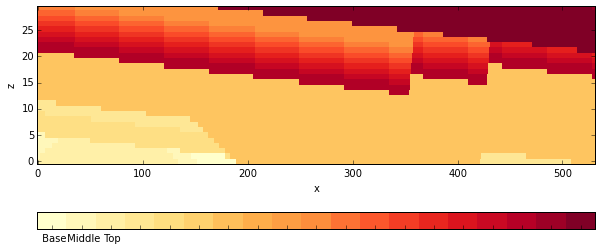

Kinematic model of the Gippsland Basin - Version 4
==================================================

We analyse here uncertainties in a kinematic model of the Gippsland
Basin, Victoria. The model is built on the basis of a detailed analysis
of the geological history and adjusted to observed structures in the
area.

Here, we first evaluate the model and analyse the setting a little bit
and then proceed to investigate how errors in the parameterised
geological history (i.e. the parameters of the kinematic events)
propagate into model uncertainties.

.. code:: python

    from IPython.core.display import HTML
    css_file = 'pynoddy.css'
    HTML(open(css_file, "r").read())

.. raw:: html

    <link href='http://fonts.googleapis.com/css?family=Alegreya+Sans:100,300,400,500,700,800,900,100italic,300italic,400italic,500italic,700italic,800italic,900italic' rel='stylesheet' type='text/css'>
    <link href='http://fonts.googleapis.com/css?family=Arvo:400,700,400italic' rel='stylesheet' type='text/css'>
    <link href='http://fonts.googleapis.com/css?family=PT+Mono' rel='stylesheet' type='text/css'>
    <link href='http://fonts.googleapis.com/css?family=Shadows+Into+Light' rel='stylesheet' type='text/css'>
    <link rel="stylesheet" type="text/css" href="http://fonts.googleapis.com/css?family=Tangerine">
    <link href='http://fonts.googleapis.com/css?family=Philosopher:400,700,400italic,700italic' rel='stylesheet' type='text/css'>
    <link href='http://fonts.googleapis.com/css?family=Libre+Baskerville:400,400italic' rel='stylesheet' type='text/css'>
    <link href='http://fonts.googleapis.com/css?family=Lora:400,400italic' rel='stylesheet' type='text/css'>
    <link href='http://fonts.googleapis.com/css?family=Karla:400,400italic' rel='stylesheet' type='text/css'>
    
    

.. code:: python

    import sys, os
    import matplotlib.pyplot as plt
    import pynoddy.history
    import pynoddy.output
    import copy
    import pickle
    plt.rcParams['font.size'] = 16

.. code:: python

    pwd

.. parsed-literal::

    u'/Users/flow/git/pynoddy/docs/notebooks'

.. code:: python

    # the following reloads are only required during development phase
    reload(pynoddy.history)
    reload(pynoddy.events)
    PH = pynoddy.history.NoddyHistory("../../examples/GBasin_Ve1_V4_b.his")

.. parsed-literal::

     STRATIGRAPHY
     FOLD
     UNCONFORMITY
     FAULT
     FAULT
     UNCONFORMITY
     FAULT
     FAULT
     UNCONFORMITY
     FAULT
     FAULT
     UNCONFORMITY
     TILT
     FOLD

.. code:: python

    # get some basic model information
    print PH.get_extent()
    print PH.get_origin()

.. parsed-literal::

    (26630.0, 19291.0, 1500.0)
    (0.0, 0.0, 1500.0)

.. code:: python

    # Let's have a look at the defined events
    PH.events

.. parsed-literal::

    {1: <pynoddy.events.Stratigraphy at 0x10d9d6b10>,
     2: <pynoddy.events.Fold at 0x10d9d6b50>,
     3: <pynoddy.events.Unconformity at 0x10d9d6b90>,
     4: <pynoddy.events.Fault at 0x10d9b4050>,
     5: <pynoddy.events.Fault at 0x10d9d6c10>,
     6: <pynoddy.events.Unconformity at 0x10d9d6c90>,
     7: <pynoddy.events.Fault at 0x10d9d6c50>,
     8: <pynoddy.events.Fault at 0x10d9d6cd0>,
     9: <pynoddy.events.Unconformity at 0x10d9d6d50>,
     10: <pynoddy.events.Fault at 0x10d9d6d10>,
     11: <pynoddy.events.Fault at 0x10d9d6dd0>,
     12: <pynoddy.events.Unconformity at 0x10d9d6e50>,
     13: <pynoddy.events.Tilt at 0x10d9d6d90>,
     14: <pynoddy.events.Fold at 0x10d9d6e90>}

.. code:: python

    # Determine model stratigraphy for plots below
    PH.determine_model_stratigraphy()
    PH.get_footer_lines()

.. code:: python

    # Compute the model
    reload(pynoddy)
    his = 'GBasin_V4_new.his'
    PH.write_history(his)
    out = 'GBasin_V4_out'
    pynoddy.compute_model(his, out)
    print os.getcwd()

.. parsed-literal::

    
    /Users/flow/git/pynoddy/docs/notebooks

Visualise output
----------------

**To do: fix colorbar!**

.. code:: python

    reload(pynoddy.output)
    PO = pynoddy.output.NoddyOutput(out)

.. code:: python

    %matplotlib inline

.. code:: python

    # create section plots in axes diretions:
    PO.plot_section('x', ve = 5.,
                    cmap = 'YlOrRd',
                    title = '',
                    colorbar = True)
                    # layer_labels = PH.model_stratigraphy)
    PO.plot_section('y', position = 100, ve = 5.,
                    cmap = 'YlOrRd',
                    title = '',
                    colorbar_orientation = 'horizontal',
                    layer_labels = PH.model_stratigraphy)

.. image:: Gippsland-Basin-V4_files/Gippsland-Basin-V4_12_0.png

.. code:: python

    import numpy as np
    np.unique(PO.block)

.. parsed-literal::

    array([  1.,   2.,   3.,   4.,   5.,   7.,  10.,  11.,  12.,  13.,  14.,
            15.,  16.,  17.,  18.,  19.,  20.])

.. code:: python

    PO.plot_section('y')

.. image:: Gippsland-Basin-V4_files/Gippsland-Basin-V4_14_0.png

.. code:: python

    # Export to VTK for 3-D visualisation and analysis
    PO.export_to_vtk(vtk_filename = "GBasin_V4")

.. code:: python

    pwd

.. parsed-literal::

    u'/Users/flow/git/pynoddy/docs/notebooks'

Update model origin and extent
------------------------------

Test new implementation as basis for 1-D "Drillhole" export

.. code:: python

    reload(pynoddy.history)
    reload(pynoddy.events)
    PH = pynoddy.history.NoddyHistory("../../examples/GBasin_Ve1_V4_b.his")

.. parsed-literal::

     STRATIGRAPHY
     FOLD
     UNCONFORMITY
     FAULT
     FAULT
     UNCONFORMITY
     FAULT
     FAULT
     UNCONFORMITY
     FAULT
     FAULT
     UNCONFORMITY
     TILT
     FOLD

.. code:: python

    PH.info(events_only = True)

.. parsed-literal::

    This model consists of 14 events:
    	(1) - STRATIGRAPHY
    	(2) - FOLD
    	(3) - UNCONFORMITY
    	(4) - FAULT
    	(5) - FAULT
    	(6) - UNCONFORMITY
    	(7) - FAULT
    	(8) - FAULT
    	(9) - UNCONFORMITY
    	(10) - FAULT
    	(11) - FAULT
    	(12) - UNCONFORMITY
    	(13) - TILT
    	(14) - FOLD

.. code:: python

    PH.events[14].properties

.. parsed-literal::

    {'Amplitude': 500.0,
     'Cylindricity': 0.0,
     'Dip': 90.0,
     'Dip Direction': 180.0,
     'Pitch': 0.0,
     'Single Fold': 'FALSE',
     'Type': 'Sine',
     'Wavelength': 17000.0,
     'X': 0.0,
     'Y': 7000.0,
     'Z': 0.0}

.. code:: python

    PH.write_history("GB_V4_1D.his")

.. code:: python

    no = pynoddy.output.NoddyOutput("tmp")

.. code:: python

    z_range = no.block[0,0,:]

.. code:: python

    plot(z_range)

.. parsed-literal::

    [<matplotlib.lines.Line2D at 0x11187f410>]

.. image:: Gippsland-Basin-V4_files/Gippsland-Basin-V4_24_1.png

.. code:: python

    len(z_range)

.. parsed-literal::

    1500

.. code:: python

    reload(pynoddy.history)
    reload(pynoddy.events)
    PH = pynoddy.history.NoddyHistory("../../examples/GBasin_Ve1_V4_b.his")
    drillhole = PH.get_drillhole_data(10000, 10000, resolution = 100)

.. parsed-literal::

     STRATIGRAPHY
     FOLD
     UNCONFORMITY
     FAULT
     FAULT
     UNCONFORMITY
     FAULT
     FAULT
     UNCONFORMITY
     FAULT
     FAULT
     UNCONFORMITY
     TILT
     FOLD
    

.. code:: python

    plot(drillhole)

.. parsed-literal::

    [<matplotlib.lines.Line2D at 0x115780290>]

.. image:: Gippsland-Basin-V4_files/Gippsland-Basin-V4_27_1.png

