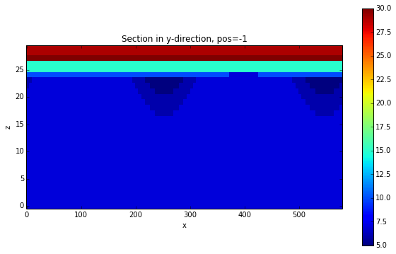
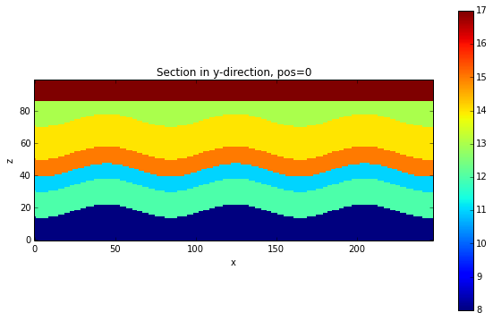

.. code:: python

    import sys, os
    import matplotlib.pyplot as plt
    import pynoddy.history
    import pynoddy.output
    import copy
    import pickle

.. code:: python

    # os.chdir(r"/Users/Florian/Documents/10_Geomodels/Noddy/GBasin/GBasin")
    os.chdir(r"/Users/flow/Documents/02_work/10_Geomodels/06_Noddy/")
    

.. code:: python

    reload(pynoddy.history)
    reload(pynoddy.events)
    PH = pynoddy.history.NoddyHistory("GBasin_Ve1_working.his")

.. parsed-literal::

     STRATIGRAPHY
     FOLD
     UNCONFORMITY
     FAULT
     FAULT
     UNCONFORMITY
     FAULT
     FAULT
     UNCONFORMITY
     FAULT
     FOLD
     UNCONFORMITY

.. code:: python

    PH.get_origin()

.. parsed-literal::

    (0.0, 0.0, 1500.0)

.. code:: python

    PH.get_extent()

.. parsed-literal::

    (26630.0, 19291.0, 1500.0)

.. code:: python

    PH.events

.. parsed-literal::

    {1: <pynoddy.events.Stratigraphy instance at 0x1124ee488>,
     2: <pynoddy.events.Fold instance at 0x1124eecf8>,
     3: <pynoddy.events.Unconformity instance at 0x1124eedd0>,
     4: <pynoddy.events.Fault instance at 0x1124ee9e0>,
     5: <pynoddy.events.Fault instance at 0x1124ee200>,
     6: <pynoddy.events.Unconformity instance at 0x1124ee518>,
     7: <pynoddy.events.Fault instance at 0x1124ee7a0>,
     8: <pynoddy.events.Fault instance at 0x1124ee998>,
     9: <pynoddy.events.Unconformity instance at 0x1124eeb90>,
     10: <pynoddy.events.Fault instance at 0x112525758>,
     11: <pynoddy.events.Fold instance at 0x112525680>,
     12: <pynoddy.events.Unconformity instance at 0x1125257e8>}

.. code:: python

    PH.events[12].properties

.. parsed-literal::

    {'Dip': 0.0, 'Dip Direction': 90.0, 'X': 0.0, 'Y': 0.0, 'Z': 1350.0}

.. code:: python

    reload(pynoddy)
    his = 'simple_folding.his'
    PH.write_history(his)
    out = 'simple_folding_out'
    pynoddy.compute_model(his, out)
    print os.getcwd()

.. parsed-literal::

    /Users/flow/Documents/02_work/10_Geomodels/06_Noddy

.. code:: python

    reload(pynoddy.output)
    PO = pynoddy.output.NoddyOutput(out)

.. code:: python

    PO.plot_section('y', position=-1, ve = 10.)

.. code:: python

    PO.export_to_vtk(vtk_filename = "GBasin")

Chaning aspects of Fold and Unconformity events
-----------------------------------------------

As a quick test of the fold and unconformity events, here some simple
examples:

-  changing amplitude and position of the folding
-  adjust position of the unconformity

.. code:: python

    PH.events[8].properties['Amplitude'] = 200.
    PH.change_cube_size(50)
    PH.update_all_event_properties()

.. code:: python

    PH.events[2].properties

.. parsed-literal::

    {'Amplitude': 1000.0,
     'Cylindricity': 0.0,
     'Dip': 75.0,
     'Dip Direction': 180.0,
     'Pitch': 0.0,
     'Single Fold': 'FALSE',
     'Type': 'Sine',
     'Wavelength': 11594.0,
     'X': 0.0,
     'Y': -477.0,
     'Z': 158.0}

.. code:: python

    PH.events[2].update_properties()

.. code:: python

    his = 'simple_folding_2.his'
    PH.write_history(his)
    out2 = 'simple_folding_out_2'
    pynoddy.compute_model(his, out2)

.. code:: python

    reload(pynoddy.output)
    PO2 = pynoddy.output.NoddyOutput(out2)

.. code:: python

    PO2.plot_section('y', position=0)

.. code:: python

    PO2.export_to_vtk(vtk_filename = "Gipps_changed_hres")

Set-up of uncertainty study
---------------------------

Ok, it's the time now to become uncertain! Let's start with some simple
uncertainties:

1. Fault dip: normal distribution with mu = original dip value stdev =
   0.1 \* mu
2. Fold amplitude: normal distribution with mu = original value and
   stdev = 0.1 \* mu
3. Fold position: normal distribution for X positoin with mu = 0 value
   and stdev = 2000.

Update: suggestions by Mark (in email):

Faults (all events) Perturb dip and strike +- 10 degrees (a range of 20
degrees)

Folds (all events) Perturb dip and strike +- 10 degrees Wavelength +-
1000 (range of 2000) Amplitude +-300

Unconformities Just adjust the Z value by +- 500... but nothing else.
That should cause enough trouble on its own.

Topology Maybe just change the folding events +- 1 position from the
original. This will mean folding will either post-date faulting, or
pre-date an unconformity. Hmm... this is fun!

.. code:: python

    # Let's start with a clean model:
    PH = pynoddy.history.NoddyHistory("GBasin.his")
    # set cube size to create higher resolution outputs - once it works...
    PH.change_cube_size(100)
    noddy_his = 'tmp'
    noddy_out = 'tmp_out'
    PH.write_history(noddy_his)
    pynoddy.compute_model(noddy_his, noddy_out)
    PO = pynoddy.NoddyOutput(noddy_out)

.. parsed-literal::

     STRATIGRAPHY
     FOLD
     FAULT
     FAULT
     UNCONFORMITY
     UNCONFORMITY
     UNCONFORMITY
     FOLD
     FAULT
     FAULT
     FAULT
     UNCONFORMITY

As Mark wants to have relative changes, let's just create a simple
function to do the trick and avoid a lot of writing later:

.. code:: python

    def disturb_percent(event, prop, percent=5):
        """Disturb the property of an evetn by a given percentage (default=10), assuming a normal distribution"""
        ori_val = event.properties[prop]
        new_val = np.random.randn() * percent/100. * ori_val + ori_val
        event.properties[prop] = new_val
    
    def disturb_value(event, prop, stdev):
        """Disturb the property of an evetn by a given stdev, assuming a normal distribution"""
        ori_val = event.properties[prop]
        new_val = np.random.randn() * stdev * ori_val + ori_val
        event.properties[prop] = new_val

Now we create a function to disturb the model once. Note: the object has
to be copied before the disturbance step, otherwise properties are
continuously changed, leading to a random walk instead of a standard
samping (and therefore to a lot more disturbance):

.. code:: python

    def disturb(PH_local):
        for event in PH_local.events.values():
            # check instances and roll the dice
            if isinstance(event,pynoddy.events.Fault):
                disturb_percent(event, 'Dip')
                disturb_percent(event, 'Dip Direction')
        
            if isinstance(event,pynoddy.events.Fold):
                disturb_percent(event, 'Dip')
                disturb_percent(event, 'Dip Direction')
                disturb_value(event, 'Wavelength', 500)
                disturb_value(event, 'Amplitude', 100)
            
            if isinstance(event,pynoddy.events.Unconformity):
                disturb_value(event, 'Z', 0)

.. code:: python

    PH_tmp = copy.deepcopy(PH)
    disturb(PH_tmp)
    PH_tmp.events[2].properties['Dip']

.. parsed-literal::

    74.82774156182523

Setting up the entire uncertainty sampling step is now straight-forward:

1. Copy original model
2. Disturb like crazy
3. Save to temporary file and compute
4. Load output block model and store in array

.. code:: python

    # define number of sampling steps:
    n = 500
    all_blocks = np.ndarray((n, PO.nx, PO.ny, PO.nz), dtype="int")
    for i in range(n):
        PH_tmp = copy.deepcopy(PH)
        disturb(PH_tmp)
        PH_tmp.write_history(noddy_his)
        pynoddy.compute_model(noddy_his, noddy_out)
        PO_tmp = pynoddy.NoddyOutput(noddy_out)
        all_blocks[i,:,:,:] = PO_tmp.block
        

For later use (and probably combination of results of multiple runs),
save results to file:

.. code:: python

    pickle.dump(all_blocks, open("all_blocks_500.pkl", 'w'))

The questions is now, of course, how to analyse and visualise the
results. As a first step, we simply generate indicator functions and
determine the id probabilities.

For a first simple visalisation, we create a "dummy" NoddyOutput file
with the same properties as the original output file and assign the
resulting grid to the block property. We can then use the standard
plot\_section and export\_to\_vtk commands:

.. code:: python

    # define id to be analysed:
    unit_id = 11
    ind_func = (all_blocks == unit_id)
    np.shape(ind_func)
    id_prob = np.sum(ind_func, axis=0) / float(n)
    
    # create dummy NoddyOutput and assign values as block
    NO_dummy = copy.deepcopy(PO_tmp)
    NO_dummy.block = id_prob
    NO_dummy.export_to_vtk(vtk_filename = 'prob_unit_id_%d' % unit_id)
    NO_dummy.plot_section('x')
    NO_dummy.plot_section('y')
    NO_dummy.plot_section('z')

.. image:: Gippsland-Basin_files/Gippsland-Basin_31_0.png

.. image:: Gippsland-Basin_files/Gippsland-Basin_31_1.png

.. image:: Gippsland-Basin_files/Gippsland-Basin_31_2.png

.. code:: python

    len(np.unique(PO.block))

.. parsed-literal::

    9

