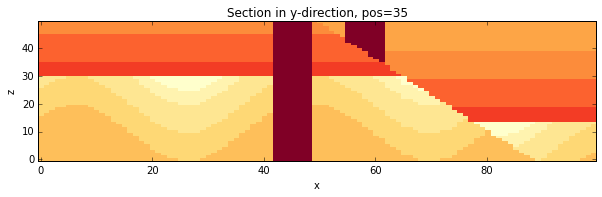
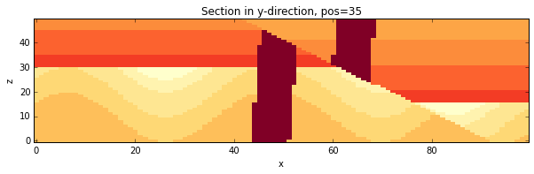
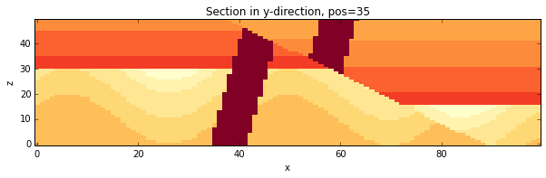

Analysis of uncertainty propagation with Monte Carlo sampling
=============================================================

.. code:: python

    from IPython.core.display import HTML
    css_file = 'pynoddy.css'
    HTML(open(css_file, "r").read())
    %matplotlib inline

.. code:: python

    # here the usual imports. If any of the imports fails, make sure that pynoddy is installed
    # properly, ideally with 'python setup.py develop' or 'python setup.py install'
    import sys, os
    import matplotlib.pyplot as plt
    import numpy as np
    
    # adjust some settings for matplotlib
    from matplotlib import rcParams
    # print rcParams
    rcParams['font.size'] = 15
    
    # determine path of repository to set paths corretly below
    repo_path = os.path.realpath('../..')
    import pynoddy.history
    import pynoddy.experiment
    rcParams.update({'font.size': 20})
    
    print "Success!"

.. parsed-literal::

    Success!

Using the Monte-Carlo experiment class
--------------------------------------

The methods for repeated Monte-Carlo sampling are integrated in a Python
experiment class. As before, we can therefore load the model and a
parameter file which defines the parameter statistics for the sampling
step:

.. code:: python

    reload(pynoddy.history)
    reload(pynoddy.output)
    reload(pynoddy.experiment)
    reload(pynoddy)
    
    import pynoddy.experiment.monte_carlo
    reload(pynoddy.experiment.monte_carlo)
    
    from pynoddy.experiment.monte_carlo import MonteCarlo
    
    # the model itself is now part of the repository, in the examples directory:
    history_file = os.path.join(repo_path, "examples/fold_dyke_fault.his")
    
    #this file defines the statistical distributions to sample from
    params = os.path.join(repo_path, "examples/fold_dyke_fault.csv")
    
    #now we initialise a MonteCarlo experiment
    gipps_mc = MonteCarlo(history_file,params)

We now generate a specified amount of samples (8 in this example) and
run them through Noddy. Note that Noddy can be spawned in separate
threads: this example runs models in 4 different threads, reducing
runtime substantially (though naturally things still take a while,
especially when running more complex models).

It is also worth noting that we specify a random seed of 10 at this
point, so that an identical set of models is generated each time anyone
runs this notebook (ie. experiments are reproducible).

.. code:: python

    n_draws = 8 #the number of models to produce
    output_path = os.path.join(repo_path,'sandbox/out') #the location to write models too
    
    gipps_mc.change_cube_size(100) #change block size
    gipps_mc.generate_model_instances(output_path,n_draws,threads=4, verbose=False, seed=10)
    
    print "%d random model variations produced." % n_draws

.. parsed-literal::

    8 random model variations produced.

Now that the model instances have been generated, we need to load them
into memory (from the output directory we specified earlier). The
easiest way to do this is to use a static method in the MonteCarlo
class: load\_noddy\_realisations.

MonteCarlo.load\_noddy\_realisations simply looks in the directory
provided and loads all of the noddy models it can find. It returns these
models as a list of NoddyOutput objects, which can be used for any
further processing.

.. code:: python

    models = MonteCarlo.load_noddy_realisations(output_path,verbose=False)
    print "%d models loaded" % len(models)

.. parsed-literal::

    8 models loaded

Now, lets draw some of them

.. code:: python

    for i in range(3):
        models[i].plot_section(direction = 'y', ve=.5)

Finally, we should really (but don't need to) delete all of the files
we've generated.

.. code:: python

    gipps_mc.cleanup()
    print "Finito!"

.. parsed-literal::

    Finito!

And now we're all done. While the MonteCarlo class itself does not
perform any particularly exciting analyses, it provides an easy (and
fast) way of producing suites of randomly purturbed models.

See the Topology Analysis and Uncertainty Analysis notebooks for
examples of the types of analyses that the MonteCarlo class allows.
