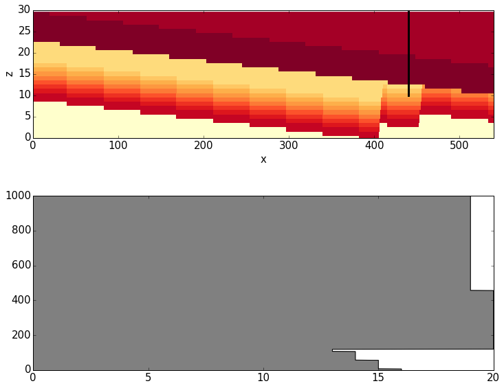

Sensitivity Analysis Gippsland Basin Model
==========================================

The kinematic model of the Gippsland Basin was constructed on the basis
of data from drillhole observations, interpreted geophysical data
(seismic sections and potential-field data) and knowledge of the
geological history.

As drillhole observations represent the only direct observation of the
actual geological subsurface structure, it is interesting to evaluate
how sensitive the match of the model at the position of these
observations is with respect to uncertainties about the exact geological
history.

We can also frame the same question in a slightly different context: how
well can we determine events of geological history on the basis of
structural information from the drillholes - in the range of the
(obviously approximate) assumptions about representing the history as a
series of kinematic events (as we do with Noddy).

In order to answer this question, we now use the constructed model of
the Gippsland Basin and test the sensitivity of modelled geology at
observation positions (the drillholes) with respect to several main
parameters that define the geological history as parameterised events.

.. code:: python

    from IPython.core.display import HTML
    css_file = 'pynoddy.css'
    HTML(open(css_file, "r").read())

.. raw:: html

    <link href='http://fonts.googleapis.com/css?family=Alegreya+Sans:100,300,400,500,700,800,900,100italic,300italic,400italic,500italic,700italic,800italic,900italic' rel='stylesheet' type='text/css'>
    <link href='http://fonts.googleapis.com/css?family=Arvo:400,700,400italic' rel='stylesheet' type='text/css'>
    <link href='http://fonts.googleapis.com/css?family=PT+Mono' rel='stylesheet' type='text/css'>
    <link href='http://fonts.googleapis.com/css?family=Shadows+Into+Light' rel='stylesheet' type='text/css'>
    <link rel="stylesheet" type="text/css" href="http://fonts.googleapis.com/css?family=Tangerine">
    <link href='http://fonts.googleapis.com/css?family=Philosopher:400,700,400italic,700italic' rel='stylesheet' type='text/css'>
    <link href='http://fonts.googleapis.com/css?family=Libre+Baskerville:400,400italic' rel='stylesheet' type='text/css'>
    <link href='http://fonts.googleapis.com/css?family=Lora:400,400italic' rel='stylesheet' type='text/css'>
    <link href='http://fonts.googleapis.com/css?family=Karla:400,400italic' rel='stylesheet' type='text/css'>
    
    

.. code:: python

    import sys, os
    import matplotlib.pyplot as plt
    # adjust some settings for matplotlib
    from matplotlib import rcParams
    # print rcParams
    rcParams['font.size'] = 15
    # determine path of repository to set paths corretly below
    # os.chdir(r'/Users/flow/git/pynoddy/docs/notebooks/')
    repo_path = os.path.realpath('../..')
    import pynoddy.history
    import pynoddy.events

Analysis of events in the Gippsland Basin model
-----------------------------------------------

We are starting with an analysis of the events in the Gippsland Basin
model - and a quick overview of the model in sections:

.. code:: python

    os.chdir(r'/Users/flow/git/paper_pynoddy/notebooks')
    reload(pynoddy.history)
    gipps = pynoddy.history.NoddyHistory("GBasin_Ve1_V4_b.his")

.. parsed-literal::

     STRATIGRAPHY
     FOLD
     UNCONFORMITY
     FAULT
     FAULT
     UNCONFORMITY
     FAULT
     FAULT
     UNCONFORMITY
     FAULT
     FAULT
     UNCONFORMITY
     TILT
     FOLD

We first have a quick look at the model and the defined events:

.. code:: python

    gipps.info()

.. parsed-literal::

    ************************************************************
    			Model Information
    ************************************************************
    
    
    This model consists of 14 events:
    	(1) - STRATIGRAPHY
    	(2) - FOLD
    	(3) - UNCONFORMITY
    	(4) - FAULT
    	(5) - FAULT
    	(6) - UNCONFORMITY
    	(7) - FAULT
    	(8) - FAULT
    	(9) - UNCONFORMITY
    	(10) - FAULT
    	(11) - FAULT
    	(12) - UNCONFORMITY
    	(13) - TILT
    	(14) - FOLD
    The model extent is:
    	x - 26630.0 m
    	y - 19291.0 m
    	z - 1500.0 m
    Number of cells in each direction:
    	nx = 532
    	ny = 385
    	nz = 30
    The model origin is located at: 
    	(0.0, 0.0, 1500.0)
    The cubesize for model export is: 
    	50 m
    
    
    ************************************************************
    			Meta Data
    ************************************************************
    
    
    The filename of the model is:
    	 GBasin_Ve1_V4.his
    It was last saved (if origin was a history file!) at:
    	 12/11/2014 11:33:12
    

And for a quick overview about the model and what it actually looks
like:

**TO DO: Fix colorbar**

.. code:: python

    print os.sys.path

.. parsed-literal::

    ['', '/Users/flow/git/pynoddy', '/Users/flow/git/prettyplotlib', '/Users/flow/git/github/pygeomod', '/opt/local/Library/Frameworks/Python.framework/Versions/2.7/lib/python27.zip', '/opt/local/Library/Frameworks/Python.framework/Versions/2.7/lib/python2.7', '/opt/local/Library/Frameworks/Python.framework/Versions/2.7/lib/python2.7/plat-darwin', '/opt/local/Library/Frameworks/Python.framework/Versions/2.7/lib/python2.7/plat-mac', '/opt/local/Library/Frameworks/Python.framework/Versions/2.7/lib/python2.7/plat-mac/lib-scriptpackages', '/opt/local/Library/Frameworks/Python.framework/Versions/2.7/lib/python2.7/lib-tk', '/opt/local/Library/Frameworks/Python.framework/Versions/2.7/lib/python2.7/lib-old', '/opt/local/Library/Frameworks/Python.framework/Versions/2.7/lib/python2.7/site-packages/readline', '/opt/local/Library/Frameworks/Python.framework/Versions/2.7/lib/python2.7/lib-dynload', '/opt/local/Library/Frameworks/Python.framework/Versions/2.7/lib/python2.7/site-packages', '/opt/local/Library/Frameworks/Python.framework/Versions/2.7/lib/python2.7/site-packages/PIL', '/opt/local/Library/Frameworks/Python.framework/Versions/2.7/lib/python2.7/site-packages/gtk-2.0', '/opt/local/Library/Frameworks/Python.framework/Versions/2.7/lib/python2.7/site-packages/wx-2.8-gtk2-unicode', '/opt/local/Library/Frameworks/Python.framework/Versions/2.7/lib/python2.7/site-packages/IPython/extensions']

.. code:: python

    os.sys.path.append(r"/Users/flow/bin")
    # Compute the model
    reload(pynoddy)
    his = 'GBasin_V4_new.his'
    gipps.write_history(his)
    out = 'GBasin_V4_out'
    pynoddy.compute_model(his, out)

.. code:: python

    reload(pynoddy.output)
    gipps_out = pynoddy.output.NoddyOutput("tmp_out")

.. code:: python

    gipps.determine_model_stratigraphy()
    # create section plots in axes diretions:
    gipps_out.plot_section('x', ve = 5.,
                    cmap = 'YlOrRd',
                    title = '',
                    colorbar = False,
    #                layer_labels = gipps.model_stratigraphy
                    )
    gipps_out.plot_section('y', position = 100, ve = 5.,
                    cmap = 'YlOrRd',
                    title = '',
                     colorbar = False,
                     colorbar_orientation = 'horizontal',
     #                layer_labels = gipps.model_stratigraphy
                     )
    

.. image:: SA-Gippsland_files/SA-Gippsland_11_0.png

.. image:: SA-Gippsland_files/SA-Gippsland_11_1.png

Extract 1-D drillhole information
---------------------------------

We will now define drillholes at defined positions within the model and
export high-resolution 1-D vertical profiles for those drillholes and
their appropriate depth.

We define the drillhole "coller" data as dictionaries for more clarity
below:

.. code:: python

    reload(pynoddy.history)
    gipps = pynoddy.history.NoddyHistory("GBasin_Ve1_V4_b.his")
    gipps.info()
    440 * 50

.. parsed-literal::

     STRATIGRAPHY
     FOLD
     UNCONFORMITY
     FAULT
     FAULT
     UNCONFORMITY
     FAULT
     FAULT
     UNCONFORMITY
     FAULT
     FAULT
     UNCONFORMITY
     TILT
     FOLD
    ************************************************************
    			Model Information
    ************************************************************
    
    
    This model consists of 14 events:
    	(1) - STRATIGRAPHY
    	(2) - FOLD
    	(3) - UNCONFORMITY
    	(4) - FAULT
    	(5) - FAULT
    	(6) - UNCONFORMITY
    	(7) - FAULT
    	(8) - FAULT
    	(9) - UNCONFORMITY
    	(10) - FAULT
    	(11) - FAULT
    	(12) - UNCONFORMITY
    	(13) - TILT
    	(14) - FOLD
    The model extent is:
    	x - 26630.0 m
    	y - 19291.0 m
    	z - 1500.0 m
    Number of cells in each direction:
    	nx = 532
    	ny = 385
    	nz = 30
    The model origin is located at: 
    	(0.0, 0.0, 1500.0)
    The cubesize for model export is: 
    	50 m
    
    
    ************************************************************
    			Meta Data
    ************************************************************
    
    
    The filename of the model is:
    	 GBasin_Ve1_V4.his
    It was last saved (if origin was a history file!) at:
    	 12/11/2014 11:33:12
    

.. parsed-literal::

    22000

.. code:: python

    # Create dictionaries for wells:
    drill_1 = {'x' : 22000., 'y' : 9600., 'z_max' : 1000.}
    drill_2 = {'x' : 20000., 'y' : 5000., 'z_min' : 500.}
    drill_3 = {'x' : 5000., 'y' : 15000., 'z_min' : 750.}

So, let's have a look at the modelled geology at one of these drillholes
for comparison:

.. code:: python

    # %%timeit # uncomment this command to time execution of command
    drill_1_data = gipps.get_drillhole_data(drill_1['x'], drill_1['y'], z_max = drill_1['z_max'])

.. code:: python

    plot(drill_1_data[::-1])

.. parsed-literal::

    [<matplotlib.lines.Line2D at 0x114a94a10>]

.. image:: SA-Gippsland_files/SA-Gippsland_17_1.png

.. code:: python

    fig = plt.figure(figsize = (12,10))
    ax1 = fig.add_subplot(211)
    ax2 = fig.add_subplot(212)
    gipps_out.plot_section('y', position = 'center', ve = 5.,
                    cmap = 'YlOrRd',
                    title = '',
                    ax = ax1,
                    colorbar = False,
                   # colorbar_orientation = 'horizontal',
    #                layer_labels = gipps.model_stratigraphy
                    )
    ax1.plot([440,440], [10,30], 'k', lw=3)
    ax1.set_ylim([0,30])
    ax1.set_xlim([0,540])
    ax2.plot(drill_1_data, range(len(drill_1_data)), 'k')
    ax2.fill_betweenx(range(len(drill_1_data)),drill_1_data, color = 'gray') #, range(le

.. parsed-literal::

    <matplotlib.collections.PolyCollection at 0x114b7ffd0>

.. code:: python

    gipps_out.export_to_vtk()

Comparing this profile to the position in the section:

.. code:: python

    fig = plt.figure(figsize = (12,10))
    ax1 = fig.add_subplot(211)
    ax2 = fig.add_subplot(212)
    gipps_out.plot_section('y', position = 100, ve = 5.,
                    cmap = 'YlOrRd',
                    title = '',
                    ax = ax1,
                    colorbar = False,
                   # colorbar_orientation = 'horizontal',
    #                layer_labels = gipps.model_stratigraphy
                    )
    ax1.plot([200,200], [10,30], 'k', lw=3)
    ax1.set_ylim([0,30])
    ax1.set_xlim([0,540])
    ax2.plot(drill_1_data, range(len(drill_1_data)), 'k')
    ax2.fill_betweenx(range(len(drill_1_data)),drill_1_data, color = 'gray') #, range(len(drill_1_data)))

.. parsed-literal::

    <matplotlib.collections.PolyCollection at 0x1145f7850>

.. image:: SA-Gippsland_files/SA-Gippsland_21_1.png

The modelled geology of the drillhole matches the position in the
section (luckily!), but the profile has a much higher resolution - and
important aspect in order to use it for a meaningful sensitivity
analysis.

Defining parameter ranges for uncertain events
----------------------------------------------

We now need to define the parameter ranges for the geological events in
the model. Here a list of the events again:

.. code:: python

    gipps.info(events_only = True)

.. parsed-literal::

    This model consists of 14 events:
    	(1) - STRATIGRAPHY
    	(2) - FOLD
    	(3) - UNCONFORMITY
    	(4) - FAULT
    	(5) - FAULT
    	(6) - UNCONFORMITY
    	(7) - FAULT
    	(8) - FAULT
    	(9) - UNCONFORMITY
    	(10) - FAULT
    	(11) - FAULT
    	(12) - UNCONFORMITY
    	(13) - TILT
    	(14) - FOLD

Relevant parameters for typical events are (this is a minimum number
more parameters can be defined!):

-  Faults: x, y, z, dip, dip direction, slip (6)
-  Tilt: x, y, z, plunge, plunge direction, rotation (6)
-  Fold: x, y, z, wavelength, amplitude (5)
-  Unconformity: x, y, z, dip, dip direction (5)

In our case, we would have a total of **72 parameters**! We might be
able to reduce some parameters due to translational invariance:

-  unconformities without dip: x,y position not relevant
-  faults with dip direction in one of main axes: one axis irrelevant
-  fold parallel to main axis: one axis irrelevant
-  same for tilt.

Note: this assumption is, of course, only valid if we assume that the
uncertainty in, say, the dip direction of a fault is so small that the
uncertainty in the position can be neglected. In a sense of a local
sensitivity analysis, this is certainly the case - with a global
sensitivity analysis (as we aim for here), the correlated sensitivity
could be analysed - however, at the cost of adding one more parameter!

So, we have to evaluate the events and see if we can reduce the order of
the problem:

-  2: Fold dip dir is 090, so invariant to y
-  3: Unconformity is flat, only one parameter (z)
-  4: Fault dip dir is 270, invariant to y
-  5: no reduction possible
-  6: Unconformity is flat, only one parameter (z)
-  7: Dip direction 180, invariant to x
-  8: no reduction possible
-  9: Unconformity is flat, only one parameter (z)
-  10: no reduction possible
-  11: dip dir 270, invariant to y
-  12: unfortunately a small dip (1 degree) - still consider as flat and
   only z?
-  13: as tilt affects entire block: position of x,y,z not important?
-  14: direction 180: invariant to x.

In total, we remain with: 42 parameters! Still a lot... but let's see -
a model calculation for a 1-D export is quite fast (approx. 0.1 s), so
it could be possible.

We define ranges for the remaining parameters and save them to a file:

.. code:: python

    param_file = "params_gipps.txt"
    params = """ev2_fold_amplitude 400. 600.
    ev2_fold_wavelength 12500. 17500.
    ev2_fold_x 0 15000.
    ev2_fold_z 0 1000.
    ev3_uc_z 150. 350.
    ev4_fault_dip 60. 80.
    ev4_fault_x 22000. 24000.
    ev4_fault_z 4000. 6000.
    ev4_fault_slip 0 -200.
    ev5_fault_dip 60. 80.
    ev5_fault_dip_dir 276. 296.
    ev5_fault_x 17000. 19000.
    ev5_fault_y 0 1000.
    ev5_fault_z 4000. 6000.
    ev5_fault_slip 0 -200.
    ev6_uc_z 650. 850.
    ev7_fault_dip 60. 80.
    ev7_fault_y 12000. 14000.
    ev7_fault_z 4000. 6000.
    ev7_fault_slip 400. 600.
    ev8_fault_dip 35. 55.
    ev8_fault_dip_dir 0. 20.
    ev8_fault_x 7730. 9730.
    ev8_fault_y -1000. 1000.
    ev8_fault_z 4000. 6000.
    ev8_fault_slip 400. 600.
    ev9_uc_z 650. 850.
    ev10_fault_dip 60. 80.
    ev10_fault_dip_dir 276. 296.
    ev10_fault_x 17000. 19000.
    ev10_fault_y -1000. 1000.
    ev10_fault_z 4000. 6000.
    ev10_fault_slip 100. 300.
    ev11_fault_dip 60. 80.
    ev11_fault_x 22000. 24000.
    ev11_fault_z 4000. 6000.
    ev11_fault_slip 100. 300.
    ev12_uc_z 900. 1100.
    ev13_tilt_plunge_dir 38. 58.
    ev13_tilt_rot 350. 360.
    ev14_fold_amplitude 400. 600.
    ev14_fold_wavelength 16000. 18000.
    ev14_fold_y 0 17000."""
    f = open(param_file, "w")
    f.write(params)
    f.close()

.. code:: python

    !wc -l params_gipps.txt

.. parsed-literal::

          42 params_gipps.txt

Generate samples for sensitivity analysis
-----------------------------------------

.. code:: python

    from SALib.sample import saltelli

.. code:: python

    param_values = saltelli.sample(10, param_file, calc_second_order = True)

.. code:: python

    len(param_values)

.. parsed-literal::

    880

Running the models
------------------

We now run the models, one for each of the generated parameter sets

.. code:: python

    # set resolution for analysis:
    res = 1 # m
    
    # get original model distance again:
    drill_1_ori = gipps.get_drillhole_data((drill_1['x'], 
                                        drill_1['y'], 
                                        z_max = drill_1['z_min'])
    
    def change_model_with_paramter_array(param):
        # create a copy of the history object
        gipps_changed = copy.deepcopy(gipps_ori)
    
        # define the elemtents and values of the events to change.
        # Note: the order of parameters is as in the text file created above!
        changes_fault_1 = {'Dip' : param[0],
                           'Dip Direction' : param[1],
                           'Slip' : param[2]}
        changes_fault_2 = {'Dip' : param[3],
                           'Dip Direction' : param[4],
                           'Slip' : param[5]}
    
        # Assign those changes to the events (note: event ids)
        param_changes = {2 : changes_fault_1,
                         3 : changes_fault_2}
    
        # Perform changes
        nm_changed.change_event_params(param_changes)    
    
        # Export drillhole profiles
        # drill_changed_left = nm_changed.get_drillhole_data(2000, 3500)
        drill_changed_fault = nm_changed.get_drillhole_data(4000, 3500, resolution = res)
        # drill_changed_centre = nm_changed.get_drillhole_data(5000, 3500)
    
        # calculate and return distance:
        return distance(drill_ori_fault, drill_changed_fault)
    

.. code:: python

    gipps.events[12].properties

.. code:: python

    pwd

.. parsed-literal::

    u'/Users/flow/git/paper_pynoddy/notebooks'

.. code:: python

    for i,param in enumerate(param_values[0]):
        print i,param

.. parsed-literal::

    0 443.9453125
    1 12983.3984375
    2 7778.3203125
    3 676.7578125
    4 206.0546875
    5 78.14453125
    6 22091.796875
    7 5798.828125
    8 -100.1953125
    9 61.38671875
    10 277.69921875
    11 17509.765625
    12 161.1328125
    13 4767.578125
    14 -28.7109375
    15 724.0234375
    16 74.39453125
    17 12689.453125
    18 5982.421875
    19 545.1171875
    20 45.44921875
    21 10.99609375
    22 9630.390625
    23 80.078125
    24 5166.015625
    25 581.4453125
    26 658.0078125
    27 79.58984375
    28 277.19140625
    29 17681.640625
    30 -705.078125
    31 4291.015625
    32 159.1796875
    33 71.85546875
    34 23603.515625
    35 5541.015625
    36 269.7265625
    37 1066.2109375
    38 44.15234375
    39 354.794921875
    40 582.6171875
    41 16509.765625
    42 16319.3359375

