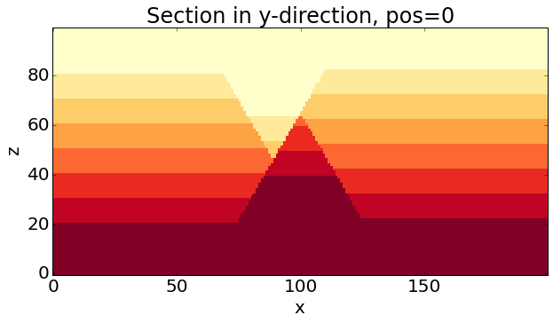

Sensitivity analysis with SALib
===============================

We have got the single parts now for the sensitivity analysis. We are
now using the global sensitivity analysis methods of the Python package
SALib, available on:

https://github.com/jdherman/SALib

As a start, we will test the sensitivity of the model at each drillhole
position separately. As parameters, we will use the parameters of the
fault events: dip, dip direction, and slip.

.. code:: python

    from IPython.core.display import HTML
    css_file = 'pynoddy.css'
    HTML(open(css_file, "r").read())

.. raw:: html

    <link href='http://fonts.googleapis.com/css?family=Alegreya+Sans:100,300,400,500,700,800,900,100italic,300italic,400italic,500italic,700italic,800italic,900italic' rel='stylesheet' type='text/css'>
    <link href='http://fonts.googleapis.com/css?family=Arvo:400,700,400italic' rel='stylesheet' type='text/css'>
    <link href='http://fonts.googleapis.com/css?family=PT+Mono' rel='stylesheet' type='text/css'>
    <link href='http://fonts.googleapis.com/css?family=Shadows+Into+Light' rel='stylesheet' type='text/css'>
    <link rel="stylesheet" type="text/css" href="http://fonts.googleapis.com/css?family=Tangerine">
    <link href='http://fonts.googleapis.com/css?family=Philosopher:400,700,400italic,700italic' rel='stylesheet' type='text/css'>
    <link href='http://fonts.googleapis.com/css?family=Libre+Baskerville:400,400italic' rel='stylesheet' type='text/css'>
    <link href='http://fonts.googleapis.com/css?family=Lora:400,400italic' rel='stylesheet' type='text/css'>
    <link href='http://fonts.googleapis.com/css?family=Karla:400,400italic' rel='stylesheet' type='text/css'>
    
    

.. code:: python

    %matplotlib inline

.. code:: python

    import sys, os
    import matplotlib.pyplot as plt
    import numpy as np
    # adjust some settings for matplotlib
    from matplotlib import rcParams
    # print rcParams
    rcParams['font.size'] = 15
    # determine path of repository to set paths corretly below
    os.chdir(r'../../../pynoddy/docs/notebooks/')
    repo_path = os.path.realpath('../..')
    import pynoddy.history
    import pynoddy.experiment
    rcParams.update({'font.size': 20})

Model set-up
------------

We use the two-fault model from previous examples and assign parameter
ranges with a dictionary:

.. code:: python

    reload(pynoddy.history)
    import pynoddy.experiment.sensitivity_analysis
    reload(pynoddy.experiment.sensitivity_analysis)
    # Start again with the original model
    his_filename = "two_faults_sensi.his"
    sa = pynoddy.experiment.sensitivity_analysis.SensitivityAnalysis(history = his_filename)
    
    # Initialise list
    param_stats = []
    
    # Add one entry as dictionary with relevant properties:
    
    # for event 2:
    param_stats.append({'event' : 2, 'parameter' : 'Dip', 'min' : 55., 'max' : 65., 
                        'type' : 'normal', 'stdev' : 10., 'mean' : 60., 'initial' : 60.})
    param_stats.append({'event' : 2, 'parameter' : 'Dip Direction', 'min' : 85., 'max' : 95., 
                        'type' : 'normal', 'stdev' : 10., 'mean' : 90., 'initial' : 90.})
    param_stats.append({'event' : 2, 'parameter' : 'Slip', 'min' : 900., 'max' : 1100., 
                        'type' : 'normal', 'stdev' : 500, 'mean' : 1000., 'initial' : 1000.})
    # for event 3:
    param_stats.append({'event' : 3, 'parameter' : 'Dip', 'min' : 55., 'max' : 65., 
                        'type' : 'normal', 'stdev' : 10., 'mean' : 60., 'initial' : 60.})
    param_stats.append({'event' : 3, 'parameter' : 'Dip Direction', 'min' : 265., 'max' : 275., 
                        'type' : 'normal', 'stdev' : 10., 'mean' : 270., 'initial' : 270.})
    param_stats.append({'event' : 3, 'parameter' : 'Slip', 'min' : 900., 'max' : 1100., 
                        'type' : 'normal', 'stdev' : 500, 'mean' : 1000., 'initial' : 1000.})
    
    sa.set_parameter_statistics(param_stats)

Define sampling lines
---------------------

As before, we need to define points in the model (or lines) which we
want to evaluate the sensitivity for:

.. code:: python

    # sa.add_sampling_line(5000, 3500, label = 'centre')
    sa.add_sampling_line(2500, 3500, label = 'left')
    # sa.add_sampling_line(7500, 3500, label = 'right')
    # sa.add_sampling_line(4000, 3500, label = 'compare')

And, again, we "freeze" the base state for later comparison and distance
caluclations:

.. code:: python

    sa.freeze()

Setting-up the parameter set
----------------------------

For use with SALib, we have to define a parameter set as a text file
(maybe there is a different way directly in Python - something to figure
out for the future). The sensitivity object has a method to do that
automatically:

.. code:: python

    param_file = "params_file_tmp.txt"
    sa.create_params_file(filename = param_file)

We now invoke the methods of the SALib library to generate parameter
data sets that are required for the type of sensitivity analysis that we
want to perform:

.. code:: python

    # import SALib method
    from SALib.sample import saltelli

.. code:: python

    param_values = saltelli.sample(10, param_file, calc_second_order = True)

::

    ---------------------------------------------------------------------------
    TypeError                                 Traceback (most recent call last)

    <ipython-input-19-b4266f3f8fc6> in <module>()
    ----> 1 param_values = saltelli.sample(10, param_file, calc_second_order = True)
    

    /usr/local/Cellar/python/2.7.9/Frameworks/Python.framework/Versions/2.7/lib/python2.7/site-packages/SALib-0.4-py2.7.egg/SALib/sample/saltelli.py in sample(problem, N, calc_second_order)
         12 def sample(problem, N, calc_second_order=True):
         13 
    ---> 14     D = problem['num_vars']
         15 
         16     # How many values of the Sobol sequence to skip

    TypeError: 'int' object has no attribute '__getitem__'

The object 'param\_values' is a list of samples for the parameters that
are defined in the model, in the order of appearance in param\_file,
e.g.:

.. code:: python

    param_values[0]

Calculating distances for all parameter sets
--------------------------------------------

We now need to create a model realisation for each of these parameter
sets and calculate the distance between the realisation and the base
model at the position of the defined sampling lines. As we are not
(always) interested in keeping the results of all realisations, those
steps are combined and only the calculated distance is retained (per
default):

.. code:: python

    distances = sa.determine_distances(param_values = param_values)

.. code:: python

    # plot(sa.get_model_lines(model_type = 'base'))
    plt.plot(sa.get_model_lines(model_type = 'current'))

.. code:: python

    # Just to check if we actualy did get different models:
    plt.plot(distances, '.-k')
    plt.title("Model distances")
    plt.xlabel("Sensitivity step")
    plt.ylabel("Distance")

Sensitivity analysis
--------------------

We can now analyse the sensitivity of the modelled stratigraphy along
the defined vertical lines ("drillholes") with respect to the model
parameters:

.. code:: python

    # save results
    results_file = 'dist_tmp.txt'
    np.savetxt(results_file, distances, delimiter=' ')

.. code:: python

    from SALib.analyze import sobol

.. code:: python

    Si = sobol.analyze(param_file, results_file, 
                       column = 0, 
                       conf_level = 0.95,
                       calc_second_order = True, 
                       print_to_console=False)

.. code:: python

    # create composite matrix for sensitivities
    n_params = 6
    comp_matrix = np.ndarray(shape = (n_params,n_params))
    for j in range(n_params):
        for i in range(n_params):
            if i == j:
                comp_matrix[i,j] = Si['S1'][i]
            else:
                comp_matrix[i,j] = Si['S2'][i,j]
                comp_matrix[j,i] = Si['S2'][i,j]
                
    # print comp_matrix
    
    # define labels for figure: phi = dip, d = dip direction, s = slip, subscript = fault event
    label_names = ["","$\phi_1$", "$d_1$", "$s_1$", "$\phi_2$", "$d_2$", "$s_2$"]
    
    # Create figure
    fig = plt.figure()
    ax = fig.add_subplot(111)
    im = ax.imshow(comp_matrix, interpolation='nearest', cmap='RdBu_r', 
                   vmax = np.max(np.abs(comp_matrix)),
                    vmin = -np.max(np.abs(comp_matrix)),
    
    )
    
    ax.yaxis.set_ticks_position("both")
    ax.xaxis.set_ticks_position("top")
    
    ax.set_xticklabels(label_names)
    ax.set_yticklabels(label_names)
    
    # ax.set_title("Sensitivities")
    
    ax.set_xlabel("Parameter Sensitivities")
    
    fig.colorbar(im)
    
    plt.tight_layout()
    # plt.savefig("two_fault_sensi.png")

Reading parameter ranges from file
----------------------------------

So, now that we have all the required ingredients for the sensitivity
analysis, we can make life a bit easier with more automation. First,
instead of defining parameters in a dictionary as above, we can actually
read them in from a csv file (e.g. saved from Excel as Windows-csv
file).

In order to be read in correctly, the header should contain the labels:

-  'event' : event id
-  'parameter' : Noddy parameter ('Dip', 'Dip Direction', etc.)
-  'min' : minimum value
-  'max' : maximum value
-  'initial' : initial value

In addition, it is possible to define PDF type and parameters. For now,
the following settings are supported:

-  'type' = 'normal'
-  'stdev' : standard deviation
-  'mean' : mean value (default: 'initial' value)

We can read in the parameters simply with:

.. code:: python

    reload(pynoddy.history)
    reload(pynoddy.experiment)
    # Start again with the original model
    his_filename = "two_faults_sensi.his"
    sa = pynoddy.experiment.SensitivityAnalysis(history = his_filename)
    sa.load_parameter_file("params_fault_model.csv")

The only further aspect we need to define are the sampling lines:

.. code:: python

    # sa.add_sampling_line(5000, 3500, label = 'centre')
    sa.add_sampling_line(2500, 3500, label = 'left')
    # sa.add_sampling_line(7500, 3500, label = 'right')
    # sa.add_sampling_line(4000, 3500, label = 'compare')

And then we know everything to perform the sensitivity analysis. The
relevant steps are combined in one method:

.. code:: python

    sa.perform_analsis(10)

.. code:: python

    sa.plot_distances()

.. code:: python

    sa.plot_sensitivity_matrix()

.. code:: python

    # for event 2:
    param_stats.append({'event' : 2, 'parameter' : 'Dip', 'min' : 55., 'max' : 65., 
                        'type' : 'normal', 'stdev' : 10., 'mean' : 60., 'initial' : 60.})
    param_stats.append({'event' : 2, 'parameter' : 'Dip Direction', 'min' : 85., 'max' : 95., 
                        'type' : 'normal', 'stdev' : 10., 'mean' : 90., 'initial' : 90.})
    param_stats.append({'event' : 2, 'parameter' : 'Slip', 'min' : 900., 'max' : 1100., 
                        'type' : 'normal', 'stdev' : 500, 'mean' : 1000., 'initial' : 1000.})
    # for event 3:
    param_stats.append({'event' : 3, 'parameter' : 'Dip', 'min' : 55., 'max' : 65., 
                        'type' : 'normal', 'stdev' : 10., 'mean' : 60., 'initial' : 60.})
    param_stats.append({'event' : 3, 'parameter' : 'Dip Direction', 'min' : 265., 'max' : 275., 
                        'type' : 'normal', 'stdev' : 10., 'mean' : 270., 'initial' : 270.})
    param_stats.append({'event' : 3, 'parameter' : 'Slip', 'min' : 900., 'max' : 1100., 
                        'type' : 'normal', 'stdev' : 500, 'mean' : 1000., 'initial' : 1000.})
    

.. code:: python

    sa.param_stats

.. code:: python

    sa.plot_section(model_type = "base")

.. code:: python

    plt.plot(sa.get_drillhole_data(4000, 3500))
    plt.plot(sa.get_model_lines())

.. code:: python

    reload(pynoddy.history)
    reload(pynoddy.experiment)
    sa2 = pynoddy.experiment.Experiment(history = "two_faults_sensi.his")

.. code:: python

    sa2.write_history("test5.his")

.. code:: python

    nm = pynoddy.history.NoddyHistory(history = "two_faults_sensi.his")
    # nm.determine_events()
    nm.write_history("test6.his")

.. code:: python

    param_values[0]

.. code:: python

    reload(pynoddy.history)
    reload(pynoddy.experiment)
    # Start again with the original model
    his_filename = "two_faults_sensi.his"
    sa = pynoddy.experiment.SensitivityAnalysis(history = his_filename)
    
    sa.freeze()
    # sa.change_event_params({3 : {'Slip' : 500.}})
    sa.change_event_params({3 : {'Dip' : 15.}})

::

    ---------------------------------------------------------------------------
    TypeError                                 Traceback (most recent call last)

    <ipython-input-22-3455686c98cb> in <module>()
          3 # Start again with the original model
          4 his_filename = "two_faults_sensi.his"
    ----> 5 sa = pynoddy.experiment.SensitivityAnalysis(history = his_filename)
          6 
          7 sa.freeze()

    TypeError: 'module' object is not callable

.. code:: python

    fig = plt.figure(figsize = (12,6))
    ax1 = fig.add_subplot(121)
    ax2 = fig.add_subplot(122)
    sa.plot_section(ax = ax1, colorbar = False, title = "")
    sa.plot_section(ax = ax2, model_type = "base", colorbar = False, title = "")

.. image:: Sensitivity-Analysis-2_files/Sensitivity-Analysis-2_43_0.png

.. code:: python

    sa.change_event_params({3 : {'Slip' : 100.}})
    sa.plot_section()

.. code:: python

    # sa.add_sampling_line(5000, 3500, label = 'centre')
    # sa.add_sampling_line(2500, 3500, label = 'left')
    sa.add_sampling_line(7500, 3500, label = 'right')
    # sa.add_sampling_line(4000, 3500, label = 'compare')
    plt.plot(sa.get_model_lines(), 'k')
    plt.plot(sa.get_model_lines(model_type = "base"), 'b')

.. parsed-literal::

    [<matplotlib.lines.Line2D at 0x113c09a90>]

.. image:: Sensitivity-Analysis-2_files/Sensitivity-Analysis-2_45_1.png

.. code:: python

    pwd

