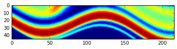

Test efficient calculation of information entropy with masked arrays
~~~~~~~~~~~~~~~~~~~~~~~~~~~~~~~~~~~~~~~~~~~~~~~~~~~~~~~~~~~~~~~~~~~~

.. code:: python

    # Step 1: load previously calculated results

.. code:: python

    import pickle
    import numpy as np

.. code:: python

    ua = pickle.load(open("gipps_results.pkl"))

.. code:: python

    # cast probabilities into numpy array
    ua.p_block = np.array(ua.p_block)

.. code:: python

    def ie_standard(ua):
        # test standard way to calculate information entropy with nested blocks:
        # calculate information entropy and store in self.e_block
        e_block = np.zeros_like(ua.p_block[1])
        for p_block in ua.p_block:
            for i in range(ua.nx):
                for j in range(ua.ny):
                    for k in range(ua.nz):
                        if p_block[i, j, k] > 0:
                            e_block[i, j, k] -= p_block[i, j, k] * np.log2(p_block[i, j, k])
        return e_block

.. code:: python

    %%timeit
    e_block_1 = ie_standard(ua)

.. parsed-literal::

    1 loops, best of 3: 32.8 s per loop

.. code:: python

    # now test implementation with masked arrays

.. code:: python

    def ie_masked(ua):
        pm = np.ma.masked_equal(ua.p_block, 0)
        pm2 = - pm * np.ma.log2(pm)
        ie_masked = np.sum(pm2.filled(0), axis = 0)
        return ie_masked

.. code:: python

    %%timeit
    e_block_2 = ie_masked(ua)

.. parsed-literal::

    1 loops, best of 3: 2.69 s per loop

.. code:: python

    # Check if result is correct
    assert((e_block_1.all() == e_block_2.all()))

.. code:: python

    import matplotlib.pyplot as plt

.. code:: python

    %matplotlib inline

.. code:: python

    plt.imshow(e_block_1[100,:,:].transpose())

.. parsed-literal::

    <matplotlib.image.AxesImage at 0x10c86cf10>

.. code:: python

    plt.imshow(e_block_2[100,:,:].transpose())

.. parsed-literal::

    <matplotlib.image.AxesImage at 0x10c98a490>

.. image:: Test-efficient-entropy-calc_files/Test-efficient-entropy-calc_14_1.png

.. code:: python

    np.max(ie_masked)

.. parsed-literal::

    3.2090368361692407

.. code:: python

    75 * 75

.. parsed-literal::

    5625

.. code:: python

    (1 * 0.05 - 1.0)**2 * 5625

.. parsed-literal::

    5076.5625

.. code:: python

    print ua

