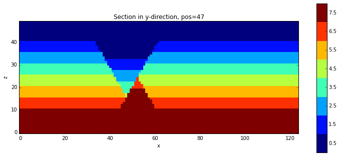

Test combination/ extension of existing history files with new events

.. code:: python

    import sys, os
    import matplotlib.pyplot as plt
    # adjust some settings for matplotlib
    from matplotlib import rcParams
    # print rcParams
    rcParams['font.size'] = 15
    # determine path of repository to set paths corretly below
    os.chdir(r'/Users/flow/git/pynoddy/docs/notebooks/')
    repo_path = os.path.realpath('../..')
    import pynoddy

.. code:: python

    %pylab inline

.. parsed-literal::

    Populating the interactive namespace from numpy and matplotlib

.. code:: python

    # Change to sandbox directory to store results
    os.chdir(os.path.join(repo_path, 'sandbox'))
    # Path to exmaple directory in this repository
    example_directory = os.path.join(repo_path,'examples')

.. code:: python

    # Compute noddy model for history file
    reload(pynoddy.history)
    history_file = 'simple_two_faults.his'
    history = os.path.join(example_directory, history_file)
    output_name = 'noddy_out'
    H1 = pynoddy.history.NoddyHistory(history)

.. parsed-literal::

     STRATIGRAPHY
     FAULT
     FAULT

.. code:: python

    pynoddy.compute_model(history, output_name) 
    NO1 = pynoddy.output.NoddyOutput(output_name)

.. code:: python

    NO1.plot_section('y')

.. code:: python

    H1.all_events_begin

.. parsed-literal::

    7

.. code:: python

    H1.all_events_end

.. parsed-literal::

    761

.. code:: python

    H1.n_events

.. parsed-literal::

    3

.. code:: python

    H1.history_lines[:2]

.. parsed-literal::

    ['#Filename = simple_two_faults.his\n', '#Date Saved = 24/3/2014 14:21:0\n']

.. code:: python

    # Compute noddy model for history file
    reload(pynoddy.history)
    history_file = 'simple_two_faults.his'
    history = os.path.join(example_directory, history_file)
    output_name = 'noddy_out'
    H1 = pynoddy.history.NoddyHistory(history)

.. parsed-literal::

     STRATIGRAPHY
     FAULT
     FAULT

.. code:: python

    H1.info()

.. parsed-literal::

    ************************************************************
    			Model Information
    ************************************************************
    
    
    This model consists of 3 events:
    	(1) - STRATIGRAPHY
    	(2) - FAULT
    	(3) - FAULT
    The model extent is:
    	x - 10000.0 m
    	y - 7000.0 m
    	z - 5000.0 m
    The model origin is located at: 
    	(0.0, 0.0, 5000.0)
    The cubesize for model export is: 
    	100 m
    
    
    ************************************************************
    			Meta Data
    ************************************************************
    
    
    The filename of the model is:
    	 simple_two_faults.his
    It was last saved (if origin was a history file!) at:
    	 24/3/2014 14:21:0
    

.. code:: python

    H1.get_cube_size()

.. code:: python

    reload(pynoddy.history)
    new_his = pynoddy.history.NoddyHistory()

.. code:: python

    new_his.info()

::

    ---------------------------------------------------------------------------
    AttributeError                            Traceback (most recent call last)

    <ipython-input-60-4b07ce9fc388> in <module>()
    ----> 1 new_his.info()
    

    /Users/flow/git/pynoddy/pynoddy/history.py in info(self)
         35         """Print out model information"""
         36         # First: check if all information available
    ---> 37         if not hasattr(self, 'extent_x'): self.get_extent()
         38         if not hasattr(self, 'origin_x'): self.get_origin()
         39         if not hasattr(self, 'cube_size'): self.get_cube_size()

    /Users/flow/git/pynoddy/pynoddy/history.py in get_extent(self)
         92                 break
         93 
    ---> 94         return(self.extent_x, self.extent_y, self.extent_z)
         95 
         96 

    AttributeError: NoddyHistory instance has no attribute 'extent_x'

.. code:: python

    new_his.history_lines

.. parsed-literal::

    []

.. code:: python

    a = [1,2,3]

.. code:: python

    a + a

.. parsed-literal::

    [1, 2, 3, 1, 2, 3]

