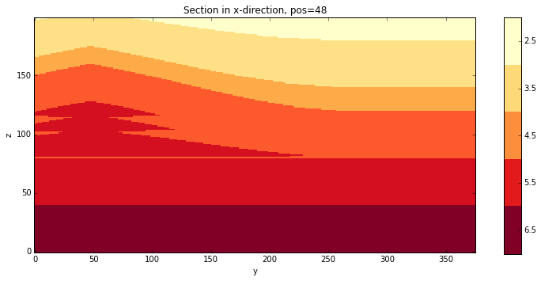

Test curved faults and stacking in Duplex structure
===================================================

Example based on discussions with Christoph

.. code:: python

    import matplotlib.pyplot as plt
    import numpy as np

.. code:: python

    %matplotlib inline

.. code:: python

    import pynoddy
    import pynoddy.experiment

.. code:: python

    shis = pynoddy.experiment.Experiment(history = '../../examples/stack.his')

.. parsed-literal::

     STRATIGRAPHY
     FAULT
     FAULT
     FAULT
     FAULT

.. code:: python

    shis.plot_section('x')

.. parsed-literal::

    

.. image:: Test_stack_files/Test_stack_5_1.png

.. code:: python

    print shis.get_cube_size()
    shis.get_extent()

.. parsed-literal::

    200.0

.. parsed-literal::

    (10000.0, 7000.0, 5000.0)

.. code:: python

    shis.change_cube_size(25)
    shis.plot_section('x')

.. parsed-literal::

    

.. code:: python

    shis.export_to_vtk(vtk_filename = 'stack.vtk')

.. parsed-literal::

    

